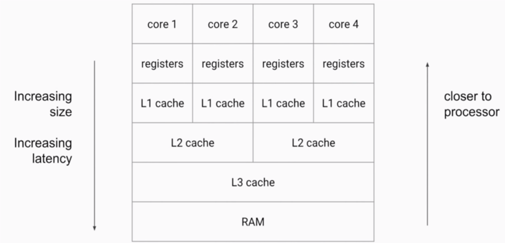
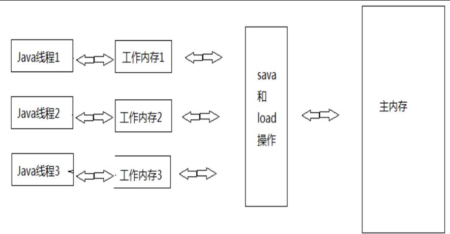

# 从Java代码到CPU指令

1. 最开始，我们编写的Java代码，是*.java文件
2. 在编译（javac命令）后，从刚才的*.java文件会变出一个新的Java字节码文件（*.*class）
3. JVM会执行刚才生成的字节码文件（*.class），并把字节码文件转化为机器指令
4. 机器指令可以直接在CPU上执行，也就是最终的程序执行

- JVM实现会带来不同的“翻译”，不同的CPU平台的机器指令又千差万别，无法保证并发安全的效果一致

# JVM内存结构 VS Java内存模型VS Java对象模型

- JVM内存结构，和Java虚拟机的运行时区域有关。分成5个部分（堆、栈、方法区、程序计数器、本地方法栈）
- Java内存模型，和Java的并发编程有关。
- Java对象模型，和Java对象在虚拟机中的表现形式有关

## Java对象模型

- Java对象自身的存储模型
- JVM会给这个类创建一个instanceKlass，保存在方法区中，用来在JVM层表示该Java类
- 当我们在Java代码中，使用new创建一个对象的时候，JVM会创建一个instanceOopDesc对象，这个对象中包含了对象头以及实例数据

## JMM，Java内存模型

- Java Memory Model
- 是一组**规范**，需要各个JVM的实现来遵守JMM规范，以便于开发者可以利用这些规范，更方便地开发多线程程序
- 如果没有这样的一个JMM内存模型来规范，那么很有可能经过不同的JVM的不同规则的重排序之后，**导致不同的虚拟机上运行的结果不一样**，那就是很大的问题

## JMM是工具类和关键字的原理

- `volatile、synchronized、Lock`等原理都是JMM
- 如果没有JMM，那就需要我们自己指定什么时候用内存栅栏，那是相当麻烦的，幸好有了JMM，让我们只需要用同步工具和关键字就可以开发并发程序
- 最重要的3点内容：**重排序、可见性、原子性**

# 重排序

- 什么是重排序：在线程1内部两行代码的实际执行顺序和代码在Java文件中的顺序不一致，代码指令并不是严格按照代码语句顺序执行的，它们的顺序被改变了，这就是重排序，这里被颠倒的是y=a和b=1这两行语句

```java
      Thread two = new Thread(new Runnable() {
                @Override
                public void run() {
                    try {
                        latch.countDown();
                        latch.await();
                    } catch (InterruptedException e) {
                        e.printStackTrace();
                    }
                    b = 1;
                    y = a;
                }
            });
```
- 重排序前指令

- 重排序后指令


# 重排序的3种情况

- 编译器优化：包括JVM，JIT编译器等
- CPU指令重排：就算编译器不发生重排，CPU也可能对指令进行重排
- 内存的“重排序”：线程A的修改线程B却看不到，引出可见性问题

# 可见性
CPU缓存结构



## 为什么会有可见性问题

- CPU有多级缓存，导致读的数据过期
  - 高速缓存的容量比主内存小，但是速度仅次于寄存器，所以在CPU和主内存之间就多了Cache层
  - 线程间的对于共享变量的可见性问题不是直接由多核引起的，而是由多缓存引起的。
  - 如果所有个核心都只用一个缓存，那么也就不存在内存可见性问题了
  - 每个核心都会将自己需要的数据读到独占缓存中，数据修改后也是写入到缓存中，然后等待刷入到主存中。所以会导致有些核心读取的值是一个过期的值。

主内存和工作内存1


主内存和工作内存2



- Java作为高级语言，屏蔽了这些底层细节，用JMM定义了一套读写内存数据的规范，虽然我们不再需要关系一级缓存和二级缓存的问题，但是JMM抽象了主内存和本地内存的概念。
- 这里说的本地内存并不是真的一块给每个线程分配的内存，而是JMM的一个抽象，是对于寄存器、一级缓存、二级缓存的抽象

### 总结

所有的**共享变量存在于主内存**中，每个**线程都有自己的本地内存**，而且**线程读写共享数据**也是通过**本地内存交换**的，所以才导致了可见性问题。

# Happens-Before

## 单线程原则

一个线程中，按照程序的顺序，前面的操作happens-before后续的任何操作。

## 锁操作（synchronized和Lock）（重点）

对一个锁的解锁操作，happens-before后续对这个锁的加锁操作。

## volatile规则（重点）

对一个volatile变量的写操作，happens-before后续对这个变量的读操作。

## 线程start()规则

主线程A启动线程B，线程B中可以看到主线程启动B之前的操作。也就是start() happens before 线程B中的操作。

## 线程join()规则

主线程A等待子线程B完成，当子线程B执行完毕后，主线程A可以看到线程B的所有操作。也就是说，子线程B中的任意操作，happens-before join()的返回。

## 传递性规则

如果A happens-before B，B happens-before C，那么A happens-before C。

## 程序中断规则

如果一个线程被其它线程interrupt时，那么检测中断（isInterrupted）或者抛出InterruptedException一定能看到

# volatile关键字

## volatile是什么

- volatile是一种同步机制，比synchronized或者Lock相关类更轻量，因为volatile并不会发生上下文切换等开销很大的行为
- 如果一个变量被修饰成volatile，那么JVM就知道了这个变量可能会被并发修改
- 但是开销小，响应的能力也小，虽然说volatile是用来同步的保护线程安全的，但是volatile做不到synchronized那样的原子保护，volatile仅在很有限的场景下才能发挥作用

## volatile的适用场合

- 不适用:a++
- 适用场合1：boolean flag，如果一个共享变量自始至终只被各个线程赋值，而没有其他的操作，那么就可以用volatile来代替synchronized或者代替原子变量，因为赋值自身是有原子性的，而volatile又保证了可见性，所以就足以保证线程安全。
- 使用场合2：作为刷新之前变量的触发器

## volatile的作用：可见性、禁止重排序

- 可见性：读一个volatile变量之前，需要先使相应的本地缓存失效，这样就必须到主内存读取最新值，写一个volatile属性会立即刷入到主内存
- 禁止指令重排序优化：解决单例双重锁乱序问题

## volatile和synchronized的关系

- volatile在这方面可以看做是轻量版的synchronized：如果一个共享变量自始至终只被各个线程赋值，而没有其它操作，那么就可以用volatile来代替synchronized或者代替原子变量，因为赋值自身是有原子性的，而volatile又保证了可见性，所以就足以保证线程安全

## 学以致用：用volatile修正重排序问题

## volatile小结

1. volatile修饰符适用于以下场景：某个属性被多个线程共享，其中有一个线程修改了此属性，其它线程可以立即得到修改后的值，比如`boolean flag`;或者作为触发器，实现轻量级同步。
2. volatile属性的读写操作都是无锁的，它不能代替synchronized，因为它没有提供**原子性和互斥性**。因为无锁，不需要花费时间在获取锁和释放锁上，所以说它是低成本的。
3. volatile只能作用于属性，我们用volatile修饰属性，这样compilers就不会对这个属性做指令重排序
4. volatile提供了可见性，任何一个线程对其的修改将立马对其它线程可见。volatile属性不会被线程缓存，始终从主存中读取
5. volatile提供了happpens-before保证，对volatile变量v的写入happens-before所有线程后续对v的读操作
6. volatile可以使得long和double的赋值是原子的，后面马上会讲long和double的原子性

## 升华：对synchronized可见性的正确理解

- synchronized不仅保证了原子性，还保证了可见性
- synchronized不仅让被保护的代码安全，还近朱者赤（对被保护的代码前面的代码可见）

synchronized不仅防止了一个线程在操作其对象时收到其他线程的干扰，同时还保证了修改好之后，可以立即被其它线程所看到。（因为如果其他线程看不到，那也会有线程安全问题）

# 原子性

## Java中原子操作有哪些

1. 除了long和double之外的基本类型（int，byte，boolean，short，char，float）的赋值操作
2. 所有**引用reference的赋值操作**，不管是32位的机器还是64位的机器
3. `java.concurrent.Atomic.*`包中所有类的原子操作

## long和double的原子性

结论：Oracle官方文档有写：在32位上的JVM上，long和double的操作不是原子的，需要分2次，分别写入32位，但是在64位的jvm上是原子的
在实际开发中：商用Java虚拟机中不会出现这个问题，所以在实际开发中基本不用考虑

# 面试常见问题

## 单例模式

```java
package com.wjj.design.pattern.creational.singleton;

/**
 * @author wjj
 * @version 1.0
 * @date 2019/12/1 11:42
 */
public class LazyDoubleCheckSingleton {
    private volatile static LazyDoubleCheckSingleton lazyDoubleCheckSingleton;
    private LazyDoubleCheckSingleton(){
    }
    public static LazyDoubleCheckSingleton getInstance(){
        if (lazyDoubleCheckSingleton==null){
            synchronized (LazyDoubleCheckSingleton.class){
                if (lazyDoubleCheckSingleton==null){
                    lazyDoubleCheckSingleton=new LazyDoubleCheckSingleton();
                    //指令重排
                    //1.分配内存给这个对象
                    //3.设置lazyDoubleCheckSingleton 指向刚分配的内存地址
                    //2.初始化对象
                    //intra-thread semantics保证重排序不会改变单线程内的执行结果
                    //  ------------------------3.设置lazyDoubleCheckSingleton 指向刚分配的内存地址
                }
            }
        }
        return lazyDoubleCheckSingleton;
    }
}

```

## 单例的最佳实践

```java
/**
 * 描述：     枚举单例
 */
public enum Singleton8 {
    INSTANCE;

   public static Singleton8 getInstance(){
       return INSTANCE;
   }
}
```


## 讲一讲什么是Java内存模型 

- 规范，重排序，可见性，原子性

## volatile和synchronized的异同

## 什么是原子操作？Java中有哪些原子操作？生成对象过程是不是原子操作？

1. 新建一个空的Person对象
2. 把这个对象的地址指向p
3. 执行Person的构造函数

## 什么是内存的可见性

## 64位的double和long写入的时候是原子的吗

- 通常不需要考虑

