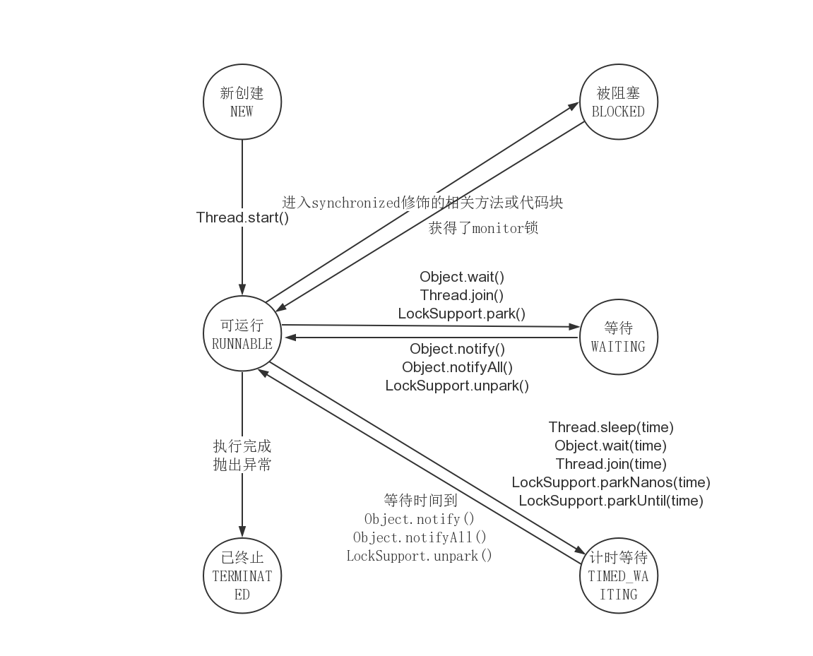
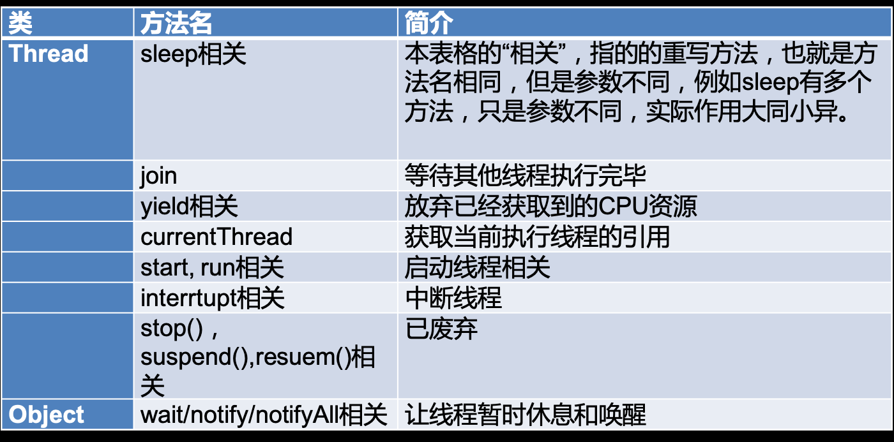
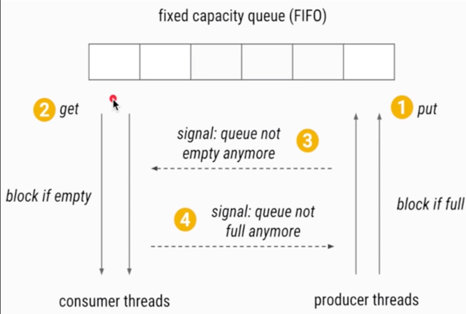
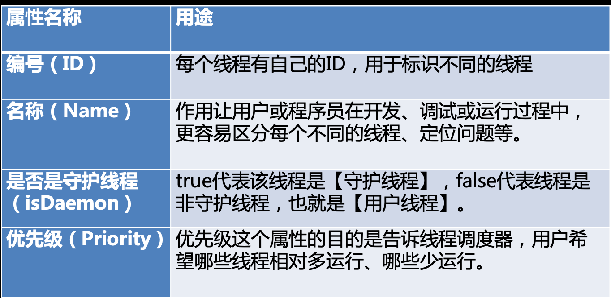
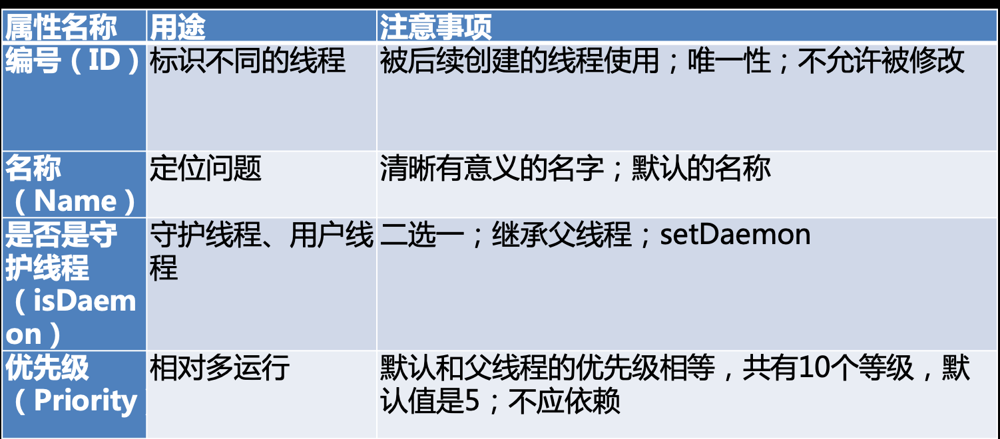
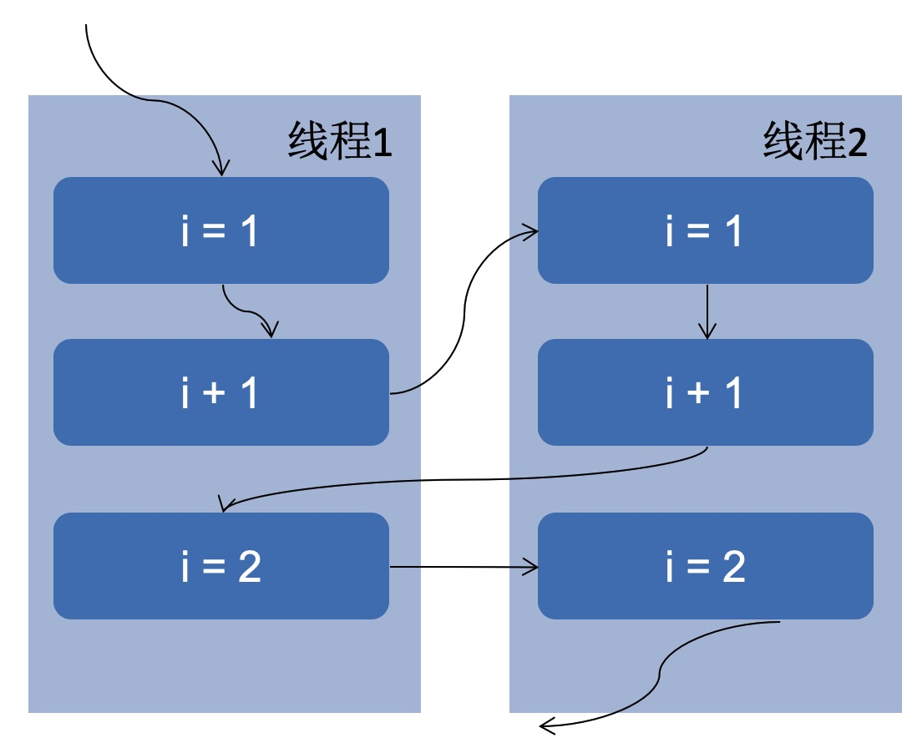

# 实现多线程的两种方式

- 通常我们分为两类，在Oracle官方也是这么说的

- 准确的讲，创建线程只有一种方式那就是构造Thread类，而实现线程的执行单元有两种方式

  1. 方法一：实现`Runnable`接口的run方法，并把`Runnable`实例传给Thread类（更好）
     1. 从代码架构角度（应该把具体要做的业务跟线程的生命周期解耦）
     2. 新建线程的损耗（可以反复利用一个Runnable实例，线程池就是基于这个原理）
     3. Java不支持双继承，可以有更好的扩展性
  2. 方法二：重写Thread的run方法（继承Thread类）

  本质是一样的，第一种是传入target对象（即一个Runnable实例），调用`target.run()`,第二种是重写

# 启动线程的正确和错误方式

1. 一个线程两次调用start（）方法会出现什么情况？为什么？
   - 答：会抛出异常`IllegalThreadStateException`,Thread类中的start方法，一开始会对线程状态进行检查,如果已经执行过了start（）方法，则会抛出异常。
   ```java
   if (threadStatus != 0)
            throw new IllegalThreadStateException();
   ```

2. 既然`start()`方法会调用`run()`方法，为什么我们选择调用`start()`方法，而不是直接调用`run()`方法呢？

   - `start()`方法才是真正的启动线程，会经历线程的6个生命周期，执行`run()`方法就只是调用了一个普通的方法，不会通过子线程去调用

# 线程停止、中断之最佳实践

**其实是一种规范，需要要求停止线程和被停止线程相互配合**

## 如何正确停止线程

- 原理介绍：使用interrupt来通知，而不是强制

存在一个问题，在sleep过程中被中断，会清除标记位

## 两种最佳实践

- 优先选择：传递中断
- 不想或无法传递：恢复中断
- 不应屏蔽中断

第一种

```java
package threadcoreknowledge.stopthreads;
/**
 * 描述：     最佳实践：catch了InterruptedExcetion之后的优先选择：
 *  在方法签名中抛出异常 那么在run()就会强制try/catch
 */
public class RightWayStopThreadInProd implements Runnable {

    @Override
    public void run() {
        while (true && !Thread.currentThread().isInterrupted()) {
            System.out.println("go");
            try {
                throwInMethod();
            } catch (InterruptedException e) {
                Thread.currentThread().interrupt();
                //保存日志、停止程序
                System.out.println("保存日志");
                e.printStackTrace();
            }
        }
    }

    private void throwInMethod() throws InterruptedException {
            Thread.sleep(2000);
    }

    public static void main(String[] args) throws InterruptedException {
        Thread thread = new Thread(new RightWayStopThreadInProd());
        thread.start();
        Thread.sleep(1000);
        thread.interrupt();
    }
}
```

第二种

```java
package threadcoreknowledge.stopthreads;

/**
 * 描述：最佳实践2：在catch子语句中调用Thread.currentThread().interrupt()来恢复设置中断状态，以便于在后续的执行中，依然能够检查到刚才发生了中断
 * 回到刚才RightWayStopThreadInProd补上中断，让它跳出
 */
public class RightWayStopThreadInProd2 implements Runnable {

    @Override
    public void run() {
        while (true) {
            System.out.println("go");
            if (Thread.currentThread().isInterrupted()) {
                System.out.println("Interrupted，程序运行结束");
                break;
            }
            reInterrupt();
        }
    }

    private void reInterrupt() {
        try {
            Thread.sleep(2000);
        } catch (InterruptedException e) {
           Thread.currentThread().interrupt();
            e.printStackTrace();
        }
    }

    public static void main(String[] args) throws InterruptedException {
        Thread thread = new Thread(new RightWayStopThreadInProd2());
        thread.start();
        Thread.sleep(1000);
        thread.interrupt();
    }
}
```

## 响应中断方法总结列表

- `Object.wait()/wait(long)/wait(long,int)`
- `Thread.sleep(long)/sleep(long,int)`
- `Thread.join()/join(long)/join(long,int)`
- `java.util.concurrent.BlockingQueue.take()/put(E)`
- `java.util.concurrent.locks.Lock.lockInterruptibly()`
- `java.util.concurrent.CountDownLatch.await()`
- `java.util.concurrent.CyclicBarrier.await()`
- `java.util.concurrent.Exchanger.exchanger(V)`
- `java.nio.channels.InterruptibleChannel`相关方法
- `java.nio.channels.Selector`的相关方法

## 停止线程相关重要函数解析

- 判断是否已被中断相关方法

  1. `static bollean interrupted()`会清除Interrupted状态标志位
  2. `boolean isInterrupted()`
  3. `Thread.interrupted()`的目的对象是“当前线程”，而不管本方法来自于哪个对象

## 常见面试问题

- 如何停止线程

  1. 原理：用interrupt来请求、好处

     可以保证数据安全，把主动权交给被中断的线程

  2. 想停止线程，要求请求方，被停止方，子方法被调用方相互配合

     请求方发出请求信号，被停止方需要在循环的时候或者适当的时候去检测这个中断信号，子方法应该抛出Exception或者在收到中断信号的时候，再次发出中断信号

  3. 最后再说错误的方法：stop/suspend已废弃，volatile的boolean无法处理长时间阻塞的情况

- 如何处理不可中断的阻塞

  1. 没有通用方法，对于某些锁，或者某些IO需要有具体的解决方案，尽量用能够响应中断的特定方法

# 图解线程生命周期，6种状态



## 阻塞状态

- 一般习惯而言，把`Blocked`（被阻塞）、`Waiting`（等待）、`Timed_waiting`(计时等待)都称为阻塞状态
- 不仅仅是`Blocked`

## 常见面试问题

- 线程有哪几种状态？生命周期是什么？
  - 6种，见上图

# Thread和Object类中线程相关方法

1. 为什么线程通信的方法`wait()`,`notify()`和`notifyAll()`被定义在Object类里？而sleep定义在Thread类里
2. 用3种方式实现生产者模式
3. join和sleep和wait期间线程的状态分别是什么？为什么？



## wait，notify，notifyAll性质、特点

- 必须**先拥有**monitor（即synchronized锁）
- notify只能唤醒其中一个，不取决于我们的选择，由JVM决定
- 属于Object类
- 类似功能的Condition
- 同时持有多个锁的情况，注意执行顺序，不然可能发生死锁，**wait只释放当前对象的那把锁**

## 生产者消费者模式

- 为什么要有生产者消费者模式
  - 在实际生产中，生产者和消费者速度不一样，需要平衡不存在一方过多或过少，所以需要一种设计模式来进行解耦



## wait，notify，notifyAll常见面试问题

### 用程序实现两个线程交替打印0~100的奇偶数

- 法一，会存在浪费的情况

```java
package threadcoreknowledge.threadobjectclasscommonmethods;

/**
 * 描述：     两个线程交替打印0~100的奇偶数，用synchronized关键字实现
 */
public class WaitNotifyPrintOddEvenSyn {

    private static int count;

    private static final Object lock = new Object();

    //新建2个线程
    //1个只处理偶数，第二个只处理奇数（用位运算）
    //用synchronized来通信
    public static void main(String[] args) {
        new Thread(new Runnable() {
            @Override
            public void run() {
                while (count < 100) {
                    synchronized (lock) {
                        if ((count & 1) == 0) {
                            System.out.println(Thread.currentThread().getName() + ":" + count++);
                        }
                    }
                }
            }
        }, "偶数").start();

        new Thread(new Runnable() {
            @Override
            public void run() {
                while (count < 100) {
                    synchronized (lock) {
                        if ((count & 1) == 1) {
                            System.out.println(Thread.currentThread().getName() + ":" + count++);
                        }
                    }
                }
            }
        }, "奇数").start();
    }
}

```
- 法二.最佳实践

  ```java
  package threadcoreknowledge.threadobjectclasscommonmethods;
  /**
   * 描述：     两个线程交替打印0~100的奇偶数，用wait和notify
   */
  public class WaitNotifyPrintOddEveWait {
  
      private static int count = 0;
      private static final Object lock = new Object();
      public static void main(String[] args) {
          new Thread(new TurningRunner(), "偶数").start();
          new Thread(new TurningRunner(), "奇数").start();
      }
  
      //1. 拿到锁，我们就打印
      //2. 打印完，唤醒其他线程，自己就休眠
      static class TurningRunner implements Runnable {
  
          @Override
          public void run() {
              while (count <= 100) {
                  synchronized (lock) {
                      //拿到锁就打印
                      System.out.println(Thread.currentThread().getName() + ":" + count++);
                      lock.notify();
                      if (count <= 100) {
                          try {
                              //如果任务还没结束，就让出当前的锁，并休眠
                              lock.wait();
                          } catch (InterruptedException e) {
                              e.printStackTrace();
                          }
                      }
                  }
              }
          }
      }
  }
  ```
### 手写生产者消费者模型

```java
package threadcoreknowledge.threadobjectclasscommonmethods;

import java.util.ArrayList;
import java.util.Date;
import java.util.LinkedList;
import java.util.List;

/**
 * 描述：     用wait/notify来实现生产者消费者模式
 */
public class ProducerConsumerModel {
    public static void main(String[] args) {
        EventStorage eventStorage = new EventStorage();
        Producer producer = new Producer(eventStorage);
        Consumer consumer = new Consumer(eventStorage);
        new Thread(producer).start();
        new Thread(consumer).start();
    }
}

class Producer implements Runnable {

    private EventStorage storage;

    public Producer(
            EventStorage storage) {
        this.storage = storage;
    }

    @Override
    public void run() {
        for (int i = 0; i < 100; i++) {
            storage.put();
        }
    }
}

class Consumer implements Runnable {

    private EventStorage storage;

    public Consumer(
            EventStorage storage) {
        this.storage = storage;
    }

    @Override
    public void run() {
        for (int i = 0; i < 100; i++) {
            storage.take();
        }
    }
}

class EventStorage {

    private int maxSize;
    private LinkedList<Date> storage;

    public EventStorage() {
        maxSize = 10;
        storage = new LinkedList<>();
    }

    public synchronized void put() {
        while (storage.size() == maxSize) {
            try {
                wait();
            } catch (InterruptedException e) {
                e.printStackTrace();
            }
        }
        storage.add(new Date());
        System.out.println("仓库里有了" + storage.size() + "个产品。");
        notify();
    }

    public synchronized void take() {
        while (storage.size() == 0) {
            try {
                //这里可以使用wait，因为synchronized方法锁的是当前对象，相当于this.wait()
                wait();
            } catch (InterruptedException e) {
                e.printStackTrace();
            }
        }
        System.out.println("拿到了" + storage.poll() + "，现在仓库还剩下" + storage.size());
        notify();
    }
}
```


### 为什么wait（）需要在同步代码块内使用，而sleep（）不需要

  - 答：主要是为了通信变得可靠，防止死锁或者永久等待的发生。如果没有同步代码块，则`notify（）`之后，另一个`wait（）`线程马上被唤醒，则不好控制。所以在需要线程间配合的`wait()`,`notify()`需要用`synchronized`保护，而sleep则是当前线程休眠，不存在跟别的线程配合的问题

### 为什么线程通信的方法`wait()`,`notify()`和`notifyAll()`被定义在`Object`类里？而sleep定义在Thread类里

- 答：因为`wait()`,`notify()`和`notifyAll()`是锁级别的操作，锁是属于某个对象的，每一个对象的对象头中，都含有几位用来保存当前锁的状态，所以锁实际上是绑定在某个对象中，而并不是线程中，假设某一个线程中可以存在多把锁，并且这些锁之间是相互配合的，如果把这些方法定义在Thread类中，就无法实现这样灵活的逻辑了

### wait方法是属于Object对象的，那调用Thread.wait会怎么样？

- Thread也是一个普通的对象，继承自Object，Thread非常特殊，在线程退出的时候，会自动执行`notify（）`，这样会使得设计的流程受到干扰，Thread类适合作为锁对象，最好用普通的Object类

### 如何选择notify还是notifyAll

- 答：看我们是想唤醒一个线程还是唤醒全部线程

### notifyAll之后所有的线程都会再次抢夺锁，如果某线程抢夺失败怎么办

- 等待再次抢锁

### 用`suspend()`和`resume（）`来阻塞线程可以吗？为什么？

- `suspend()`和`resume（）`由于安全问题已经被我们弃用了，所以我们不推荐，推荐用`wait()`和`notify`来进行阻塞线程

## sleep一句话总结

sleep方法可以让线程进入Waiting状态，并且不占用CPU资源，但是不释放锁，直到规定时间后再执行，休眠期间如果被中断，会抛出异常并清除中断状态

## sleep——常见面试问题

- `wait/notify`、`sleep`异同（方法属于哪个对象？线程状态怎么切换?）
  - 相同
    - 都会阻塞
    - 都可以响应中断
  - 不同
    - `wait/notify`必须要在同步方法中执行，sleep不需要
    - 释放锁。wait会释放当前对象的锁，sleep不会释放锁
    - sleep方法必须传入休眠时间，wait可以不传，直到自己被唤醒
    - 所属类不一样，wait/notify属于Object类，sleep属于Thread类

## join方法——常见面试问题

- 在join期间，线程处于哪种状态

  - Waiting

  下面两个代码等价

  ```java
   //   thread.join();
  ```

  ```java
   synchronized (thread) {
              thread.wait();
          }
  ```

  **join源码,其实是thread对象的wait，thread线程执行完毕之后，会自动notify唤醒线程。所以可以实现插队效果**

  ```java
      public final synchronized void join(long millis)
      throws InterruptedException {
  
          if (millis == 0) {
              while (isAlive()) {
                  wait(0);
              }
          } else {
              while (isAlive()) {
                  long delay = millis - now;
                  if (delay <= 0) {
                      break;
                  }
                  wait(delay);
                  now = System.currentTimeMillis() - base;
              }
          }
      }
  ```

  ## yield方法

  作用：释放我的CPU时间片

  定位：JVM不保证遵循

  yield和sleep区别：是否随时可能再次被调度

# 线程属性

线程各属性纵览





## 守护线程的3个特性

- 线程类型默认继承自父线程
- 被谁启动
- 不影响JVM退出 

## 守护线程和普通线程的区别

- 整体无区别
- 唯一区别在于守护线程不影响JVM的离开
- 用户线程执行逻辑，守护线程用于服务于用户线程

## 守护线程——常见面试问题

- 守护线程和普通线程的区别
- 我们是否需要给线程设置为守护线程
  - 不需要，这是非常危险的，因为守护线程不影响JVM的离开，**没有必要去设置守护线程**

## 线程优先级

- 10个级别，默认是5
- 程序设计**不应依赖于优先级**
  - 不同操作系统不一样
  - 优先级会被操作系统改变

# 线程异常处理

## 为什么需要`UncaughtExceptionHandler`

- 主线程可以轻松发现异常，子线程却不行
- 子线程异常无法用传统方法捕获
- 不能直接捕获的后果、提高健壮性

## 两种解决方法

- 方案一（不推荐）:手动在每个run方法里面进行try catch

- 方案二（推荐）：利用`UncaughtExceptionHandler`

  ```java
    Thread.setDefaultUncaughtExceptionHandler(new MyUncaughtExceptionHandler("捕获器1"));
  ```

  

  ```java
  package threadcoreknowledge.uncaughtexception;
  
  import java.util.logging.Level;
  import java.util.logging.Logger;
  
  /**
   * 描述：     自己的MyUncaughtExceptionHanlder
   */
  public class MyUncaughtExceptionHandler implements Thread.UncaughtExceptionHandler {
  
      private String name;
  
      public MyUncaughtExceptionHandler(String name) {
          this.name = name;
      }
  
      @Override
      public void uncaughtException(Thread t, Throwable e) {
          Logger logger = Logger.getAnonymousLogger();
          logger.log(Level.WARNING, "线程异常，终止啦" + t.getName(),e);
          System.out.println(name + "捕获了异常" + t.getName() + "异常"+e);
      }
  }
  ```

## 线程未捕获异常——常见面试问题

- Java异常体系
- 如何全局处理异常？为什么要全局处理？不处理行不行？

  - 用全局`UncaughtExceptionHandler`处理,从而根据业务需要，有前端的处理和后端日志的处理
- run方法是否可以抛出异常？如果抛出异常，线程的状态会怎么样？

  - 不能抛出异常，只能try catch，如果是RuntimeException,则线程会终止执行，打印出异常堆栈
- 线程中如何处理某个未处理异常？
  - 用全局`UncaughtExceptionHandler`处理,从而根据业务需要，有前端的处理和后端日志的处理
# 线程安全

- 一共有哪几类线程安全问题
- 哪些场景需要额外注意线程安全问题
- 什么是多线程带来的上下文切换

- 什么是线程安全
- 答：不管业务中遇到怎样的多个线程访问某对象或某方法的情况，而在编程这个业务逻辑的时候，**都不需要额外做任何额外的处理**（也就是可以像单线程编程一样），程序也可以正常运行（不会因为多线程而出错），就可以称为线程安全

## 什么情况下会出现线程安全问题，这么避免（面试题一）

- 运行**结果错误**：a++多线程下会出现消失的请求现象
- **活跃性问题**：死锁、活锁、饥饿
- 对象**发布和初始化**的时候的安全问题

 

## 各种需要考虑线程安全的情况（面试题二）

- 访问共享的变量或资源，会有并发风险，比如对象的属性、静态变量、共享缓存、数据库等
- 所有依赖时序的操作，即使每一步操作都是线程安全的，还是存在并发问题：`read-modify-write`、`check-then-act`，先读取再更新，先检查再操作
- 不同的数据之间存在绑定关系的时候，如ip和端口
- 我们使用其他类的时候，如果对方没有申明自己是线程安全的，如hashmap线程不安全

## 为什么多线程会带来 性能问题（面试题三）

- 调度：上下文切换
  - 什么是上下文？：保存现场
  - 缓存开销：缓存失效
  - 何时会导致密集的上下文切换：抢锁、IO等使线程阻塞
- 协作：内存同步 
  - Java内存模型：为了数据的正确性，同步手段往往会使用禁止编译器优化，使CPU内的缓存失效

## 对象的发布和初始化的时候存在线程安全问题

### 什么是发布

- 申明为`public`
- `return`一个对象
- 把对象作为参数传递到其他类的方法中

### 什么是逸出

- 方法返回一个private对象（private的本意是不让外部访问）
- 还未完成初始化（构造函数还没完全执行完毕）就把对象返回给外界，以下3种情况
  - 在构造函数中未初始化完毕就this赋值
  - 隐式逸出——注册监听事件
  - 构造函数中运行线程

### 如何解决逸出

- 副本
- 工厂模式


