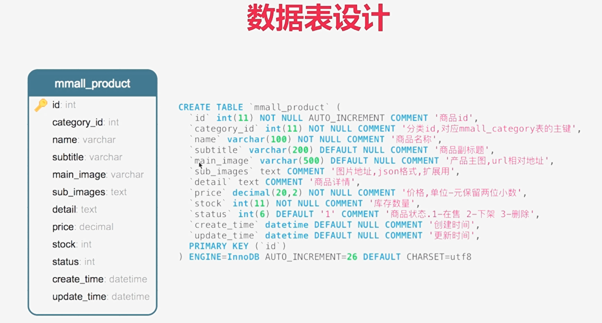

# 商品模块

## 前台功能

- 产品搜索

- 动态排序列表
- 商品详情

## 后台功能

- 商品列表
- 商品搜索
- 图片上传
- 富文本上传
- 商品详情
- 商品上下架
- 增加商品
- 更新商品

## 学习目标

- FTP服务的对接
- SpringMVC文件上传
- 流读取Properties配置文件
- 抽象POJO、BO、VO对象之间的转换关系及解决思路
- joda-time快速入门
- 静态块
- Mybatis-PageHelper高效准确地分页及动态排序
- Mybatis对List遍历的实现方法
- Mybatis对where语句动态拼装的几个版本演变

## 数据表设计

