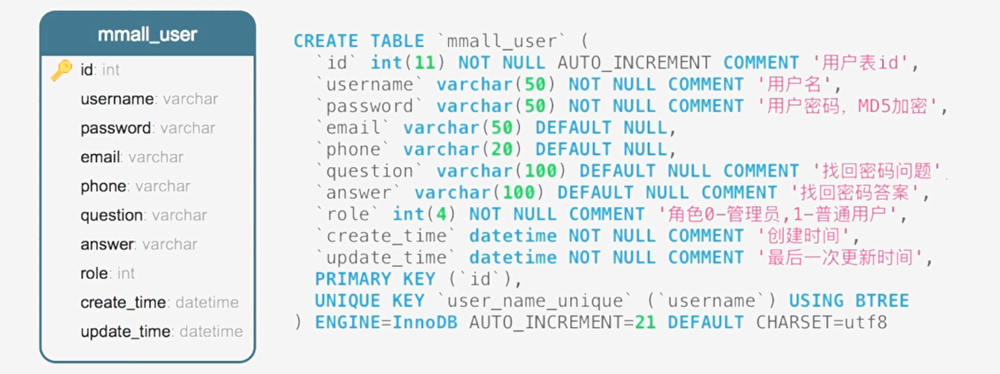

# 用户模块

- 登录
- 用户名验证
- 注册
- 忘记密码
- 提交问题答案
- 重置密码
- 获取用户信息
- 更新用户信息
- 退出登录

# 学习目标

- 横向越权、纵向越权安全漏洞
- MD5明文加密以及增加salt值
- Guava缓存的使用
- 高复用服务响应对象的设计思想及抽象封装

# 横向越权、纵向越权安全漏洞

- 横向越权：攻击者尝试使用与他拥有相同权限的用户的资源
- 纵向越权：低级别攻击者尝试访问高级别用户的资源

