# 实战导航

1. 抗压需求分析
2. 微服务基础设施构建
3. 微服务高并发抗压
4. 微服务解耦与高性能消费
5. 提升与优化网络传输数据
6. 分布式事务最佳解决方案

# 抗压需求

1. 双十一抗压场景分析
2. 用户购物车模块
3. 用户下单模块
4. 用户支付模块
5. 全链路高并发抗压方案

# 双十一抗压场景分析

- 电商平台，用户加入购物车-》用户下单-》用户支付

## 购物车

1. 用户加入购物车：设计缓存的业务维度
2. 添加商品操作：根据路由Key进行路由到不同的Redis集群
3. Redis集群不易过大：一般设置为一主两从
4. Redis数据同步问题：参考mysql binlog，配合RDB+AOF

## 下单

1. 用户下单请求：根据业务维度请求不同的SET化服务器进行处理
2. 注意高并发问题：流控、降级、兜底等
3. 订单与库存一致性：数据库表结构设计、接口调用的最终一致性

## 用户支付

1. 支付场景：A账户-money&&B账户+money
2. 传统方式：微服务同步调用强一致性+最终一致性（补偿）
3. MQ方式：MQ拆分复杂业务，保证高可靠投递/最终一致性问题

# 双十一抗压场景解决方案

1. 前端dns解析/软硬件负载均衡设施进行分流/限流
2. 缓存的业务维度拆分（比如按照业务特性进行拆分）
3. 微服务流控（guava RateLimiter/jdk semaphore/netflix hystrix）
4. 微服务熔断/降级/兜底（动态调整阈值/降级兜底策略等）
5. 微服务接口的幂等性保障（比如redis分布式锁做消息id去重）
6. 数据库分库分表策略（设计契合业务的维度，利用合适的负载均衡算法）
7. 冷热数据/读写分离（比如mysql读写分离/或es hive等）
8. 对有效业务数据的过滤与业务的解耦/微服务的拆分
9. 顺序消息机制，保障局部顺序并行化处理消息
10. 分布式事务，将A、B账户操作进行高度解耦，提高并发性能、吞吐量

# 微服务基础设施构建

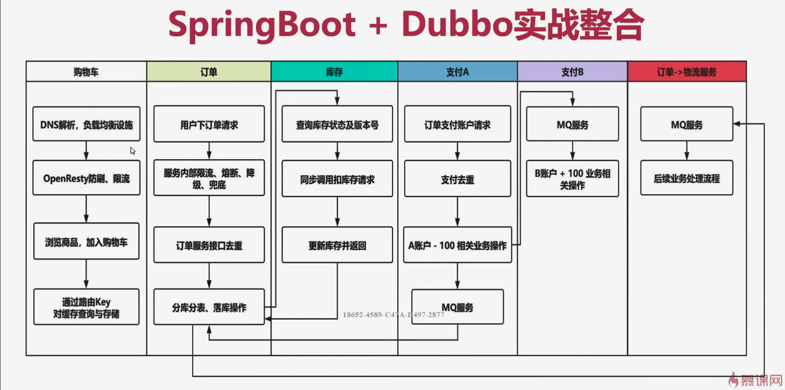

# 前端组件分流、限流设计

- 前端组件软负载均衡基础设施（lvs/nginx/haproxy）
- OpenResty防刷、限流

限流策略： 

1. 限制接口总并发数：按照ip限制其并发连接数
2. 平滑限制接口请求数：限制ip每分钟只能调用120接口（平滑处理请求，即每秒放过2个请求）
3. 限制接口时间窗请求数：限制ip每分钟只能调用120次接口（允许在时间段开始的时候一次性放过120个请求）

- 漏桶算法限流：限制ip每分钟只能调用120次接口（桶容量为120，平滑处理请求，即每秒放过2个请求），超过部分进入桶中等待，如果桶也满了，则进行限流
- 令牌桶算法限流：限制ip每分钟只能调用120次接口，但是允许一定的突发流量（突发的流量，桶的容量超过桶容量（120），直接拒绝。

# 规划业务边界-多集群缓存设计

设计集群时候最好一主两从

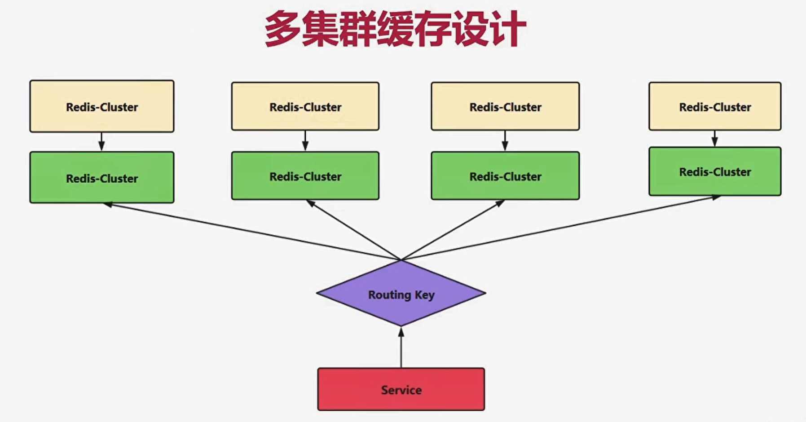

## 多级缓存设计-负载均衡算法

- 随机算法：获取多缓存集群节点的个数作为阈值，然后进行随机。
- 轮训算法：按照顺序获取服务列表的数据，并进行索引递增，当达到最后一个服务列表数据时，进行计数器清零，重新开始循环
- 加权重随机/轮训算法：放大加权重的某个集群节点，然后进行随机/轮训即可
- Hash算法：使用调用方IP地址的hash值，然后与服务列表大小进行取模作为索引，根据索引取值。

## 多集群缓存设计-缓存存储设计

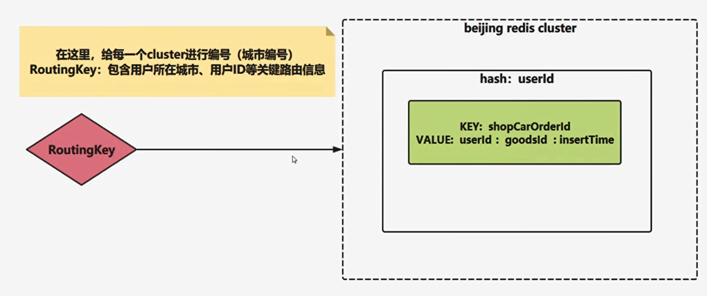

# Dubbo整合Hystrix断路器

1. 微服务架构调用的问题点
2. 网络原因、延迟
3. 请求剧增、积压
4. 线程资源无法释放等

- Netflix Hystrix

1. 控制远程访问系统、服务和第三方库
2. 对延迟、故障提供更强大的容错能力
3. 提供服务降级、熔断、线程隔离、请求缓存、合并、监控等功能

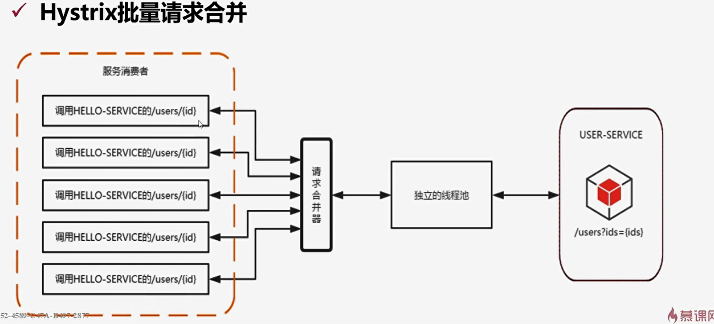

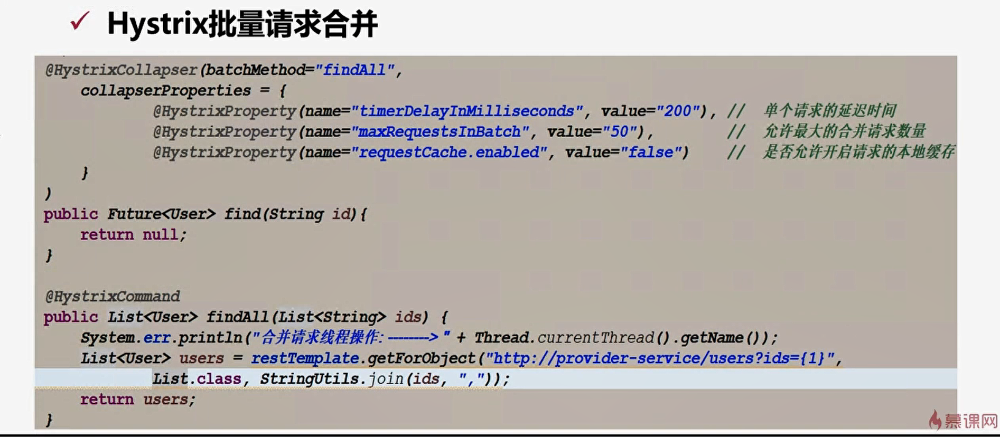

# 分库分表设计

 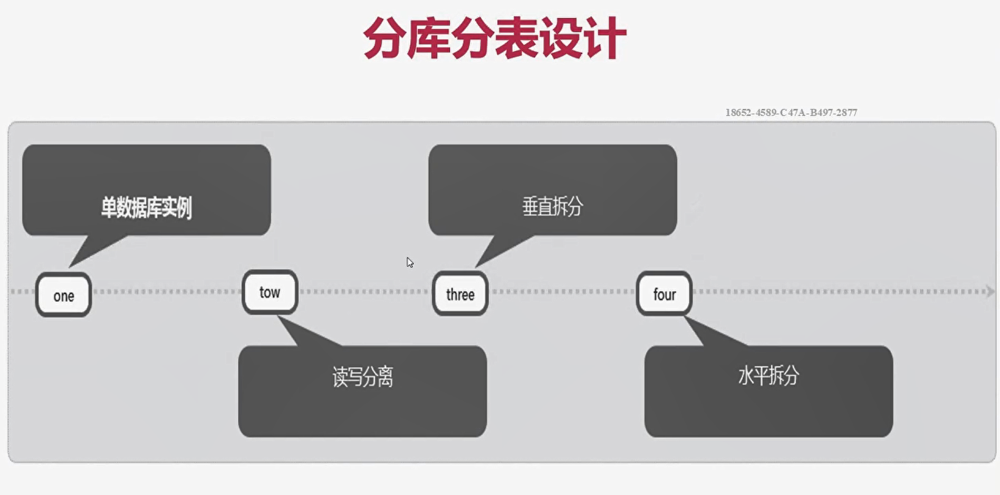

1. 水平分表，根据特定的规则（比如北京一个表，上海一个表）
2. 路由表结构，业务维度，查询效率，业务需求点，瓶颈
3. 数据源切换，多少个库表，切换策略，散表策略
4. 事务问题，分布式事务，衡量指标，压测结果

**实例**

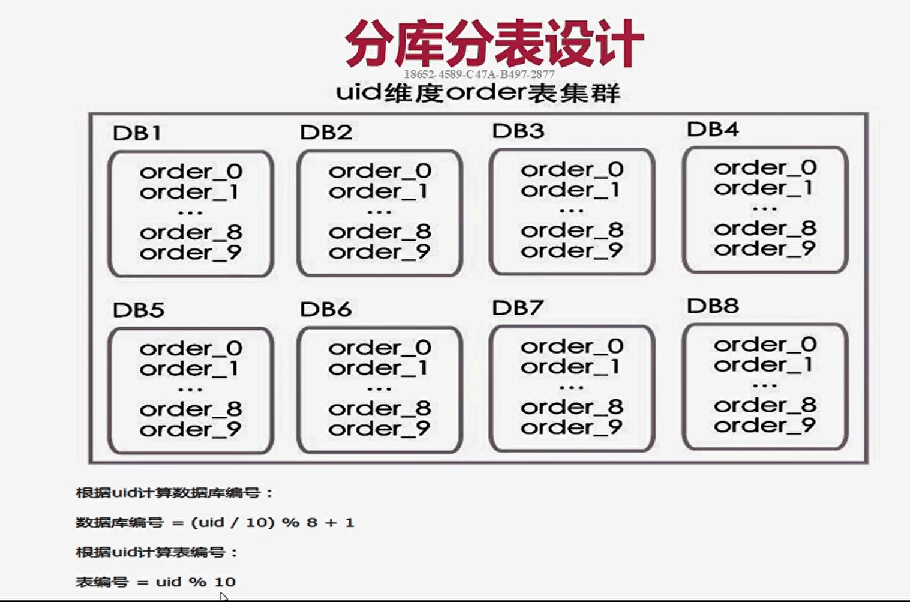

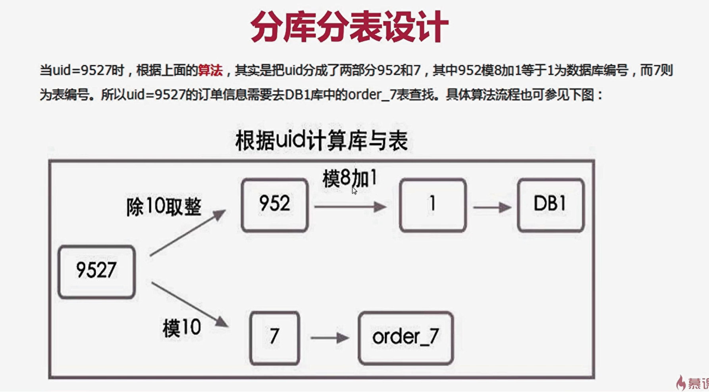

#  RocketMQ分布式事务消息

## 分布式事务架构设计

保证生产端100%可靠，消费端保证去重和幂等性，可以通过重试，回滚和人工干预来解决一致性

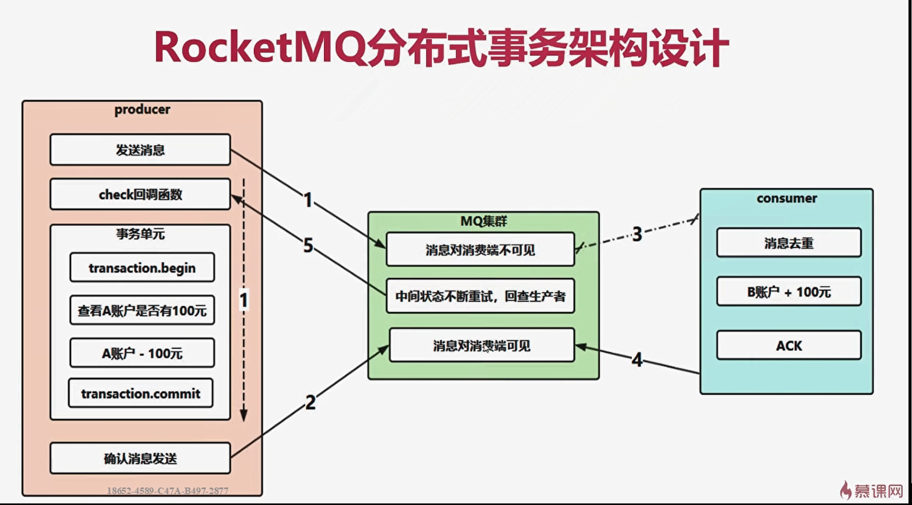

# RocketMQ顺序消费与微服务解耦

## 并行顺序消费-RocketMQ顺序消费的思想与设计

- 顺序消息：指的是消息的消费顺序和生产顺序相同
- 全局顺序：在某个topic下，所有的消息都要保证顺序（在高并发下不能保证全局顺序，所以没有意义）
- 局部顺序：只要保证每一组消息被顺序消费即可（RocketMQ实现局部顺序）

**消费端一个线程去监听一个队列**

## 并行顺序消费-RocketMQ顺序消费实战整合应用

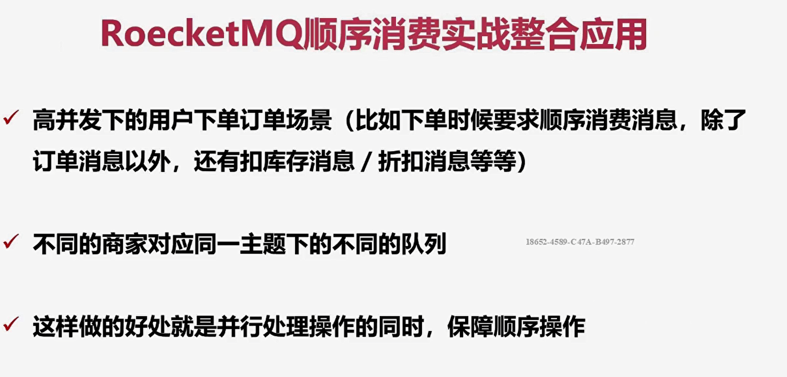

## 微服务解耦-使用RocketMQ划清业务边界

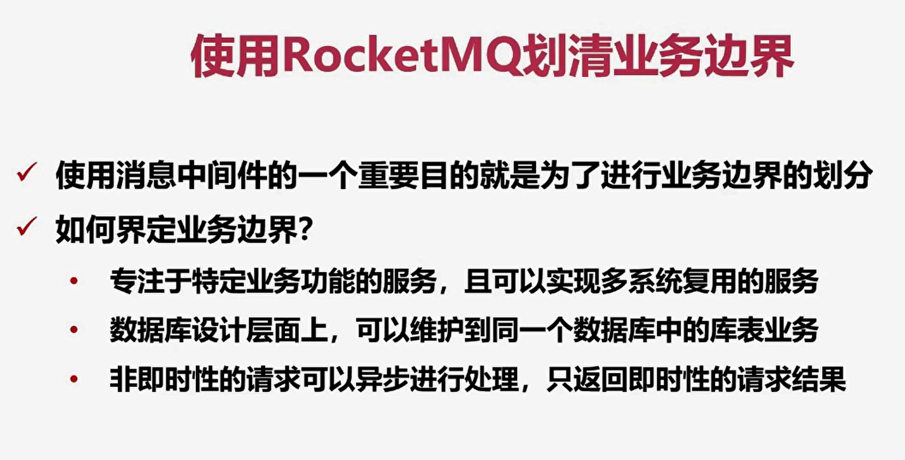

# 数据过滤与性能提升

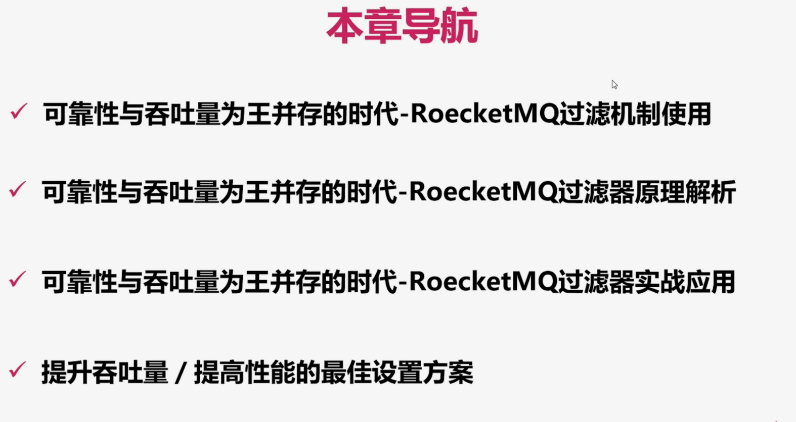

## RcoketMQ的过滤使用

- Tag方式进行消息过滤（**性能最高！**）
- 使用sql表达式方式进行过滤
- 使用filer server组件方式进行过滤

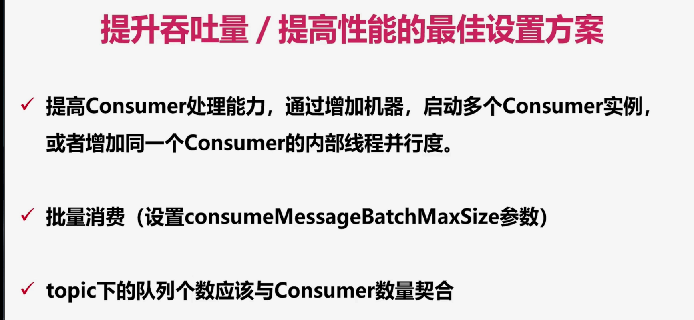

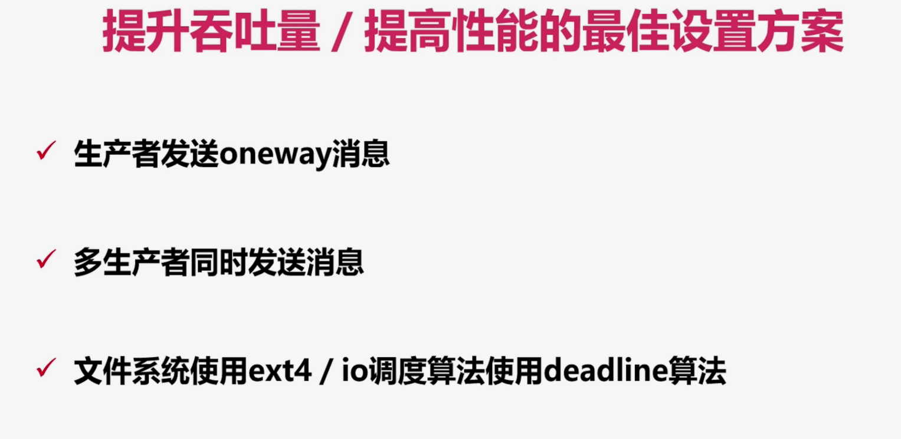