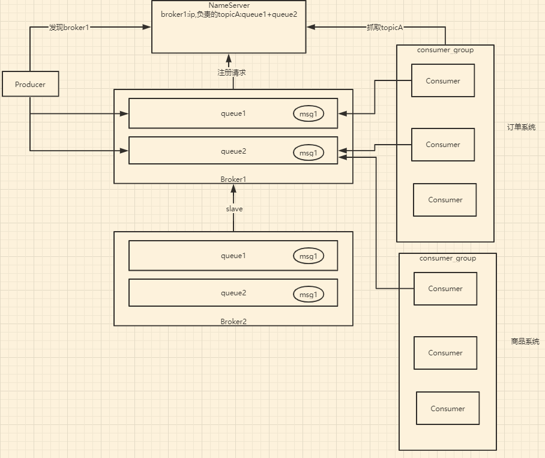
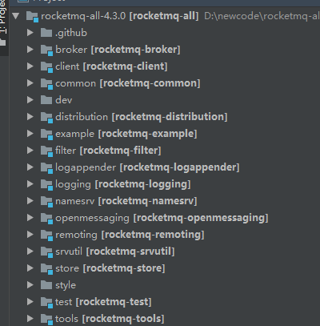

- RocketMQ-整体介绍
- RocketMQ-核心概念模型
- RocketMQ-源码包下载与结构说明
- RocketMQ环境搭建
- RocketMQ控制台使用介绍

# **异步消息队列rocketmq**

- 高性能，高并发，分布式消息中间件
- 典型应用场景：分布式事务，异步解耦

#  **RocketMQ整体认知**

RocketMQ是一款分布式、队列模型的消息中间件

- 支持集群模型、负载均衡、水平扩展能力
- 亿级别的消息堆积能力
- 采用零拷贝的原理、顺序写盘、随机读
- 丰富的API使用
- 代码优秀、底层通信框架采用Netty NIO框架
- NameServer代替Zookeeper
- 强调集群无单点，可扩展，任意一点高可用，水平可扩展
- 消息失败重试机制、消息可查询
- 开源社区活跃、成熟度（经历双十一考验）

# RocketMQ-概念模型

- Producer：消息生产者、负责产生消息、一般由业务系统负责产生消息
- Consumer：消息消费者：负责消费消息，一般是后台系统负责异步消费。
- Push Consumer：Consumer的一种，需要向Consumer对象注册监听
- Pull Consumer：Consumer的一种，需要主动请求Broker拉取消息
- Producer Group：生产者集合，一般用于发送一类消息
- Consumer Group：消费者集合，一般用于接受一类消息进行消费
- Broker：MQ消息服务（中转角色，用于消息存储于生产消费转发）

# **RocketMQ的源码结构**

- rocket-broker主要的业务逻辑，消息收发，主从同步，pagecache
- rocket-client客户端接口，比如生产者和消费者
- rocket-example示例，比如生产者和消费者
- rocket-common公用数据结构等等
- rocket-distribution编译模块，编译输出等
- rocket-fliter进行Broker过滤的不感兴趣的消息传输，减小带宽压力
- rocketmq-logappender、rocketmq-logging日志相关
- rocketmq-namesrv Namesrc服务，用于服务协调
- rocketmq-openmessaging对外提供服务
- rocketmq-remoting远程调用接口，封装Netty底层通信
- rocketmq-srvutil提供一些公用的工具方法，比如解析命令行参数
- rocketmq-store消息存储
- rocketmq-test、rocketmq-example
- rocketmq-tools管理工具，比如有名的mqadmin工具

