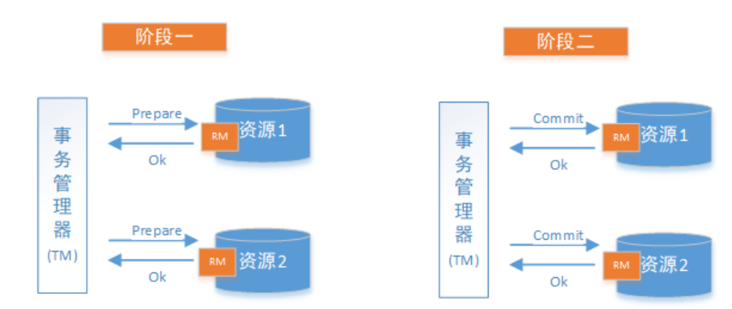
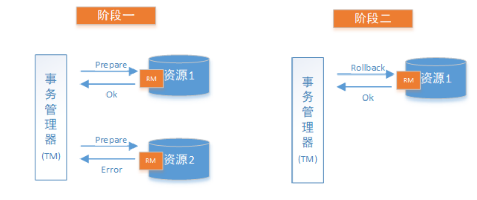

# 2PC(两阶段提交)

两阶段提交协议(Two Phase Commitment Protocol)中，涉及到两种角色

- 一个事务协调者（coordinator）：负责协调多个参与者进行事务投票及提交(回滚)
- 多个事务参与者（participants）：即本地事务执行者

在计算机中部分关系数据库如Oracle、MySQL支持两阶段提交协议，如下图：

1. 准备阶段（Prepare phase）：事务管理器给每个参与者发送Prepare消息，每个数据库参与者在本地执行事务，并写本地的Undo/Redo日志，此时事务没有提交。
   （Undo日志是记录修改前的数据，用于数据库回滚，Redo日志是记录修改后的数据，用于提交事务后写入数据文件）
2. 提交阶段（commit phase）：如果事务管理器收到了参与者的执行失败或者超时消息时，直接给每个参与者发送回滚(Rollback)消息；否则，发送提交(Commit)消息；参与者根据事务管理器的指令执行提交或者回滚操作，并释放事务处理过程中使用的锁资源。注意:必须在最后阶段释放锁资源。

**成功的情况** 

**失败的情况**

## Seata解决方案