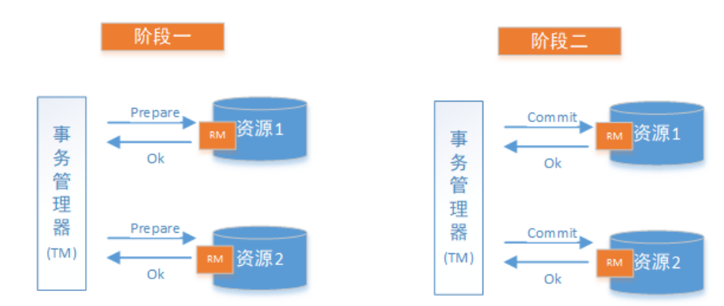
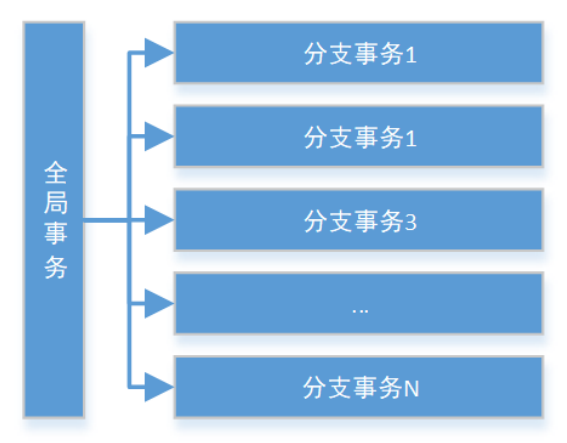
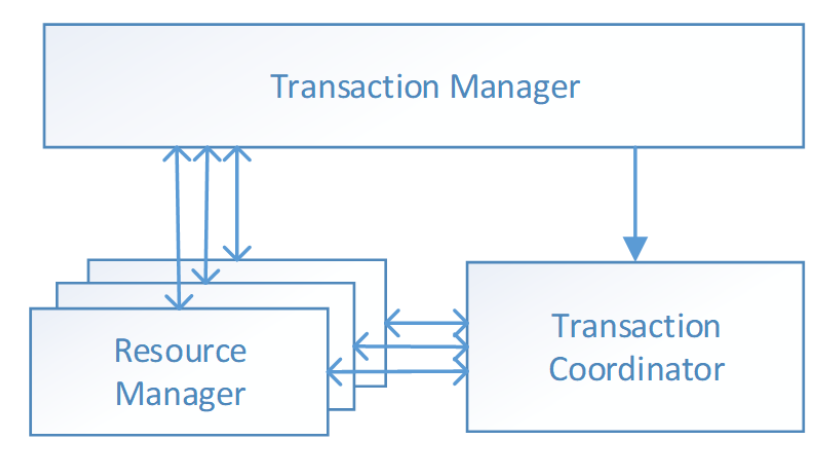

# 2PC(两阶段提交)

两阶段提交协议(Two Phase Commitment Protocol)中，涉及到两种角色

- 一个事务协调者（coordinator）：负责协调多个参与者进行事务投票及提交(回滚)
- 多个事务参与者（participants）：即本地事务执行者

在计算机中部分关系数据库如Oracle、MySQL支持两阶段提交协议，如下图：

1. 准备阶段（Prepare phase）：事务管理器给每个参与者发送Prepare消息，每个数据库参与者在本地执行事务，并写本地的Undo/Redo日志，此时事务没有提交。
   （Undo日志是记录修改前的数据，用于数据库回滚，Redo日志是记录修改后的数据，用于提交事务后写入数据文件）
2. 提交阶段（commit phase）：如果事务管理器收到了参与者的执行失败或者超时消息时，直接给每个参与者发送回滚(Rollback)消息；否则，发送提交(Commit)消息；参与者根据事务管理器的指令执行提交或者回滚操作，并释放事务处理过程中使用的锁资源。注意:必须在最后阶段释放锁资源。

**成功的情况** 

**失败的情况**

# Seata解决方案

解决分布式事务问题，有两个设计初衷

- 对业务无侵入：即减少技术架构上的微服务化所带来的分布式事务问题对业务的侵入
- 高性能：减少分布式事务解决方案所带来的性能消耗

seata中有两种分布式事务实现方案，AT及TCC

- AT模式主要关注多 DB 访问的数据一致性，当然也包括多服务下的多 DB 数据访问一致性问题
- TCC 模式主要关注业务拆分，在按照业务横向扩展资源时，解决微服务间调用的一致性问题

# AT模式(业务侵入小)

 Seata的设计目标其一是对业务无侵入，因此从业务无侵入的2PC方案着手，在传统2PC的基础上演进，并解决2PC方案面临的问题。

Seata把一个分布式事务理解成一个包含了若干**分支事务**的**全局事务**。全局事务的职责是协调其下管辖的分支事务达成一致，要么一起成功提交，要么一起失败回滚。此外，通常分支事务本身就是一个关系数据库的本地事务，下图是全局事务与分支事务的关系图：

与 传统2PC 的模型类似，Seata定义了3个组件来协议分布式事务的处理过程：

- Transaction Coordinator (TC)： 事务协调器，它是独立的中间件，需要独立部署运行，它维护全局事务的运
  行状态，接收TM指令发起全局事务的提交与回滚，负责与RM通信协调各各分支事务的提交或回滚。
- Transaction Manager (TM)： 事务管理器，TM需要嵌入应用程序中工作，它负责开启一个全局事务，并最终
  向TC发起全局提交或全局回滚的指令。
- Resource Manager (RM)： 控制分支事务，负责分支注册、状态汇报，并接收事务协调器TC的指令，驱动分
  支（本地）事务的提交和回滚。

还拿**新用户注册送积分**举例Seata的分布式事务过程：

具体的执行流程如下：
1. 用户服务的 TM 向 TC 申请开启一个全局事务，全局事务创建成功并生成一个全局唯一的XID。
2. 用户服务的 RM 向 TC 注册 分支事务，该分支事务在用户服务执行新增用户逻辑，并将其纳入 XID 对应全局
    事务的管辖。
3. 用户服务执行分支事务，向用户表插入一条记录。
4. 逻辑执行到远程调用积分服务时(XID 在微服务调用链路的上下文中传播)。积分服务的RM 向 TC 注册分支事
    务，该分支事务执行增加积分的逻辑，并将其纳入 XID 对应全局事务的管辖。
5. 积分服务执行分支事务，向积分记录表插入一条记录，执行完毕后，返回用户服务。
6. 用户服务分支事务执行完毕。
7. TM 向 TC 发起针对 XID 的全局提交或回滚决议。
8. TC 调度 XID 下管辖的全部分支事务完成提交或回滚请求。

# Seata实现2PC与传统2PC的差别

- 架构层次方面，传统2PC方案的 RM 实际上是在数据库层，RM 本质上就是数据库自身，通过 XA 协议实现，而
  Seata的 RM 是以jar包的形式作为中间件层部署在应用程序这一侧的。
- 两阶段提交方面，传统2PC无论第二阶段的决议是commit还是rollback，事务性资源的锁都要保持到Phase2完成
  才释放。而Seata的做法是在Phase1 就将本地事务提交，这样就可以省去Phase2持锁的时间，整体提高效率。

**其设计思路如图**

# 第一阶段

核心在于**对业务sql进行解析，转换成undolog，并同时入库**，这是怎么做的呢？先抛出一个概念`DataSourceProxy`代理数据源，通过名字大家大概也能基本猜到是什么个操作，后面做具体分析

# 第二阶段

分布式事务操作成功，则TC通知RM异步删除undolog

分布式事务操作失败，TM向TC发送回滚请求，RM 收到协调器TC发来的回滚请求，通过 XID 和 Branch ID 找到相应的回滚日志记录，通过回滚记录生成反向的更新 SQL 并执行，以完成分支的回滚

# sql解析与undolog生成

全局事务拦截成功后最终还是执行了业务方法的，但是由于Seata对数据源做了代理，所以sql解析与undolog入库操作是在数据源代理中执行的，箭头处的代理就是Seata对DataSource，Connection，Statement做的代理封装类

**流程如下**

1. 先判断是否开启了全局事务，如果没有，不走代理，不解析sql，避免性能下降
2. 调用`SQLVisitorFactory`对目标sql进行解析
3. 针对特定类型sql操作(INSERT,UPDATE,DELETE,SELECT_FOR_UPDATE)等进行特殊解析
4. 执行sql并返回结果

