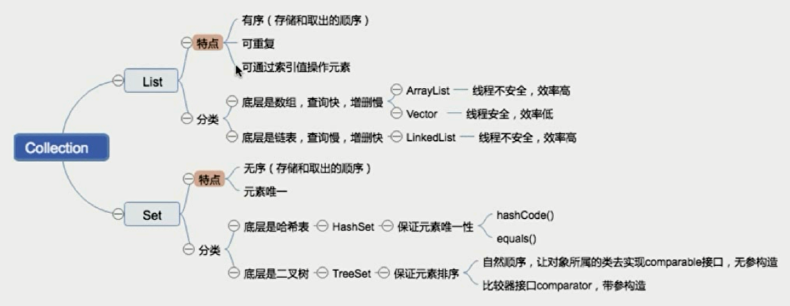
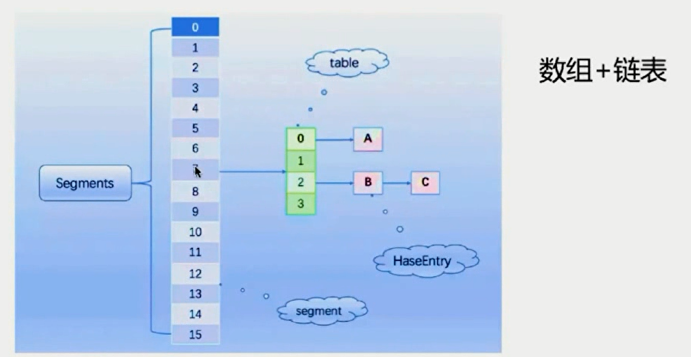
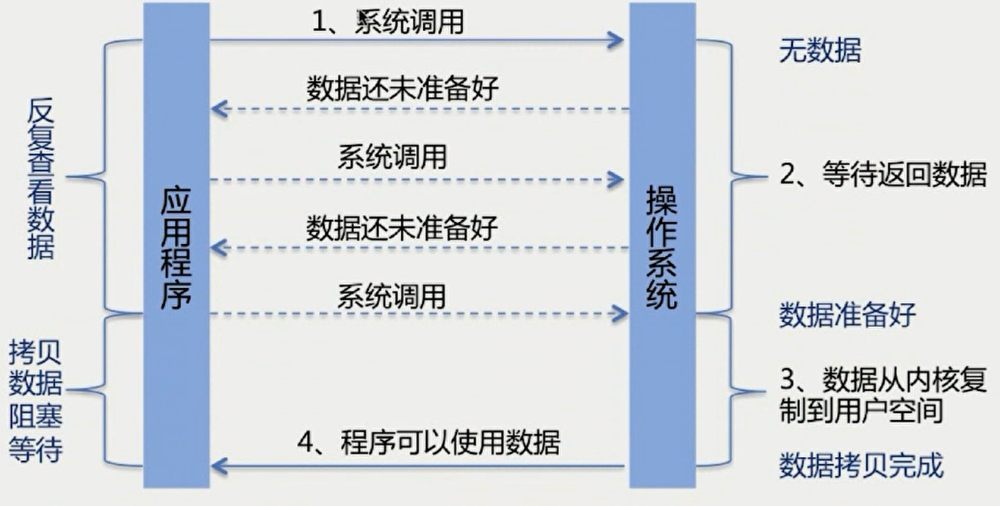
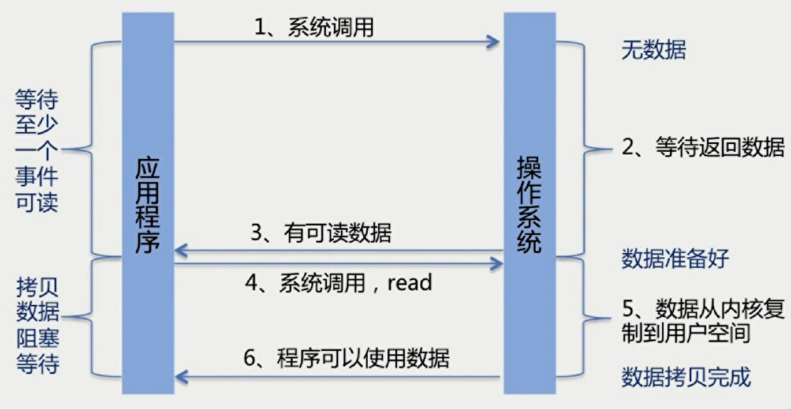

# String，StringBuffer，StringBuilder的区别

| String                                                       | StringBuffer                                                 | StringBuilder        |
| ------------------------------------------------------------ | ------------------------------------------------------------ | -------------------- |
| String的值是不可变的，这就导致每次对String的操作都会生成新的String对象，不仅效率低下，而且浪费大量优先的内存空间 | StringBuffer是可变类，和线程安全的字符串操作类，任何对它指向的字符串的操作都不会产生新的对象。每个StringBuffer对象都有一定的缓冲区容量，当字符串大小没有超过容量时，不会分配新的容量，当字符串大小超过容量时，会自动增加容量 | 可变类，速度更快     |
| 不可变                                                       | 可变                                                         | 可变                 |
|                                                              | 线程安全                                                     | 线程不安全           |
|                                                              | 多线程操作字符串用                                           | 单线程操作字符串下用 |

# Java异常

**异常处理机制主要回答了3个问题**

- What：异常类型回答了什么被抛出
- Where：异常堆栈跟踪回答了在哪抛出
- Why：异常信息回答了为什么被抛出

# Error和Exception的区别

**Java的异常体系**

- Error：程序无法处理的系统错误，编译器不做检查，JVM会停止运行
- Exception：程序可以处理的异常，捕获后可能恢复
- 总结：前者是程序无法处理的错误，后者是可以处理的异常

- RuntimeException：不可预知的，程序应当自行避免
- 非RuntimeException：可预知的，从编译器校验的异常

**从责任角度看：**

1. Error属于JVM需要负担的责任；
2. RuntimeException是程序应该负担的责任
3. checked Exception是可检查异常是Java编译器应该负担的责任

# 常见Error以及Exception

# Java的异常处理机制

- 抛出异常：创建异常对象，交由运行时系统处理
- 捕获异常：寻找合适的异常处理器处理异常，否则终止运行

## Java异常的异常处理原则

- 具体明确：抛出的异常应能通过异常类名和message准确说明异常的类型和产生异常的原因；
- 提早抛出：应尽可能早的发现并抛出异常，便于精确定位问题；
- 延迟捕获：异常的捕获和处理应尽可能延迟，让掌握更多信息的作用域来处理异常

## 高效主流的异常处理框架

在用户看来，应用系统发生的所有异常都是应用系统内部的异常

- 设计一个通用的继承自RuntimeException的异常来统一处理
- 其余异常都统一转译为上述异常AppException
- 在catch之后，抛出上述异常的子类，并提供足以定位的信息
- 由前端接受AppException做统一处理

## Java异常处理消耗性能的地方

- try-catch块影响JVM的优化
- 异常对象实例需要保存栈快照等信息，开销较大

 # Java集合框架

数据结构考点

- 数组和链表的区别；
- 链表的操作，如反转，链表环路检测，双向链表，循环链表相关操作
- 队列，栈的应用
- 二叉树的遍历方式及其递归和非递归的实现
- 红黑树的旋转

算法考点

- 内部排序：如递归排序，交换排序(冒泡、快排)、选择排序、插入排序
- 外部排序：应掌握如何利用有限的内存配合海量的外部存储来处理超大的数据及，写不出来要有相关的思路

考点扩展

- 哪些排序是不稳定的，稳定意味着什么
- 不同的数据集，各种排序最好或最差的情况
- 如何优化算法

# List和Set

# 集合之Map

# HashMap、HashTable、ConcurentHashMap

## HashMap(Java8以前)：数组+链表

## HashMap(Java8及以后)：数组+链表+红黑树

Treeify_Threshold默认值为8

## HashMap:put方法的逻辑

## HashMap：如何有效减少碰撞

- 扰动函数：促使元素位置分布均匀，减少碰撞几率
- 使用final对象,并采用合适的equals(）和hashCode()方法，以String，Interger等final类就非常适合

## HashMap：从获取hash到散列的过程

n为hash table数组的长度，总是2的n次方，所以可以用位运算取模

## HashMap：扩容问题

- 多线程环境下，调整大小会存在条件竞争，容易造成死锁 
- rehashing是一个比较耗时的过程  

## 如何优化Hashtable

- 通过锁的细粒度化，将整锁拆解成多个锁进行优化

## 早期的ConcurrentHashMap通过分段锁Segment来实现

## 当前的ConcurrentHashMap：CAS+synchronized使锁更细化

 synchronized只锁住链表或者红黑树的头结点

## ConcurrentHash：put方法的逻辑

# 三者区别

- HashMap线程不安全，数组+链表+红黑树
- Hashtable线程安全，锁住等个对象，数组+链表，效率非常低
- ConcurrentHashMap线程安全，CAS+同步锁，数组+链表+红黑树
- HashMap的key、value均可为null，而其他的两个类不支持

# ConcurrentHashMap总结

比起Segment，锁拆的更细

- 首先使用无锁操作CAS插入头结点，失败则循环重试
- 若头节点已存在，则尝试获取头节点的同步锁，再进行操作 

**ConcurrentHashMap：别的需要注意的点**

- size()方法和mappingCount()方法的异同，两者计算是否准确？
  - JDK1.7 和 JDK1.8 对 size 的计算是不一样的。 1.7 中是先不加锁计算三次，如果三次结果不一样在加锁。
  - JDK1.8 size 是通过对 baseCount 和 counterCell 进行 CAS 计算，最终通过 baseCount 和 遍历 CounterCell 数组得出 size。
  - JDK 8 推荐使用mappingCount 方法，因为这个方法的返回值是 long 类型，不会因为 size 方法是 int 类型限制最大值。
- 多线程环境下如何进行扩容

# JUC知识点

java.util.concurrent:提供了并发编程的解决方案

- CAS是java.util.concurrent.atomic包的基础
- AQS是java.util.concurrent.locks包以及一些常用类比如Semophore，ReentrantLock等类的基础
- AQS：AbstractQuenedSynchronizer抽象的队列式同步器。是除了java自带的synchronized关键字之外的锁机制。

**AQS的核心思想**是，如果被请求的共享资源空闲，则将当前请求资源的线程设置为有效的工作线程，并将共享资源设置为锁定状态，如果被请求的共享资源被占用，那么就需要一套线程阻塞等待以及被唤醒时锁分配的机制，这个机制AQS是用CLH队列锁实现的，即将暂时获取不到锁的线程加入到队列中。

## juc包的分类

## 并发工具类

**CountDownLatch：让主线程等待一组事件发生后继续执行**

- 事件指的是CountDownLatch里的countDown()方法

  

**CyclicBarrier：阻塞当前线程，等待其他线程，**

- 等待其它线程，且会阻塞自己当前线程，所有线程必须同时到达栅栏位置后，才能继续执行；
- 所有线程到达栅栏处，可以触发执行另外一个预先设置的线程

**Semaphore：控制某个资源可被同时访问的线程个数**

**Exchanger：两个线程到达同步点后，相互交换数据**

## 并发集合Collections

**BlockQueue：提供可阻塞的入队和出队操作**

主要用于生产者-消费者模型，在多线程场景时生产者线程在队列尾部添加元素，而消费者线程则在队列头部消费元素，通过这种方式能够达到将任务的生产和消费进行隔离的目的

# Java的IO机制

# BIO、NIO、AIO

**BIO：InputStream和OutputStream，Reader和Writer**

**NonBlock-IO：构建多路复用的，同步非阻塞的IO操作**

**NIO的核心**非阻塞IO

**IO多路复用**：调用系统级别的select/poll/epoll

## select、poll、epoll的区别

支持一个进程所能打开的最大连接数

**AIO**：异步IO

Asynchronous IO：基于事件和回调机制

AIO如何进一步加工处理结果

- 基于回调：实现CompletionHandler接口，调用时触发回调函数
- 返回Future：通过isDone()查看是否准备好，通过get()等待返回数据

## BIO、NIO、AIO对比

