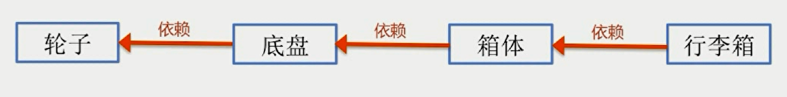
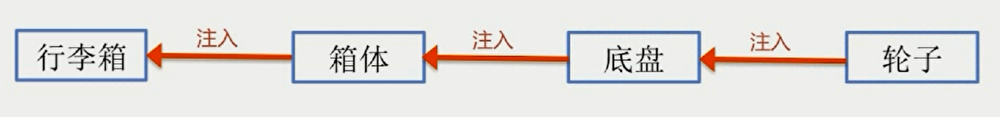
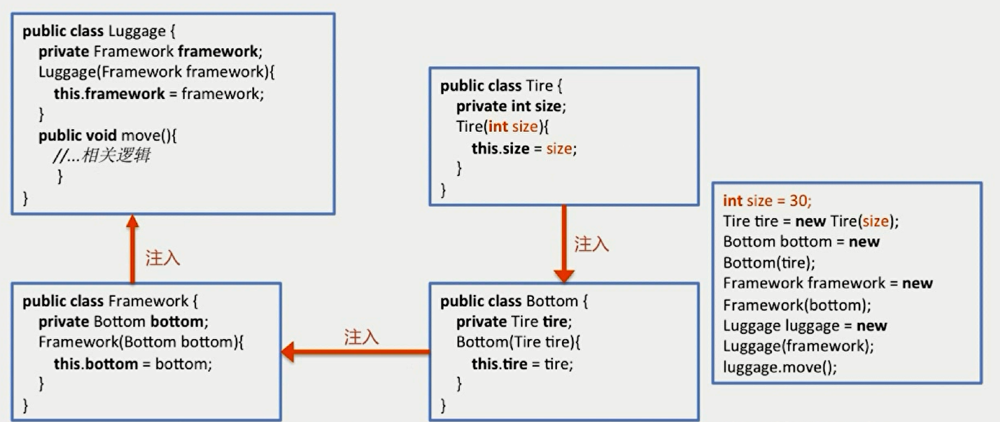
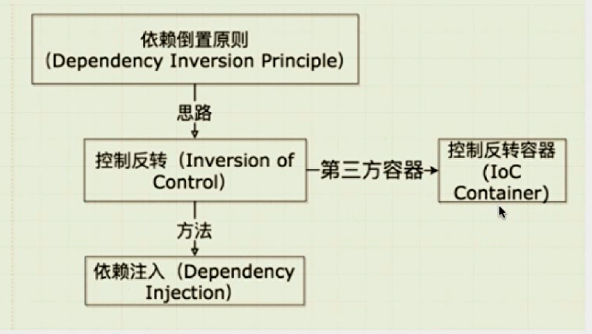
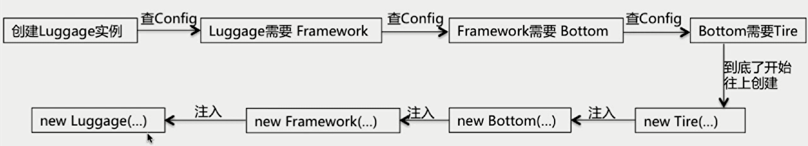
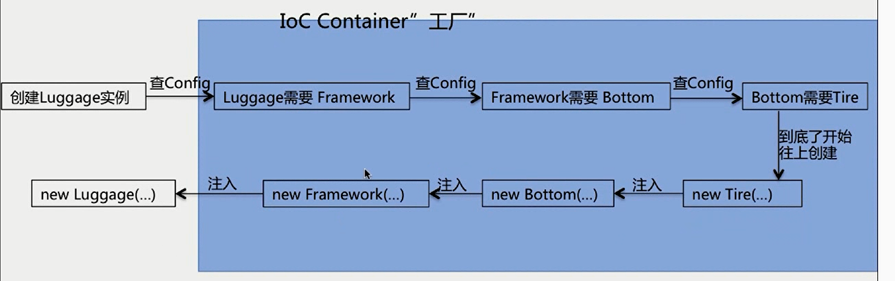
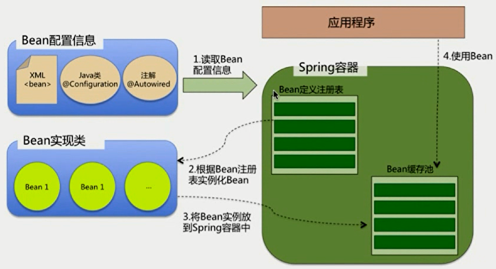

# 你了解Spring IOC么

IOC(Inversion of Control)：控制反转

- Spring Core最核心的部分
- 需要先了解依赖注入(Dependency Inversion)

DI举例：设计行李箱，如果要改轮子尺寸，就gg

改变思路：控制反转：**把底层类作为参数传递给上层类，实现上层对下层的控制**

# 依赖注入的方式

- Setter
- Interface ：实现特定接口
- Constructor
- Annotation ：例如Autowaired

# 依赖倒置、IOC、DI、IOC容器的关系

## IOC容器的优势

- 避免在各处使用new来创建类，并且可以做到统一维护
- 创建实例的时候，不需要了解其中的细节

蓝色部分是隐藏的部分，就像是一个工厂，我们不关心

Spring启动时，去读取应用容器中的bean配置信息，并在spring容器中生成一份相应的bean定义注册表，然后根据这张注册表去实例化bean，装配好bean之间的依赖关系，为上层准备就绪的运行环境，利用Java语言的反射功能实例化bean

## Spring IOC支持的功能

- 依赖注入（重要）
- 依赖检查
- 自动装配（重要）
- 支持集合
- 指定初始化方法和销毁方法
- 支持回调方法

## Spring IOC容器的核心接口

- BeanFactory
- ApplicationContext

## BeanFactory：Spring框架最核心的接口

- 提供IOC的配置机制
- 包含Bean的各种定义，便于实例化Bean
- 建立Bean之间的依赖关系
- Bean生命周期的控制

## BeanFactory与ApplicationContext的比较

- BeanFactory是Spring框架的基础设施，面向Spring
- ApplicationContext面向使用Spring框架的开发者

## ApplicationContext的功能(继承多个接口)

继承了以下接口

- BeanFactory：能够管理装配Bean
- ResourcePatternResolver：能够加载资源文件
- MessageSource：能够实现国际化等功能
- ApplicationEventPublisher：能够注册监听器：实现监听机制

## getBean方法的代码逻辑

- 转换beanName
- 从缓存中加载实例
- 实例化Bean
- 检测parentBeanFactory
- 初始化依赖的Bean
- 创建Bean

# Spring Bean的作用域

- singleton：Spring的默认作用域，容器里拥有唯一的Bean实例
- prototype：针对每个getBean请求，容器都会创建一个Bean实例
- request：会为每个Http请求创建一个Bean实例
- session：会为每个session创建一个Bean实例
- globalSession：会为每个全局Http Session创建一个Bean实例，该作用域仅对Portlet有效

# Spring Bean的生命周期

## 创建过程

1. 实例化Bean对象，以及设置Bean属性
2. 如果通过Aware接口设置的依赖关系，则会（注入Bean对容器的感知，比如Bean ID、BeanFactory和AppCtx）
3. BeanPostProcessor(s)的前置初始化方法postProcessBeforeInitialization，在Spring完成实例化之后，对Spring容器实例化的Bean添加一些自定义的处理逻辑 
4. 如果实现了InitializingBeang(s)接口，则会调用afterPropertiesSet方法，做一些属性被设置之后的自定义的事情
5. 调用Bean自身定义的init方法，做一些初始化相关的工作
6. 调用BeanPostProcessor(s)的后置初始化方法postPcocessAfterInitialization
7. Bean初始化完毕，就可以使用

## 销毁过程

- 若bean实现了DisposableBean接口，则会调用destroy方法
- 若配置了destry-method属性，则会调用其配置的销毁方法

# 你了解Spring AOP么

软件工程中：关注点分离：不同的问题交给不同的部分去解决，每个部分专注于自己的问题

- 面向切面编程AOP正是此种技术的体现
- 通用化功能代码的实现，对应的就是所谓的切面(Aspect)
- 业务功能代码和切面代码分开后，架构将变得高内聚低耦合
- 确保功能的完整性：切面最终需要被合并到业务中(织入weave)

## AOP的三种织入方式

- 编译时织入：需要特殊的Java编译器，如AspectJ
- 类加载时织入：需要特殊的Java编译器，如AspectJ和AspectWerkz
- 运行时织入：Spring采用的方式，通过动态代理的方式，实现简单，会有性能上的开销，好处就是不需要特殊的编译器和类加载器，按照写普通java程序的方式来进行就可以了

## AOP的主要名词概念

- Aspect：通用功能的代码实现
- Target：被织入Aspect的对象
- Join Point：可以作为切入点的机会，所有方法都可以作为切入点
- Pointcut：Aspect实际被应用在的Join Point，支持正则
- Adivce：类里的方法以及这个方法如何织入到目标方法的方式
- Weaving：Aop的实现过程

## Advice的种类

- 前置通知(Before)
- 后置通知(AfterReturning)
- 异常通知(AfterThrowing)
- 最终通知(After)
- 环绕通知(Around)

# AOP的实现：JdkProxy和Cglib

- 具体由哪种实现有AopProxyFactory根据AdvisedSupport对象的配置来决定
- 默认策略如果目标类是接口，则用JDKProxy来实现，否则用后者
- JDKProxy的核心：InvocationHandler接口和Proxy类，通过Java的反射机制来实现，并且要求被代理的类必须实现一个接口
- Cglib：通过修改字节码，借助ASM实现，ASM是一种可以修改字节码的框架，以继承的方式动态生成目标类的代理如果某个类是final的，是不能用cglib做动态代理的
- 反射机制在生成类的过程中比较高效
- ASM在生成类之后的执行过程中比较高效

## 代理模式：接口+真实实现类+代理类

其中真实实现类和代理类都是要实现接口的，实例化的时候，要使用代理类，SpringAOP需要做的是生成一个代理类替换掉真实实现类以对外提供服务

# Spring里代理模式的实现

- 真实实现类的逻辑包含在了getBean方法里
- getBean方法返回的实际上是Proxy的实例
- Proxy实例是Spring采用JDK Proxy或CGLIB动态生成的
- 所以SpringAOP只能管理Spring容器中的bean

