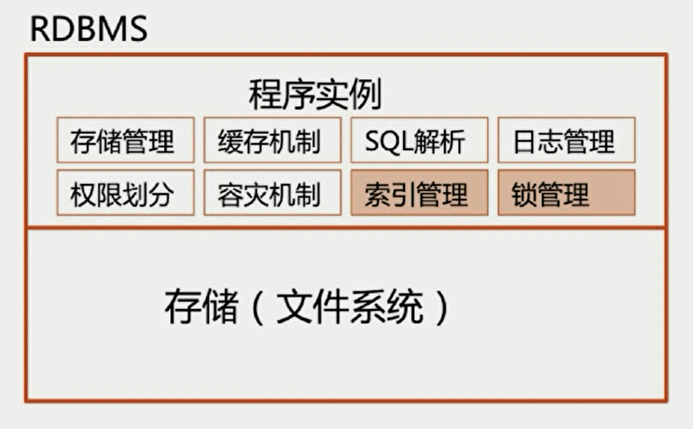

# 面试题：如何设计一个关系型数据库



# 索引模块

##  为什么要使用索引

  - 快速查询数据
  - 避免全表扫描，灵感来自于字典

## 什么样的信息能成为索引

  - 主键、唯一键以及普通键等

## 索引的数据结构

  - 生成索引，建立二叉查找树、B-Tree、B+Tree（主流）、Hash结构进行查找

## 密集索引和稀疏索引 

  - 密集索引文件中的每一个搜索码值都对应一个索引值
  - 稀疏索引文件只为索引码的某些值建立索引值 
	**innodb**
    
 **mysam**
    

  **InnoDB**

  - 若一个主键被定义，该主键则作为密集索引
  - 若没有主键被定义，该表的第一个唯一非空索引则作为密集索引
  - 若不满足以上条件，innodb内部会生成一个隐藏主键（密集索引）
  - 非主键索引存储相关键位和其对应的主键值，包含两次查找，一次查找次索引找到主键，一次查找主键索引

  

## B+Tree更适合用来做存储索引

  - B+树磁盘读写代价更低
  - B+树的查询效率更稳定
  - B+树更有利于对数据库的扫描

  

 ## 如何定位并优化慢查询Sql

1. 根据慢日志定位慢查询sql
2. 使用explain等工具分析sql
3. 修改sql或者尽量让sql走索引

## 联合索引的最左匹配原则的成因

联合索引是先根据第一个字段进行排序，然后再根据第二个字段进行排序，所以如果只用第二个字段就是无序的

## 索引是建立的越多越好么

- 数据量小的表不需要简历索引，建立会增加额外的索引开销
- 数据变更需要维护索引，因此更多的索引意味着更多的维护成本
- 更多的索引意味着也需要更多的空间

# 锁模块

## MyISAM与InnoDB关于锁方面的区别是什么

- MyISAM默认用的是表级锁，不支持行级锁
- InnoDB默认支持行级锁，也支持表级锁

## 数据库事务的四大特性

ACID


## 数据库 隔离级别以及各级别下的并发访问问题


**在实现上，数据库里面会创建一个视图，访问的时候以视图的逻辑结果为准。在“可重复读”隔离级别下，这个视图是在事务启动时创建的，整个事务存在期间都用这个视图。在“读提交”隔离级别下，这个视图是在每个SQL语句开始执行的时候创建的。这里需要注意的是，“读未提交”隔离级别下直接返回记录上的最新值，没有视图概念；而“串行化”隔离级别下直接用加锁的方式来避免并行访问。**


- 若隔离级别是“读未提交”， 则V1的值就是2。这时候事务B虽然还没有提交，但是结果已经被A看到了。因此，V2、V3也都是2。**（脏读）**
- 若隔离级别是“读提交”，则V1是1，V2的值是2。事务B的更新在提交后才能被A看到。所以， V3的值也是2。**（不可重复读）**
- 若隔离级别是“可重复读”，则V1、V2是1，V3是2。之所以V2还是1，遵循的就是这个要求：事务在执行期间看到的数据前后必须是一致的。
- 若隔离级别是“串行化”，则在事务B执行“将1改成2”的时候，会被锁住。直到事务A提交后，事务B才可以继续执行。所以从A的角度看， V1、V2值是1，V3的值是2。

# 幻读

有这么一张表，d是没有索引的

```sql
CREATE TABLE `t` (
  `id` int(11) NOT NULL,
  `c` int(11) DEFAULT NULL,
  `d` int(11) DEFAULT NULL,
  PRIMARY KEY (`id`),
  KEY `c` (`c`)
) ENGINE=InnoDB;

insert into t values(0,0,0),(5,5,5),
(10,10,10),(15,15,15),(20,20,20),(25,25,25);
```


其中，T5查出来的Q3读到id=1这一行的现象，被称为“幻读”。也就是说，幻读指的是一个事务在前后两次查询同一个范围的时候，后一次查询看到了前一次查询没有看到的行。

这里，我需要对“幻读”做一个说明：

1. 在可重复读隔离级别下，普通的查询是快照读，是不会看到别的事务插入的数据的。因此，幻读在“当前读”下才会出现。
2. 上面session B的修改结果，被session A之后的select语句用“当前读”看到，不能称为幻读。幻读仅专指**“新插入的行”。**

## InnoDB可重复读隔离级别下如何避免幻读

- 表象：快照度（非阻塞读）--伪MVCC
- 内在：next-key锁（行锁+gap锁） 

### 对主键索引或者唯一索引会用Gap锁吗

- 如果where条件全部命中，则不会Gap锁，只会加记录锁
- 如果where条件部分命中或者全不命中，则会加Gap锁

### Gap锁会用在非唯一索引或者不走索引的当前读中

(]左开右闭区间

## 当前读和快照读

- 当前读：select....lock in share mode，select ....for update
- 当前读：update，delete，insert
- 快照度：不加锁的非阻塞读，select （读到的可能不是最新版本的数据）


## RC,RR级别下InnoDB的非阻塞读如何实现

- 数据行里的DB_TRX_ID、DB_ROLL_PTR、DB_ROW_ID字段
- undo日志
- 第一次使用快照读的时候，生成read view


# 语法部分

## 关键语法

- GROUP BY 
- HAVING
- 统计相关：COUNT,SUM,MAX,MIN,AVG

## GROUP BY

- 满足“SELECT字句中的列名必须为分组列或列函数”，如果用group by，那么你的Select语句中选出的列，要么是你groupby里用到的列，要么就是带有之前我们说的如sum min等列函数的列，针对同一张表成立
- 列函数对于group by字句定义的每个组各返回一个结果 

## HAVING

- 通常与GROUP BY 字句一起使用
- WHERE过滤行，HAVING过滤组
- 出现在同一sql的顺序：WHERE>GROUP BY>HAVING


 