# 1、OSI开放式互联参考模型

  **概念性框架**

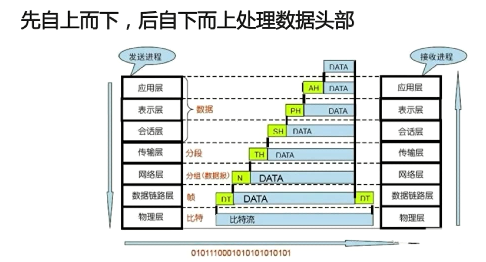

# 2、OSI的实现：TCP/IP

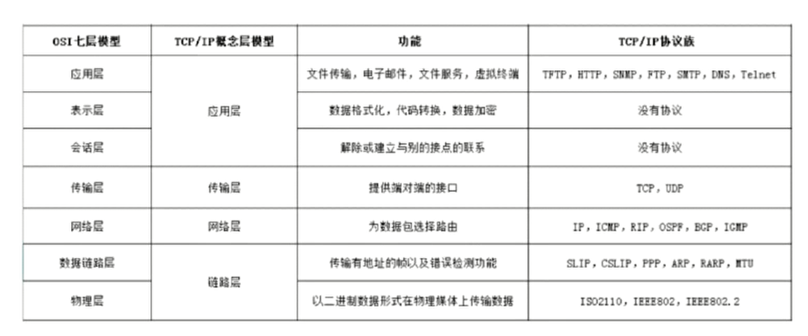

**先自上而下，后自下而上处理数据头部**

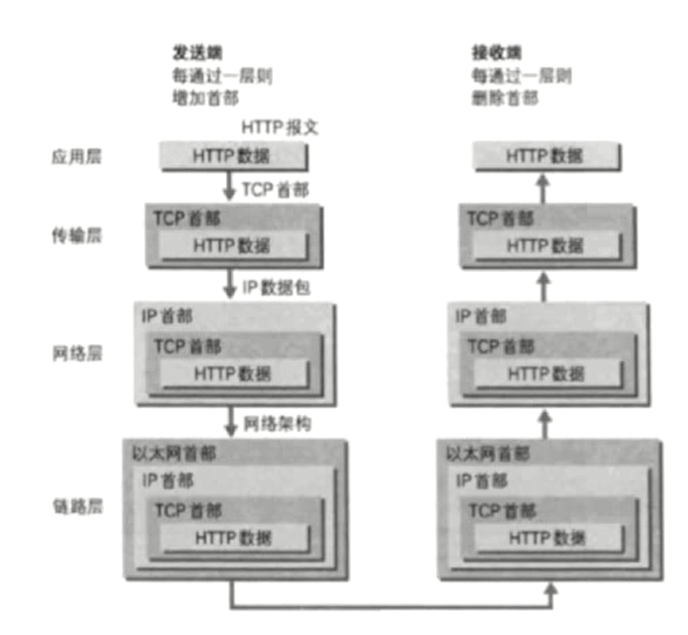

# **3、说说TCP的三次握手**

1. 面向连接的、可靠的、基于字节流的传输层通信协议
2. 将应用层数据流分割成报文段并发送给目标节点的TCP层
3. 数据包都有序号，对方收到则发送ACK确认，未收到则重传
4. 用来校验和来检验数据在传输过程中是否有误

**TCP报文头**

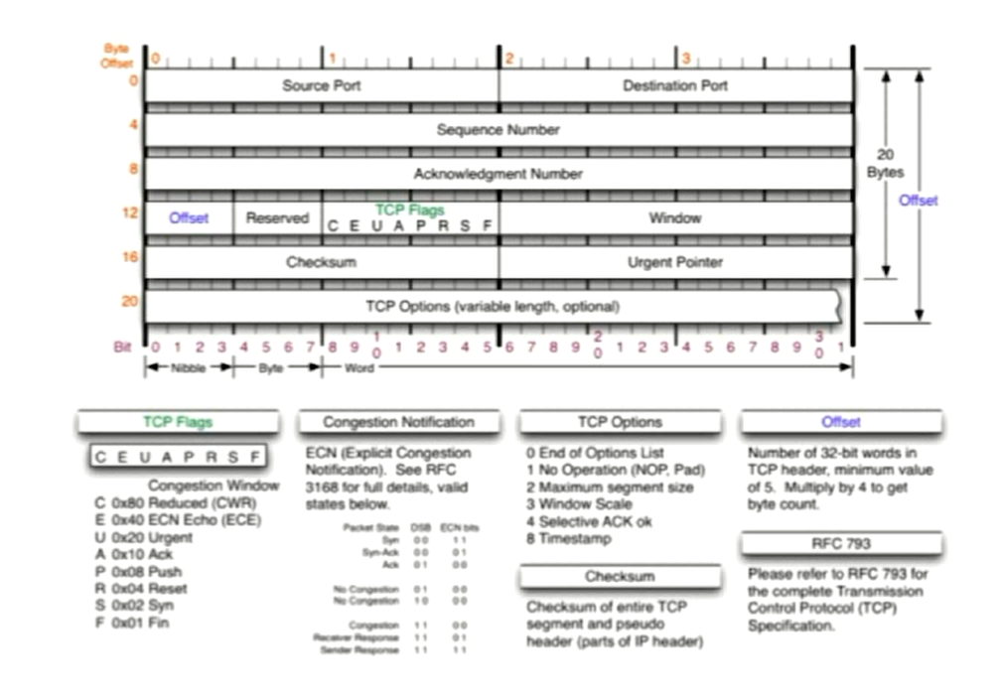

**TCP连接是全双工的**

**TCP Flags**

1. URG:紧急指针标志
2. ACK：确认序号标志
3. PSH：push标志
4. RST：重置连接标志
5. SYN：同步序号，用于建立连接过程
6. FIN：finish标志，用于释放连接

**"握手"是为了建立连接，TCP三次握手的流程图如下：**

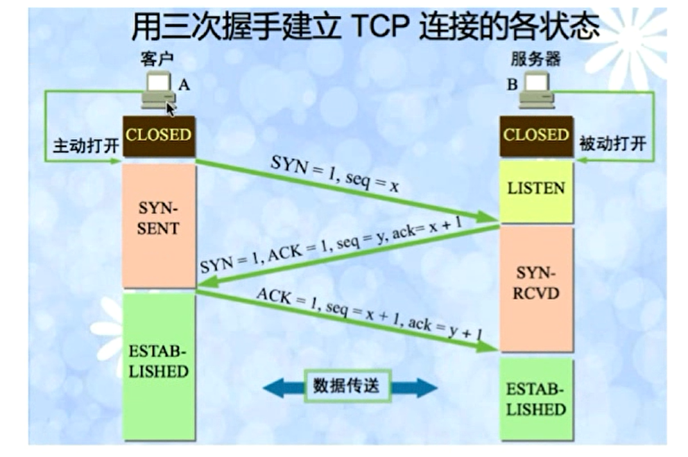

**在TCP/IP协议中，TCP协议提供可靠的连接服务，采用3次握手建立一个连接** 

- **第一次握手：主机A向主机B发送TCP连接请求数据包，其中包含主机A的初试序列号seq(A)=x。(其中报文中同步标志位SYN=1，ACK=0，表示这是一个TCP连接请求数据报文；seq=x，表明传输数据时的第一个数据字节的序号是x)，并进入SYN_SENT状态，等待服务器确认；**
- **第二次握手：主机B接受到请求后，会发回连接确认数据包。(其中确认报文段中，标识位SYN=1，ACK=1，表示这是一个TCP连接响应数据报文，并包含主机B的初始序列号seq(B)=y,以及主机B对主机A的初始序列号确认号ack(B)=seq(A)+1=x+1)，此时服务器进入SYN_RECV状态；**
- **第三次握手：主机A收到主机B的确认报文后，还需作出确认，即发送一个序列号seq(A)=x+1;确认号为ack(A)=y+1的报文,此包发送完毕，客户端和服务器进入ESTABLISHED状态，完成三次握手**

# **为什么需要三次握手才能建立起连接**

为了初始化Sequence Number即上图中的x，y。通信双方要告诉对方自己初始化的Sequence Number,作为以后数据通信的序号,以保证应用层接收到的数据，不会因为网络上的传输问题而乱序，即TCP会用这个序号来拼接数据。

**首次握手的隐患----SYN超时**

**问题起因分析**

1. Server收到Client的SYN，回复SYN-ACK的时候未收到ACK确认
2. Server不断重试直到超时，Linux默认等待63s才断开连接。（默认重试次数为5次，重试的间隔时间从1s开始，每次都翻倍1+2+4+8+16=31s，第5次发出去之后，还需要等待32s才能判定超时，所以一共63s）

**后果：SYN Flood攻击，恶意程序给服务器发1个SYN报文之后下线。让服务器等63s**

针对SYN Flood的防护措施

1. SYN队列满后，通过tcp_syncookies参数回发SYN Cookie
2. 若为正常连接则Client会回发SYN Cookie，直接建立连接

**建立连接后，Client出现故障怎么办**

**保活机制**

1. 向对方发送保活探测报文，如果未收到响应则继续发送
2. 尝试次数达到保活探测数，仍未收到响应则中断连接

# **4、谈一谈TCP的四次挥手**

**“挥手”是为了终止连接，TCP四次挥手的流程图如下：（总共发出4个包）**

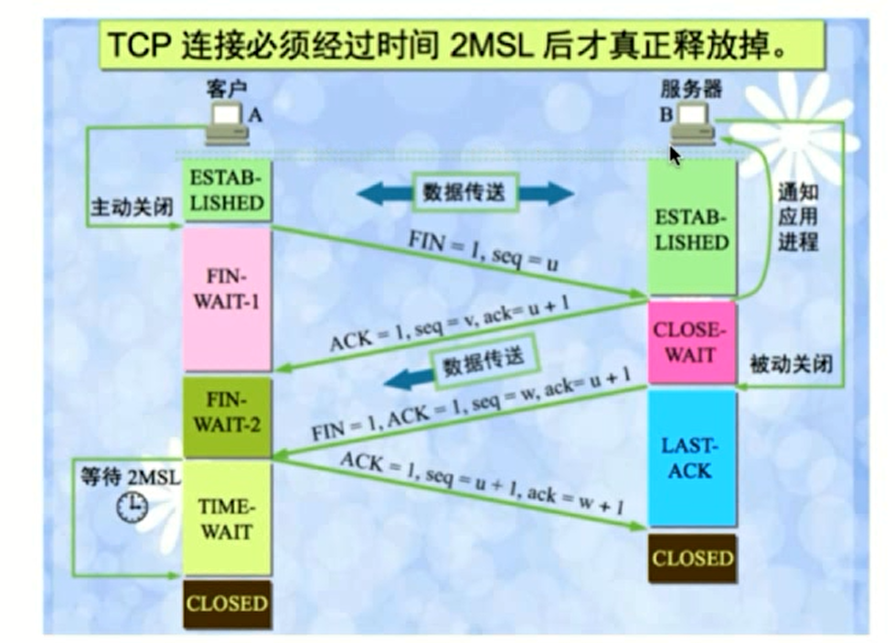

因为第二次挥手之后，服务端还可以发送数据，所以seq变成了w

**由于TCP连接是全双工的，连接的拆除需要发送四个包，因此称为“四次挥手”。客户端或服务器均可主动发起挥手动作，在socket编程中，任何一方执行close()操作即可产生挥手操作。**

1. **第一次挥手：关闭客户端到服务器的连接；首先客户端A发送一个FIN报文，用来关闭客户到服务器的数据传送，然后等待服务器的确认，其中终止标志位FIN=1，序列号seq=u，ClientA进入FIN_WAIT_1状态；**
2. **第二次挥手：Server收到FIN后，发送一个ACK给Client，确认序号ack为收到的序号+1(与SYN相同，一个FIN占用一个序号)，Server进入CLOSE_WAIT状态**
3. **第三次挥手：Server发送一个FIN，用来关闭Server到 Client的数据传输，Server进入LAST_ACK状态；**
4. **第四次挥手：Client收到FIN后，Client进入TIME_WAIT状态，接着发送一个ACK给Server，确认序号ack为收到序号+1，Server进入CLOSED状态，完成四次挥手**首先进行关闭的一方将执行主动关闭，而另一方执行被动关闭

 **MSL为最长报文段寿命**

**为什么会有TIME_WAIT状态**

1、确保有足够的时间让对方收到ACK包，如果被动关闭的那方没有收到ACK，就会触发被动端重发FIN包，一来一去正好2个MSL

2、避免新旧连接混淆，有些路由器会缓存IP数据包，如果连接被重用了，那么这些延迟收到的包可能会跟新连接混在一起

# **为什么需要四次握手才能断开连接**

因为TCP连接是全双工的，所以发送方和接收方都需要FIN报文和ACK报文，所以发送方和接收方各需要2次挥手

由于TCP连接是全双工的，因此每个方向都必须单独进行关闭，这个原则是当一方完成它的数据发送任务后就能发送一个FIN来终止这个方向的连接，收到一个FIN只意味着这一方向上没有数据流动，一个TCP连接在收到一个FIN后仍能发送数据，首先进行关闭的一方将执行主动关闭，而另一方执行被动关闭。

**服务器出现大量CLOSE_WAIT状态的原因**

其中一个表现：客户端一直在请求，但是返回给客户端的信息是异常的，但是服务器压根没收到请求 

对方关闭socket连接，我方忙于读或写，没有及时关闭连接

1、检查代码，特别是释放资源的代码

2、检查配置，特别是处理请求的线程配置，比如线程池中的线程数配置不合理

# TCP为什么可靠

三次握手，超时重传，滑动窗口，拥塞控制

**5、UDP简介**

**UDP报文结构**

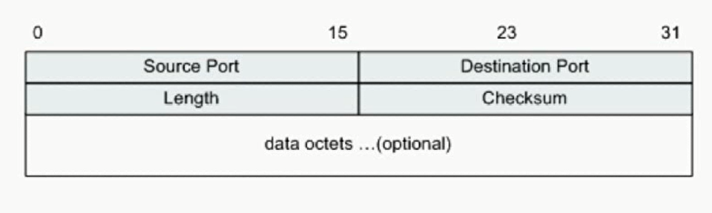

**UDP的特点**

1. 面向非连接
2. 不维护连接状态，支持同时向多个客户端传输相同的消息
3. 数据包报头只有8个字节（相对于TCP的20个字节信息报头），额外开销较小
4. 吞吐量只受限于数据生成速率，传输速率以及机器性能
5. 尽最大努力交付，不保证可靠交付，不需要维持复杂的链接状态表
6. 面向报文，不对应用程序提交的报文信息进行拆分或者合并

**TCP和UDP的区别**

1. TCP面向连接vsUDP面向无连接
2. TCP通过握手确认和重传机制来保证可靠性，UDP是不可靠的
3. 有序性，TCP利用序列号保证了消息报的顺序交互，到达可能无序，但TCP最终会排序，UDP不具备有序性
4. 速度：TCP速度较慢，因为要建立连接，保证消息的可靠性和有序性。UDP速度更快
5. 量级，TCP重量级，UDP轻量级。体现在元数据的头大小，TCP20字节，UDP8字节

# **TCP的滑动窗口**

**RTT和RTO**

- RTT（Round-Trip Time）：发送一个数据包到收到对应的ACK，所花费的时间
- RTO(Retransmission Time Out)：重传时间间隔，是根据RTT计算出来的

**TCP通过滑动窗口做流量控制与乱序重排**

- 保证TCP的可靠性
- 保证TCP的流控特性

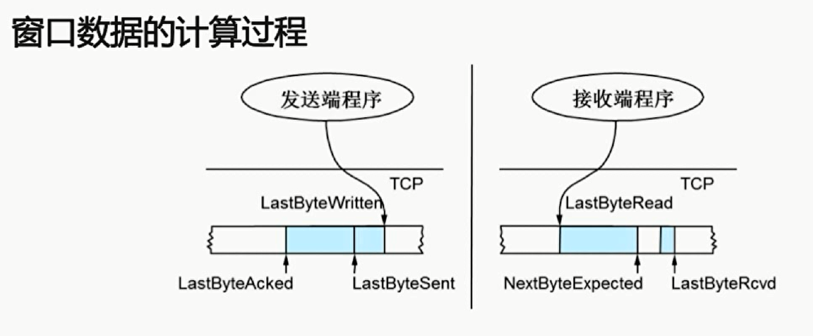

从左到右发送或者接收

发送端：

LastByteWriten：上层应用已写完的最后一个字节位置，即当前程序已经准备好的最新的一个数据段

LastByteSent：指向已发送的最后一个字节的位置，只是发出去了，还没收到ACK的回应

LastByteAcked：指向收到的最大ACK的位置

接收端：

LastByteRead：表示上层应用已经读完的最后一个字节的位置，已经给回执的最后一个位置

NextByteExpected：收到连续最大的sequence的位置

LastByteRcvd：已经收到的最后一个字节的位置 

**接收方还能接受的量**

**和窗口内剩余可发送的量**

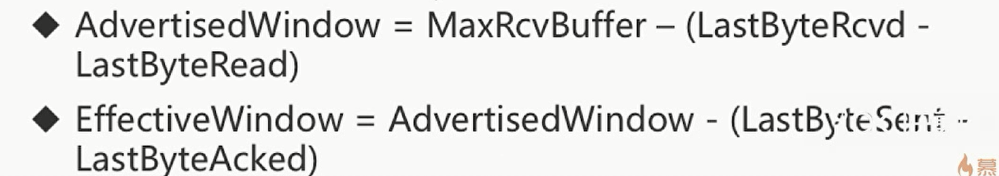

**TCP会话的发送方**

**Category2,3组成滑动窗口**

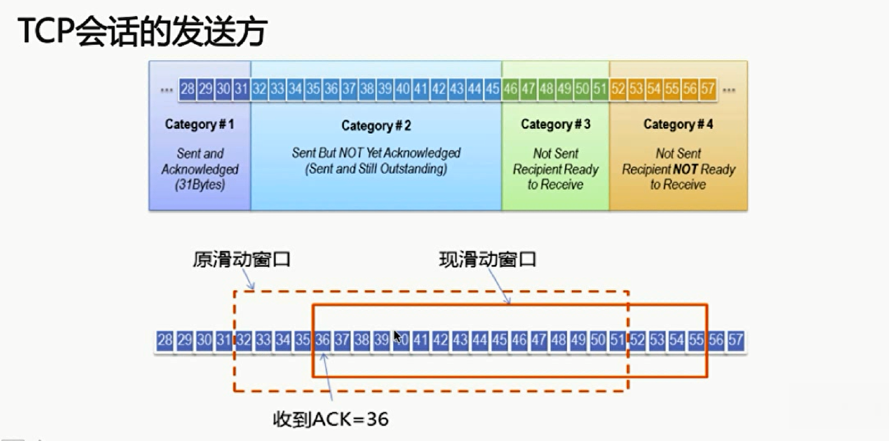

**TCP会话的接收方**

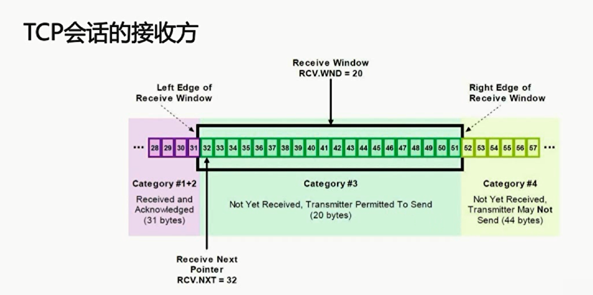

**TCP最基本的传输可靠性来源于确认重传机制，TCP的滑动窗口的可靠性，也是建立在确认重传基础上的，发送窗口只有收到接收端对于本段发送窗口内字节的ACK确认，才会移动发送窗口的左边界，接受窗口只有在前面所有的段都确认的情况下，才会移动左边界。当前面还有字节未接受，但收到后面的字节的情况下，窗口是不会移动的，并不对后续字节确认，以此确保重传。滑动窗口的大小可以根据一定策略动态调整。例如会根据自身的处理能力的变化，通过本端TCP接受窗口大小的控制来实现对端的发送窗口进行流量限制**

