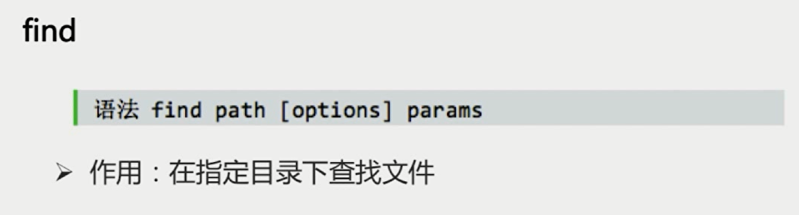
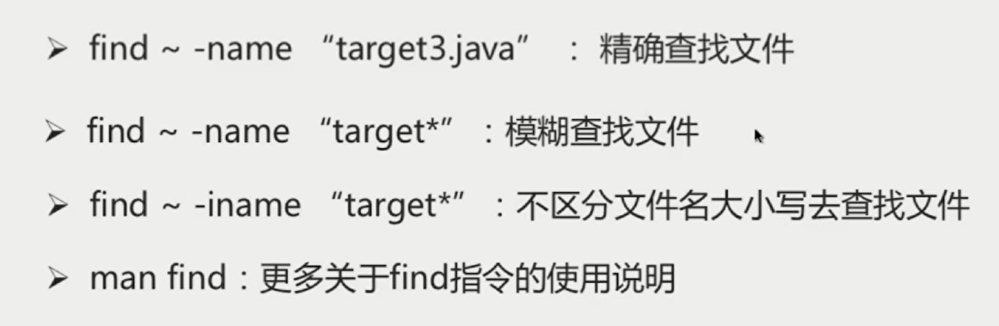
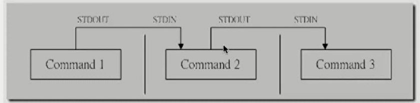
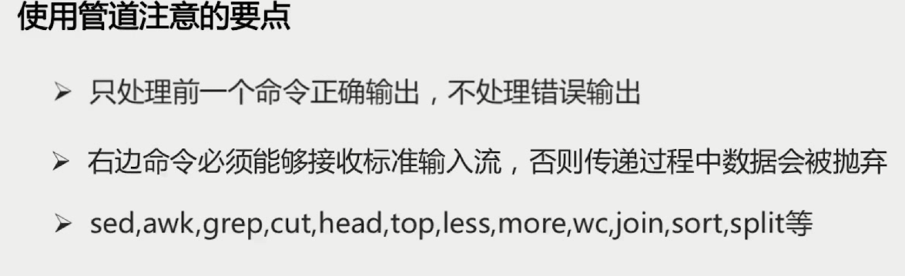
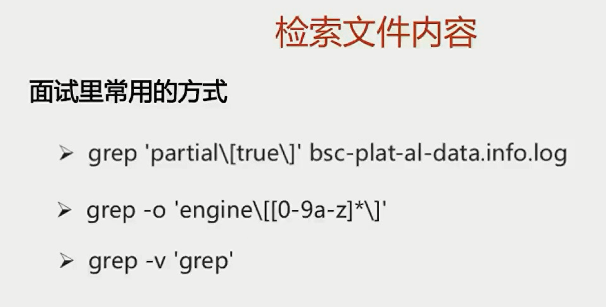
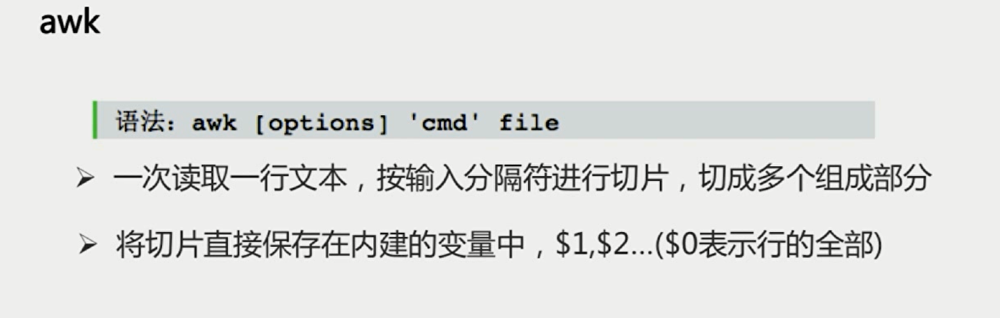
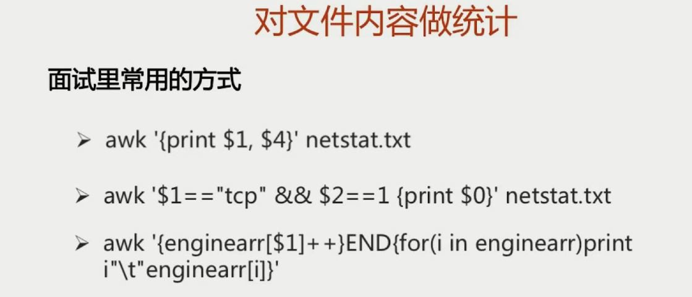
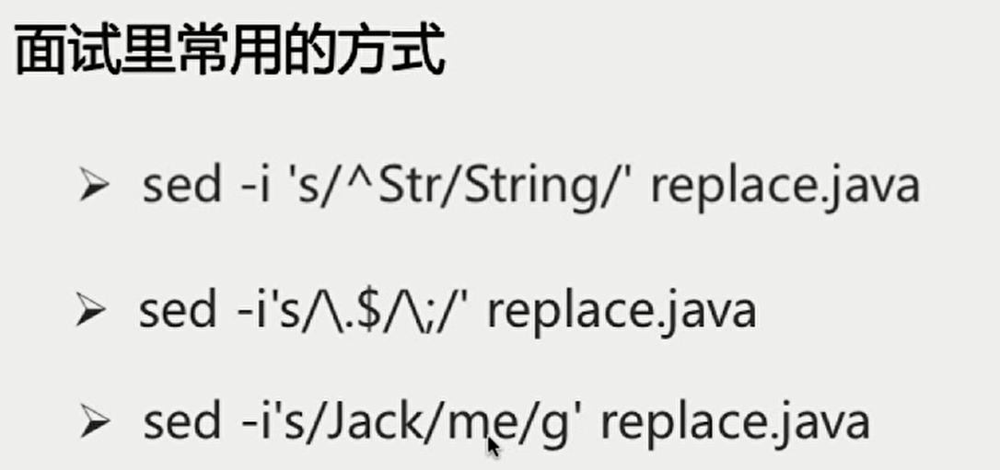

# Linux的体系结构

- 体系结构主要分为用户态（用户上层活动）和内核态
- 内核：本质是一段管理计算机硬件设备的程序
- 系统调用：内核的访问接口，是一种能再简化的操作
- 公用函数库：系统调用的封装（组合拳）
-  Shell：命令解释器，可编程

# 如何找到特点的文件

find

`find / -name "target3.java"`   精确查找文件

`find ~ -name "target* "`  模糊查找文件

# 检索文件内容

**grep**

`语法：grep [options] pattern file`

- 作用：查找文件里符合条件的字符串

**管道操作符|**

- 可将指令连接起来，前一个指令的输出作为后一个指令的输入

**使用管道注意的要点**

# 对文件内容做统计

awk

# 批量替换文本内容

sed

`语法：set [option] 'sed command' filename`

- 全名stream editor，流编辑器
- 适合用于对文本的行内容进行处理

替换Str开头的行，变成String

替换.结尾，换成;

将Jack换成me，没有g则替换每一行第一个

