# 进程和线程的区别

**进程是资源分配的最小单位，线程是cpu调度的最小单位**

- 所有与进程相关的资源，都被记录在进程控制块PCB中，以表示该进程拥有这些资源或者占有他们

  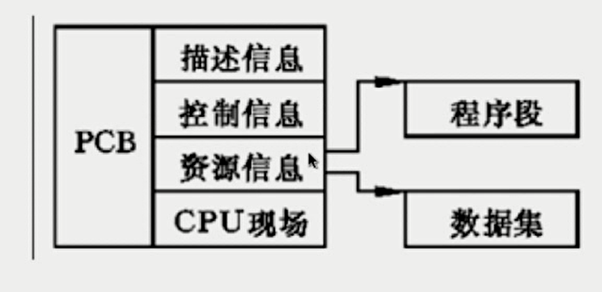

- 进程是抢占处理机的调度单位（拥有一个完整的虚拟内存空间，当进程发生调度的时候，不同进程拥有不同的虚拟地址空间，而同一进程内的线程共享同一虚拟地址空间），线程属于某个进程，共享其资源

- 线程只由堆栈寄存器、程序计数器和线程控制表TCB组成

  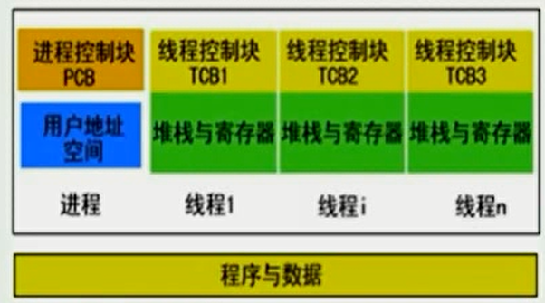

## 总结

- 线程不能看做独立应用，而进程可看做独立应用
- 进程有独立地址的地址空间，相互不影响，线程只是进程的不同执行路径
- 线程没有独立的空间，多进程的程序比多线程程序健壮
- 进程的切换比线程的切换开销大 

## Java进程和线程的关系

- Java作为与平台无关的编程语言，对操作系统提供的功能进行封装，包括进程和线程
- 运行一个程序会产生一个进程，进程包含至少一个线程
- 每个进程对应一个JVM实例，多个线程共享JVM里的堆
- Java采用单线程编程模型，程序会自动创建主线程
- 主线程可以创建子线程，原则上要后与子线程完成执行

# 进程之间是怎么通信的

1. 管道
   1. 匿名管道： 概念：在内核中申请一块固定大小的缓冲区，程序拥有写入和读取的权利，一般使用fork函数实现父子进程的通信。
   2. 命名管道：概念：在内核中申请一块固定大小的缓冲区，程序拥有写入和读取的权利，没有血缘关系的进程也可以进程间通信。
   3. 特点：
      1.  面向字节流，
      2. 生命周期随内核
      3. 自带同步互斥机制。
      4. 半双工，单向通信，两个管道实现双向通信。
2. 消息队列：容量受到系统限制，且要注意第一次读的时候，要考虑上一次没有读完数据的问题  
   1.  消息队列可以认为是一个全局的一个链表，链表节点钟存放着数据报的类型和内容，有消息队列的标识符进行标记。
   2. 消息队列允许一个或多个进程写入或者读取消息。
   3. 消息队列的生命周期随内核。
   4. 消息队列可实现双向通信。
3. 信号量：不能传递复杂消息，只能用来同步 ,信号量的本质就是一个计数器，用来实现进程之间的互斥与同步 
4. 共享内存区：能够很容易控制容量，速度快，但要保持同步，比如一个进程在写的时候，另一个进程要注意读写的问题，相当于线程中的线程安全，当然，共享内存区同样可以用作线程间通讯，不过没这个必要，线程间本来就已经共享了同一进程内的一块内存
5. socket：例如我们平时通过浏览器发起一个 http 请求，然后服务器给你返回对应的数据，这种就是采用 Socket 的通信方式了。

# Thread中的start和run方法的区别

- 调用start()方法会创建一个新的子线程并启动，start0()这个native方法会新建一个线程
- run()方法只是Thread的一个普通方法的调用

# Thread和Runnable是什么关系

- Thread是实现了Runnable接口的类，使得run支持多线程
- 因类的单一继承原则，推荐多使用Runnable接口

# 如何给run()方法传参

- 构造函数传参
- 成员变量传参setX(String name);
- 回调函数传参

# 如何实现处理线程的返回值

实现的方式主要有3种

- 主线程等待法（需要手动编写while循环等待，代码冗余）
- 使用Thread类的join()阻塞当前线程以等待子线程处理完毕
- 通过Callable接口实现，通过FutureTask或者线程池获取

# 线程的状态

六个状态

- 新建（NEW）：创建后尚未启动的线程的状态
- 运行（Runnable）：包含Running和Ready
- 无限期等待（Waiting）：不会被分配CPU执行时间，需要显式被唤醒
  - 没有设置Timeout参数的Object.wait()方法
  - 没有设置Timeout参数的Thread.join()方法
  - LockSupport.park()方法
- 限期等待（Timed Waiting）：在一定时间后会由系统自动唤醒
  - Thread.sleep(long millis)方法
  - 设置了Timeout参数的Object.wait()方法
  - 设置了Timeout参数的Thread.join()方法
  - LockSupport.parkNanos()方法
  - LockSupport.parkUntil()方法
- 阻塞(Blocked)：等待获取排它锁，这个事件在另一个线程放弃排它锁的时候发生
- 结束(Terminated)：已终止线程的状态，线程已经结束执行，线程一旦终止不能复生

# sleep和wait的区别

基本差别

- sleep是Thread类的方法，wait是Object类中定义的方法
- sleep()方法可以在任何地方使用
- wait()方法只能synchronized方法或synchronized块中使用

**最本质的差别**

- Thread.sleep只会让出CPU，不会导致锁行为的改变
- Object.wait不仅让出CPU，还会释放已经占有的同步资源锁

# notify和notifyAll的区别

**两个概念**

- 锁池EntryList
- 等待池WaitSet

**锁池**

假设线程A已经拥有了某个对象（不是类）的锁，而其他线程B,C想要调用这个对象的某个方法synchronized方法(或者块)，由于B,C线程在进入对象的synchronized方法(或者块)之前必须先获得该对象锁的拥有权，而恰巧该对象的锁目前正被线程A所占用，此时B,C线程就会被阻塞，进入一个地方去等待锁的释放，这个地方便是该对象的锁池

**等待池**

假设线程A调用了某个对象的wait()方法，线程A就会释放该对象的锁，同时线程A就进入到了该对象的等待池中，进入到等待池中的线程不会去竞争该对象的锁

- notifyAll会让所有处于等待池的线程全部进入锁池去竞争获取锁的机会
- notify只会随机选取一个处于等待池中的线程进入锁池去竞争获取锁的机会

# yield

**概念**

当调用Thread.yield()函数时，会给线程调度器一个当前线程愿意让出CPU使用的暗示，但是线程调度器可能会忽略这个暗示

# 如何中断线程

**已经被抛弃的方法**，不安全

- 通过调用stop()方法停止线程
- 通过调用suspend()和resume()方法

**目前使用的方法**

- 调用interrupt(),通知线程应该中断了
  - 如果线程处于被阻塞状态（例如处于sleep，wait等状态），那么线程将立即退出被阻塞状态，并抛出一个`InterruptedException`异常
  - 如果线程处于正常活动状态，那么会将该线程的中断标志设置为true。被设置中断标志的线程将继续正常运行，不受影响
- 需要被调用的线程配合中断
  - **在正常运行任务时，经常检查本线程的中断标志位（写一个while循环），如果被设置了中断标志就自行停止线程**
  - 如果线程处于正常活动状态，那么会将该线程的中断标志设置为true，被设置中断标志的线程将继续正常运行，不受影响
  - 被阻塞的线程如果抛出`InterruptedException`异常，就停止线程

# 线程状态以及状态之间的转换

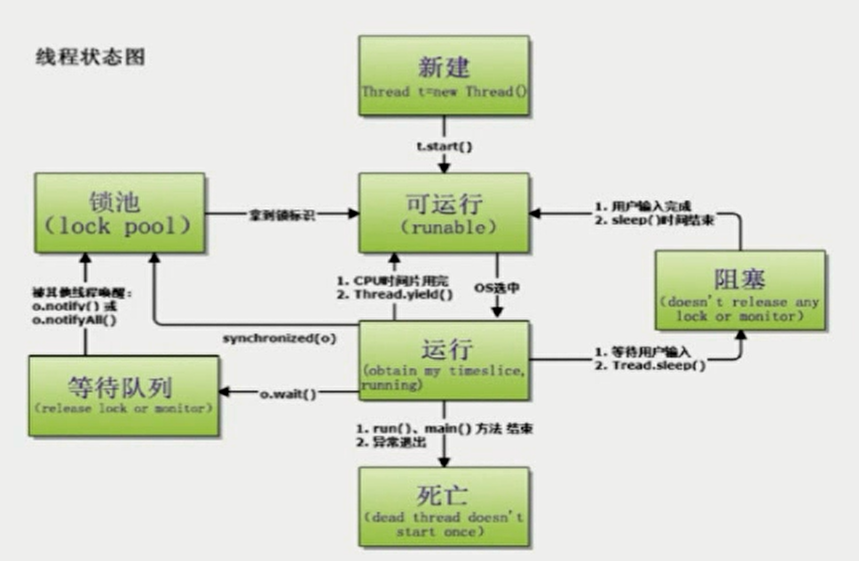

# synchronized

**线程安全问题的主要诱因**

- 存在共享数据(也称为临界资源)
- 存在多条线程共同操作这些共享资源

解决问题的根本方法：

同一时刻有且只有一个线程在操作共享数据，其它线程必须等到该线程处理完数据后再对共享数据进行操作

**互斥锁的特性**

互斥性：即在同一时间只允许一个线程持有某个对象锁，通过这种特性来实现多线程的协调机制，这样在同一时间只有一个线程对需要同步的代码块(复合操作)进行访问。互斥性也称为操作的原子性。

可见性：必须确保在锁被释放之前，对共享变量所做的修改，对于随后获得该锁的另一个线程是可见的(即在获得锁时，应获得最新共享变量的值)，否则另一个线程可能是在本地缓存的某个副本上继续操作，从而引起不一致。

**synchronized锁的不是代码，锁的都是对象**

**根据获取的锁的分类：获取对象锁和获取类锁**

获取对象锁的两种用法

1. 同步代码块(synchronized(this),synchronized(类实例对象)),锁是小括号()中的实例对象。
2. 同步非静态方法(synchronized method)，锁是当前对象的实例对象

获取类锁的两种用法，每个类只有一个类锁

1. 同步代码块(synchronized(类.class)),锁是小括号()中的类对象(Class对象)。
2. 同步静态方法(synchronized static method)，锁是当前对象的类对象(Class对象)

# 对象锁和类锁的总结

1. 有线程访问对象的同步代码块时，另外的线程可以访问该对象的非同步代码块
2. 若锁住的是同一个对象，一个线程在访问对象的同步代码块时，另一个访问对象的同步代码块（同步方法）的线程会被阻塞
3. 同一个类的不同对象的对象锁互不干扰
4. 类锁由于也是一种特殊的对象锁，因此表现性质和2一致，而由于一个类只有一个把对象锁，所以同一个类的不同对象使用类锁将会同步的；
5. 类锁和对象锁互不干扰

# synchronized底层实现原理

实现synchronized的基础

- Java对象头
- Monitor

对象在内存中的布局

- 对象头
- 实例数据
- 对齐填充

对象头的结构

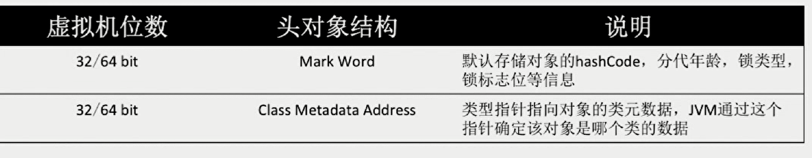

## Mark Word

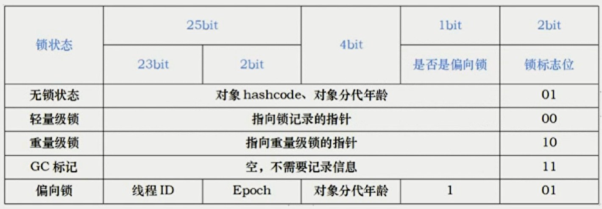

 ## Monitor：每个Java对象天生自带了一把看不见的锁

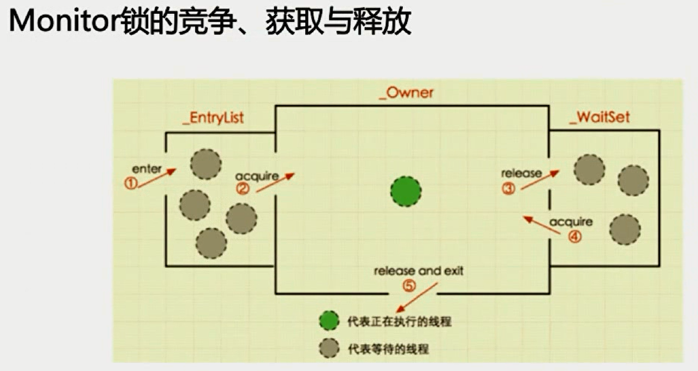

## 什么是重入

从互斥锁的设计上来说，当一个线程试图操作一个由其他线程持有的对象锁的临界资源时，将会处于阻塞状态，但当一个线程再次请求自己持有锁的临界资源，这种情况属于重入

## 为什么有人会对synchronized嗤之以鼻

- 早期版本中，synchronized属于重量级锁，属于Mutex Lock实现
- 线程之间的切换需要从用户态转换到核心态，开销较大

# Java6以后，synchronized性能得到了很大的提升

- Adaptive Spinning 自适应自旋
- Lock Eliminate 锁消除
- Lock Coarsening 锁粗化
- Lightweight Locking 轻量级锁
- Biased Locking 

## 自旋锁与自适应自旋锁

## 自旋锁

- 许多情况下，共享数据的锁定状态持续时间较短，切换线程不值得
- 通过让线程执行忙循环等待锁的释放，不让出CPU
- 缺点：若锁被其它线程长时间占用，会带来许多性能上的开销

## 自适应自旋锁

- 自旋的次数不再固定
- 由前一次在同一个锁上的自旋时间及锁的拥有者状态来决定的

## 锁消除

**更彻底的优化**

- JIT编译时，对运行上下文进行扫描，去除不可能存在竞争的锁

## 锁粗化

**另一种极端**

- 通过扩大加锁的范围，避免反复加锁和解锁，比如while循环里有频繁的加锁和解锁

# synchronized的四种状态

- 无锁、偏向锁、轻量级锁、重量级锁
- 锁膨胀方向：无锁->偏向锁->轻量级锁->重量级锁

## 偏向锁

偏向锁：减少同一线程获取锁的代价

- 大多数情况下，锁不存在多线程竞争，总是由同一线程多次获得

核心思想：
如果同一个线程获取了锁，那么锁就进入偏向模式，此时Mark Word的结构也变为偏向锁结构，当该线程再次请求锁时，无需再做任何同步操作，即获取锁的过程只需要检查Mark Word的锁标记位为偏向锁以及当前线程Id等于Mark Word的ThreadID即可，这样就省去了大量有关锁申请的操作

- 不适用于锁竞争比较激烈的多线程场合

## 轻量级锁

轻量级锁是由偏向锁升级来的，偏向锁运行在一个线程进入同步块的情况下，当第二个线程加入锁争用的时候，偏向锁就会升级为轻量级锁

适用的场景：线程交替执行同步块

若存在同一时间访问同一锁的情况，就会导致轻量级锁膨胀为重量级锁

## 锁的内存语义

当线程释放锁时，Java内存模型会把该线程对应的本地内存中的共享变量刷新到主内存中；

而当线程获取锁时，Java内存模型会把该线程对应的本地内存置为无效，从而使得被监视器保护的临界区代码必须从主内存中读取共享变量。

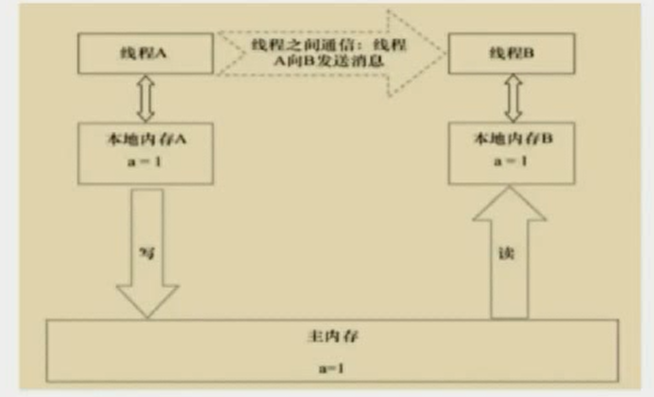

## 偏性锁、轻量级锁、重量级锁的汇总

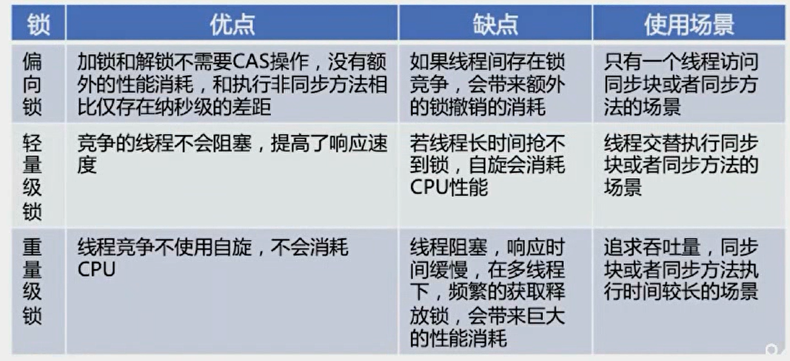

# synchronized和ReentrantLock的区别

## ReentrantLock(再入锁)

- 位于java.util.concurrent.locks包
- 和CountDownLatch、FutureTask，Semaphore一样基于AQS实现
- 能够实现比synchronized更细粒度的控制，比如控制公平性fairness
- 调用lock()之后，必须调用unlock()释放锁
- 性能未必比synchronized高，性能不能一概而论， 并且也是可重入的

## ReentrantLock公平性的设置

- ReentrantLock fairLock=new ReentrantLock(true);
- 参数为true时，倾向于将锁赋予等待时间最久的线程，避免饥饿现象的发生
- 公平锁：获取锁的顺序按先后调用Lock方法的顺序(慎用)
- 非公平锁：抢占的顺序不一定，看运气
- synchronized是非公平锁，公平性并没有那么重要，java默认的调度策略几乎不会造成饥饿现象的发生，增加公平性会增加开销

 ## ReentrantLock将锁对象化

- 判断是否有线程，或者某个特定的线程，在排队等待获取锁
- 带超时的获取锁的尝试
- 感知有没有成功获取锁

## 是否能将wait/notify/notifyAll对象化

- java.util.concurrent.locks.Condition

## 总结

- synchronized是关键字，ReentrantLock是类
- ReentrantLock可以对获取锁的等待时间进行设置，避免死锁
- ReentrantLock可以获取各种锁的信息
- ReentrantLock可以灵活地实现多路通知
- **机制：sync操作Mark Word，lock调用Unsafe的park()方法**

# 什么是Java内存模型中的happens-before

**Java内存模型JMM**

Java内存模型(即Java Memory Model，简称JMM)本身是一种抽象的概念，并不真实存在，它描述的是一组规则或规范，通过这组规范定义了程序中各个变量(包括实例字段，静态字段和构成数组对象的元素)的访问方式

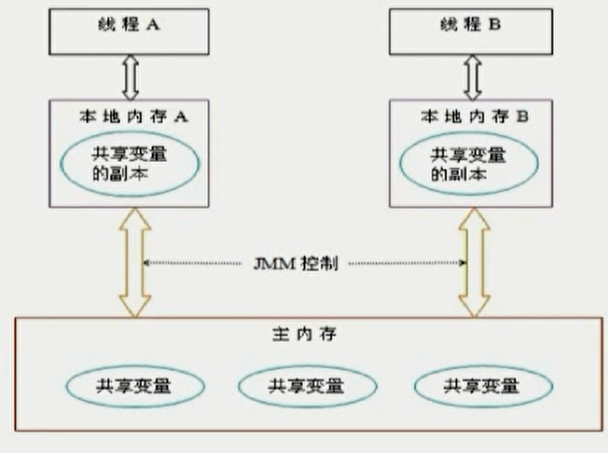

**JMM中的主内存**

- 存储Java实例对象
- 包括成员变量，类信息、常量、静态变量等
- 属于数据共享区域，多线程并发操作时会引发线程安全问题

**JMM中的工作内存**

- 存储当前方法的所有本地变量信息，本地变量对其它线程不可见
- 字节码行号指示器，Native方法信息
- 属于线程私有区域，不存在线程安全问题

**JMM与Java内存区域划分是不同的概念层次**

- JMM描述的是一组规则，围绕原子性，有序性，可见性展开
- 相似性：存在共享区域和私有区域

**主内存和工作内存的数据类型以及操作方式归纳**

- 方法里的基本数据类型本地变量将直接存储在工作内存的栈帧结构中
- 引用类型的本地变量：引用存储在工作内存中，实例存储在主内存中
- 实例的成员变量，static变量、类信息均会存储在主内存中
- 主内存共享的方式是线程各拷贝一份数据到工作内存，操作完成后刷新回主内存

# JMM如何解决可见性问题

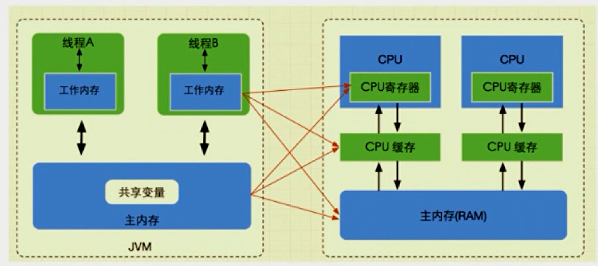

指令重排序需要满足的条件

- 在单线程环境下不能改变程序运行的结果
- 存在数据依赖关系的不允许重排序

**无法通过happens-before原则推导出来的，才能进行指令的重排序**

A操作的结果需要B操作可见，则A与B存在happens-before关系

## happens-before的八大原则

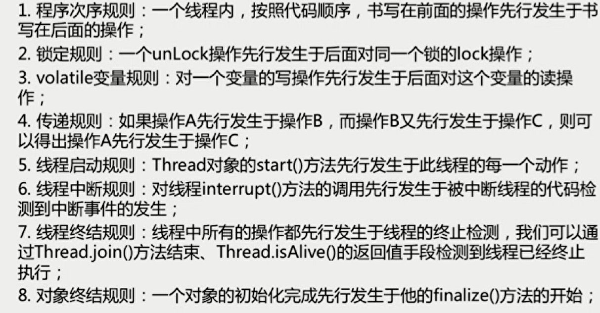

**happens-before的概念**

如果两个操作不满足上述任意一个happens-before规则，那么这两个操作就没有顺序的保障，JVM可以对这两个操作进行重排序；

如果操作A happens-before操作B,那么操作A在内存上所做的操作对操作B都是可见的

## volatile：JVM提供的轻量级同步机制

- 保证被volatile修饰的共享变量对所有线程总是可见的
- 禁止指令重排序优化
- 但是对于i++操作不保证原子性

 **volatile变量为何立即可见？**

当写一个volatile变量时，JMM会把该线程对应的工作内存中的共享变量值刷新到主内存中；

当读取一个volatile变量时，JMM会把该线程对应的工作内存置为无效

**volatile如何禁止重排优化**

首先了解一个概念，内存屏障（Memory Barrier）这是一条CPU指令

1. 保证特定操作的执行顺序
2. 保证某些变量的内存可见性

通过插入内存屏障指令禁止在内存屏障前后的指令执行重排序优化

强制刷出各种CPU的缓存数据，因此任何CPU上的线程都能读取到这些数据的最新版本

# 单例的双重检测实现

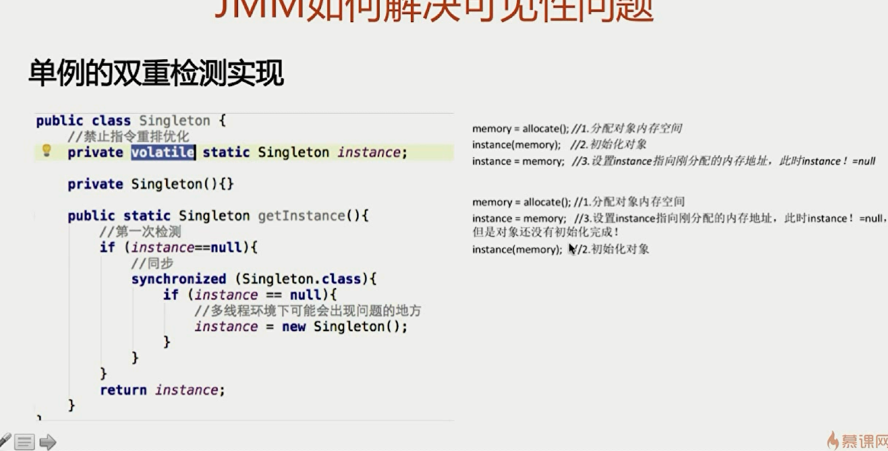

# volatile和synchronized的区别

1. volatile本质是在告诉JVM当前变量在寄存器(工作内存)中的值是不确定的，需要从主存中读取；synchronized则是锁定当前变量，只有当前线程可以访问该变量，其他线程被阻塞住直到该线程完成变量的操作为止
2. volatile仅能使用字变量级别；synchronized则可以使用在变量、方法和类级别
3. volatile仅能实现变量的修改可见性，不能保证原子性；而synchronized则可以保证变量修改的可见性和原子性
4. volatile不会造成线程的阻塞；synchronized可能会造成线程的阻塞
5. volatile标记的变量不会被编译器优化；synchronized标记的变量可以被编译器优化

# CAS(Compare and Swap)

**一种高效实现线程安全性的方法**

- 支持原子更新操作，适用于计数器，序列发生器等场景
- 属于乐观锁机制，号称lock-free
- CAS操作失败时由开发者决定是继续尝试，还是执行别的操作，失败重试的逻辑

**CAS思想**

- 包含3个操作数——内存位置(V)、预期原值(A)和新值(B)，执行CAS操作的时候，将内存位置(V)和预期原值(A)进行比较，如果相匹配，处理器会自动将该位置的值更新为新值(B),否则不做任何操作

**CAS多数情况下对开发者来说是透明的**

- JUC的atomic包提供了常用的原子性数据类型以及引用、数组等相关原子类型和更新操作工具，是很多线程安全程序的首选
- Unsafe类虽提供CAS服务，但因能够操作任意内存地址读写而有隐患
- Java9以后，可以使用Variable Handle API来代替Unsafe

## 缺点

- 若循环时间长，则开销很大
- 只能保证一个共享变量的原子操作，如果要实现多个共享变量的原子操作，还是要加锁
- ABA问题，第一次读出是A，第二次读出是A，也可能被改变过 
  -  juc解决：AtomicStampedReference，通过控制变量值的版本，来保证CAS的正确性

 

# Java线程池

利用Executors创建不同的线程池满足不同场景的需求

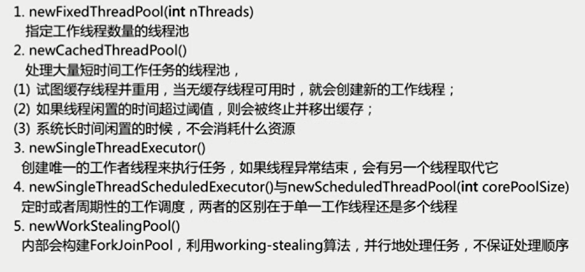

**Fork/Join框架**

- 把大任务分割成若干个小任务并行执行，最终汇总每个小人物结果后得到大任务结果的框架
  - Work-Stealing算法：某个线程从其他队列里窃取任务来执行

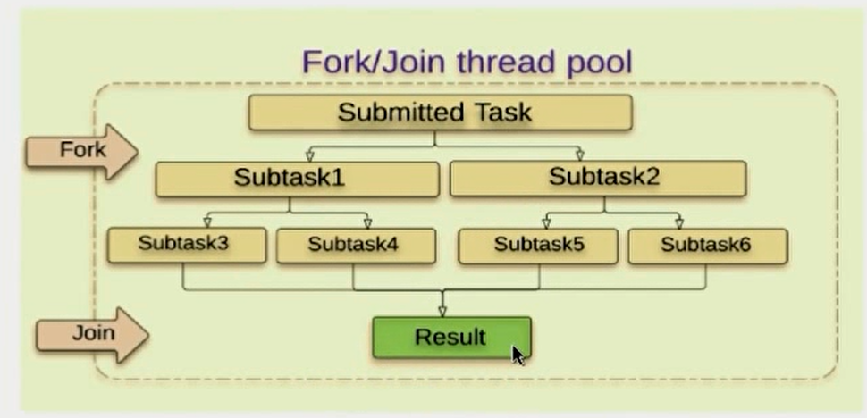

**为什么要使用线程池**

- 降低资源消耗
- 提高线程的可管理性

## Executor的框架

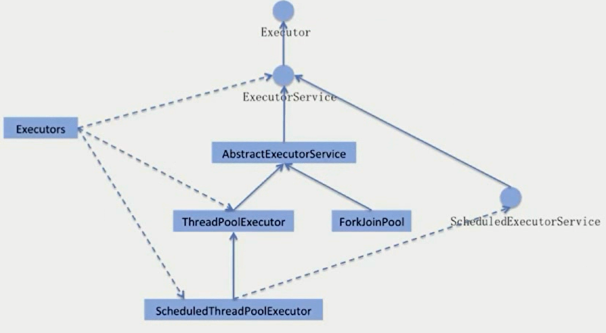

## JUC的3个Executor接口

- Executor：运行新任务的而简单接口，而任务提交和任务执行细节解耦

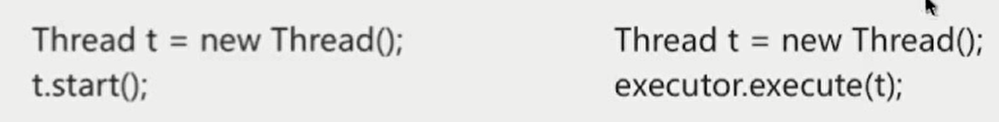

- ExecutorService：具备管理执行器和任务生命周期的方法，提交任务机制更加完善
- ScheduledExecutorService:支持Future和定期执行任务

## ThreadPoolExecutor

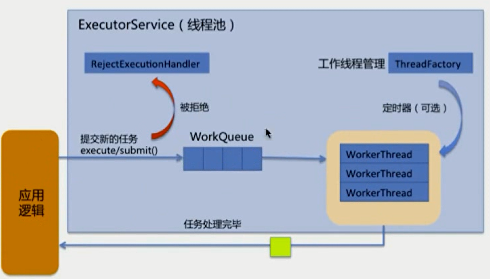

**ThreadPoolExecutor的构造函数**

- corePoolSize：核心线程数量
- maximumPoolSize：线程不够用时能够创建的最大线程数
- workQueue：任务等待队列
- keepAliveTime：线程池维护线程所允许的空闲时间，抢占的顺序不一定，看运气
- threadFactory：创建新线程，`Executors.defaultThreadFactory()` 
- handler:线程池的饱和策略
  - 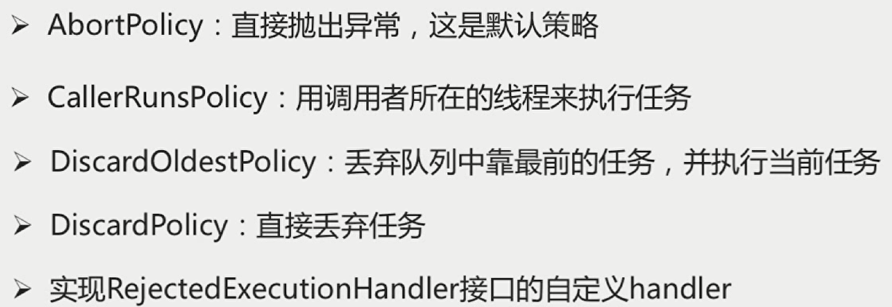

**新任务提交execute执行后的判断**

- 如果运行的线程少于corePoolSize，则创建新线程来处理任务，即使线程池中的其他线程是空闲的；
- 如果线程池中的线程数量大于等于corePoolSize，且小于maximumPoolSize，则只有当workQueue满时才创建新的线程去处理任务；
- 如果设置的corePoolSize和maximumPoolSize相同，则创建的线程池的大小是固定的，这时如果有新任务提交，若workQueue未满，则将请求放入workQueue中，等待有空闲的线程去从workQueue中取任务并处理
- 如果运行的线程数量大于等于maximumPoolSize，这时如果workQueue已经满了，则通过handler所指定的策略来处理任务

## 流程图

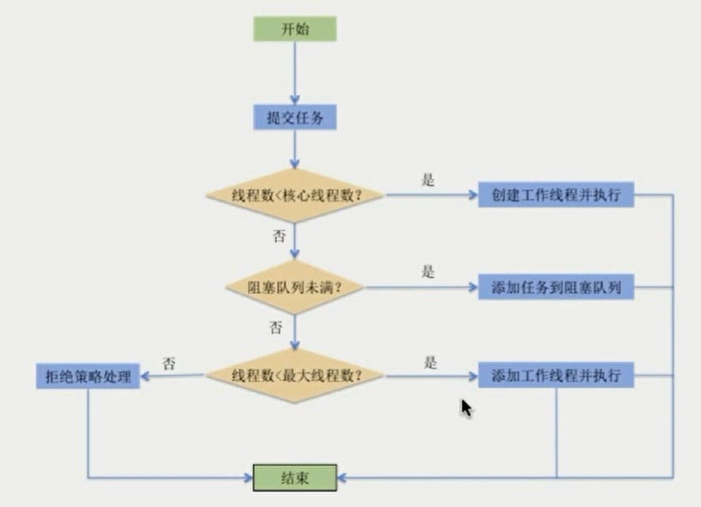

# 线程池的状态

- Running：能接受新提交的任务，并且也能处理阻塞队列中的任务
- Shutdown：不再接受新提交的任务，但可以处理存量任务
- Stop：不再接受新提交的任务，也不处理存量任务
- Tidying：所有任务都已终止
- Terminated：terminated()方法执行完后进入该状态，只是一个标识，什么都不做

**状态图**

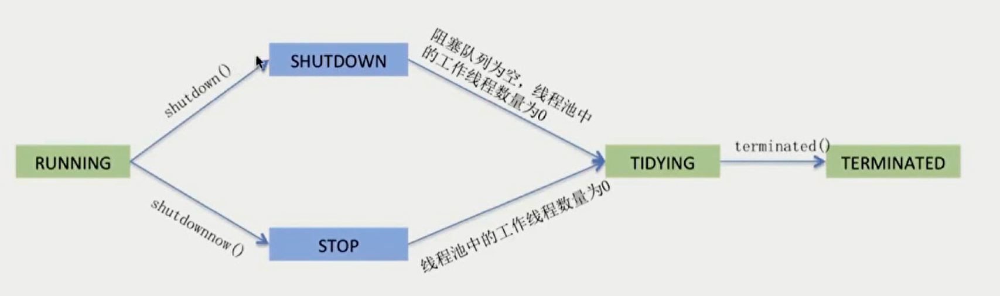

**工作线程的生命周期**

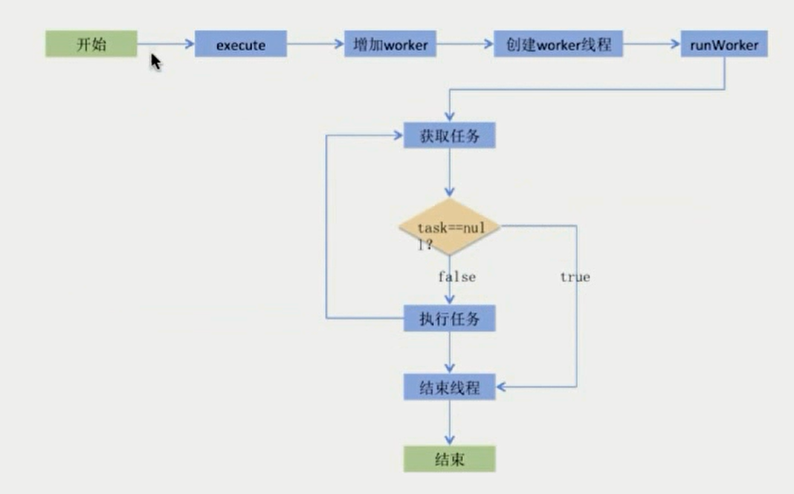

**线程池的大小如何选定**

- CPU密集型：线程数=按照核数或者核数+1设定
- I/O密集型：线程数=CPU核数*(1+平均等待时间/平均工作时间)