 

# 探探你对Java的理解

- 平台无关性
- GC
- 语言特性
- 面向对象
- 类库
- 异常处理

# 一次编译，到处运行如何实现 

# JVM如何加载.class文件

# 谈谈反射

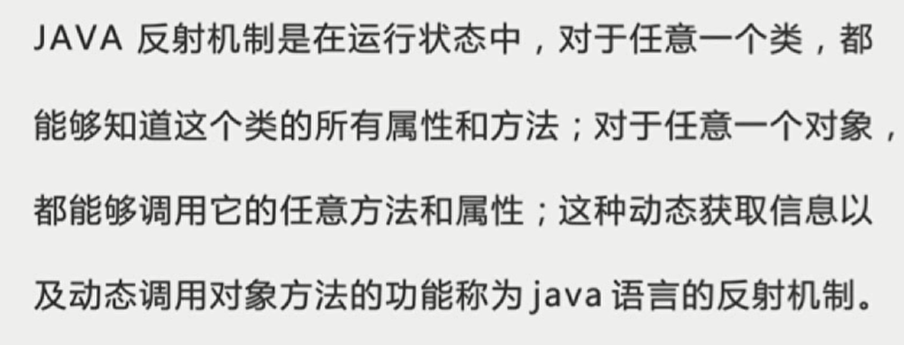

 # 类从编译到执行的过程

- 编译器将Robot.java源文件编译为Robot.class字节码文件
- ClassLoader将字节码转换为JVM中的Class<Robot>对象
- JVM利用Class<Robot>对象实例化为Robot对象

# 谈谈ClassLoader

类加载器

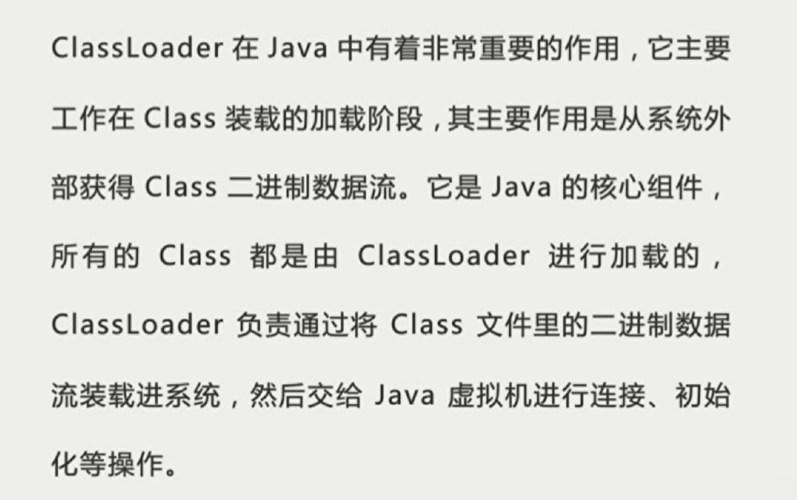

 ## ClassLoder的种类

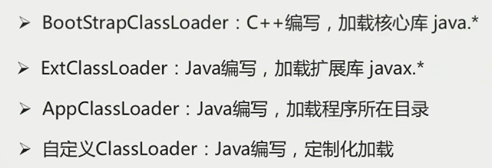

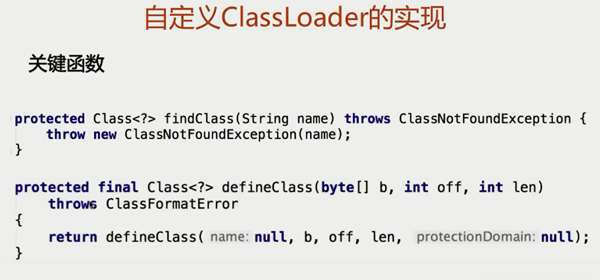

# 类的加载方式

- 隐式加载：new
- 显式加载：loadClass，forName等

# loadClass和forName的区别

类的装载过程

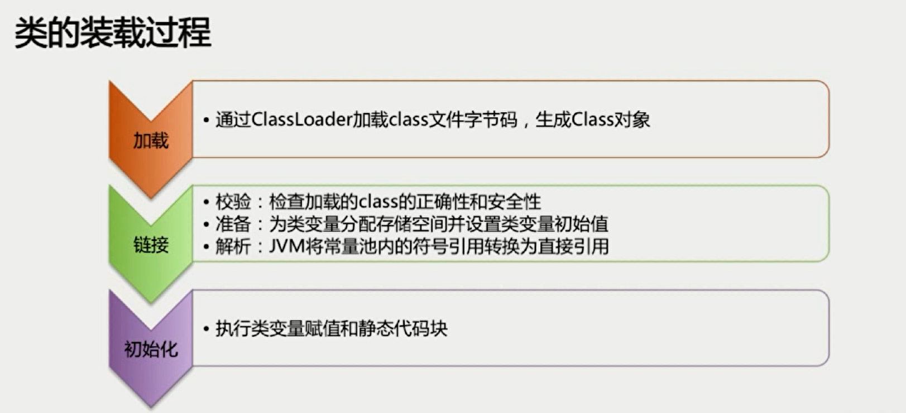

- **Class.forName得到的class是已经初始化完成的**
- **Classloder.loadClass得到的class是还没有链接的** ,Spring IOC为了延迟加载，大量使用了loadClass，加快了加载速度

# 你了解Java内存模型么

## 内存简介

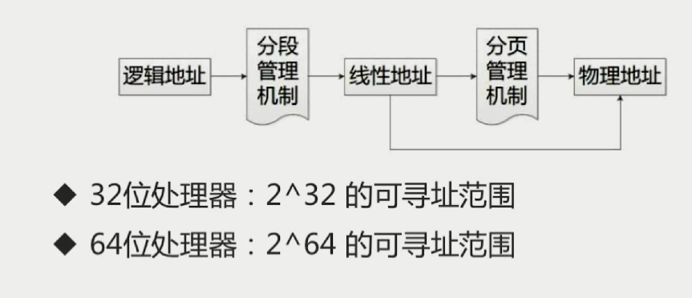

## 地址空间的划分

- 内核空间
- 用户空间

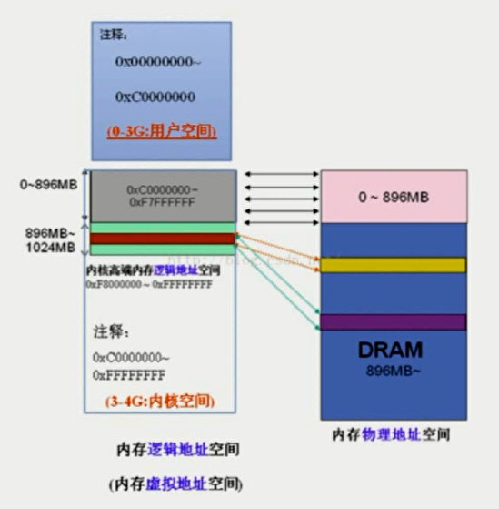 

 

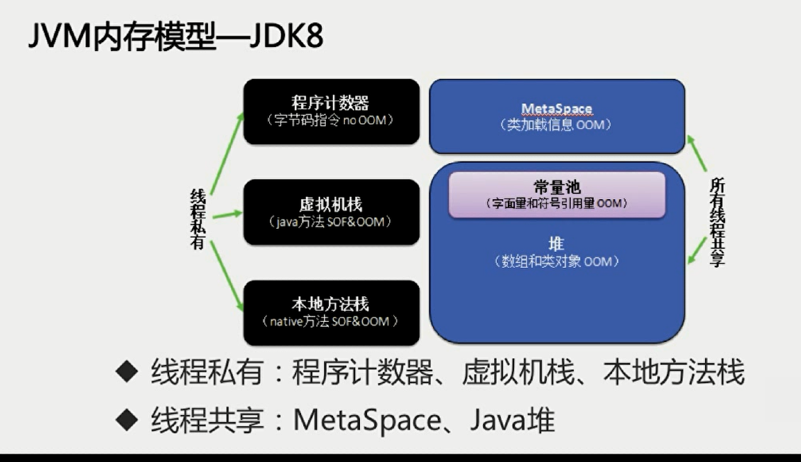

## 程序计数器

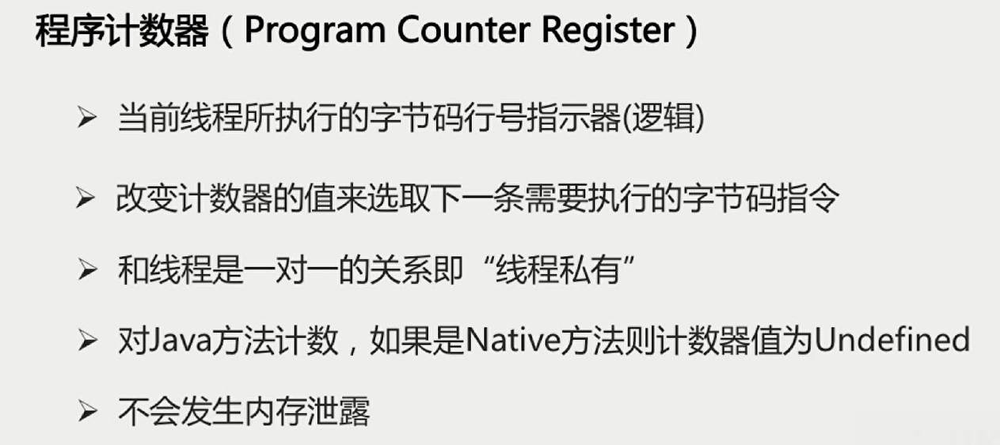

## Java虚拟机栈（Stack）

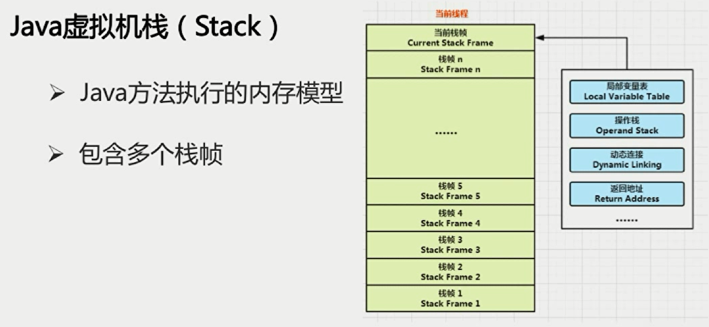

### 局部变量表和操作数栈

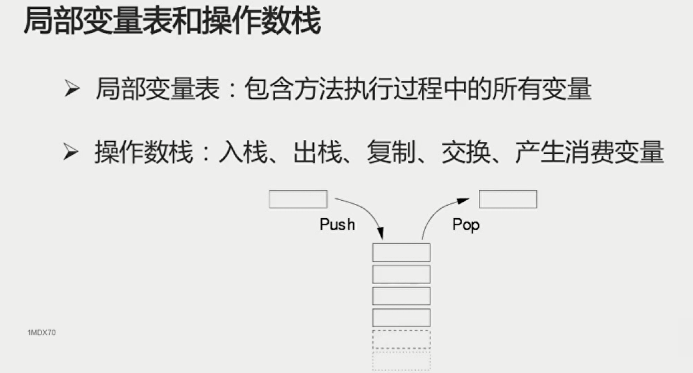

## 元空间（MetaSpace）与永久代（PermGen）的区别

- **元空间使用本地内存，而永久代使用的是jvm内存**

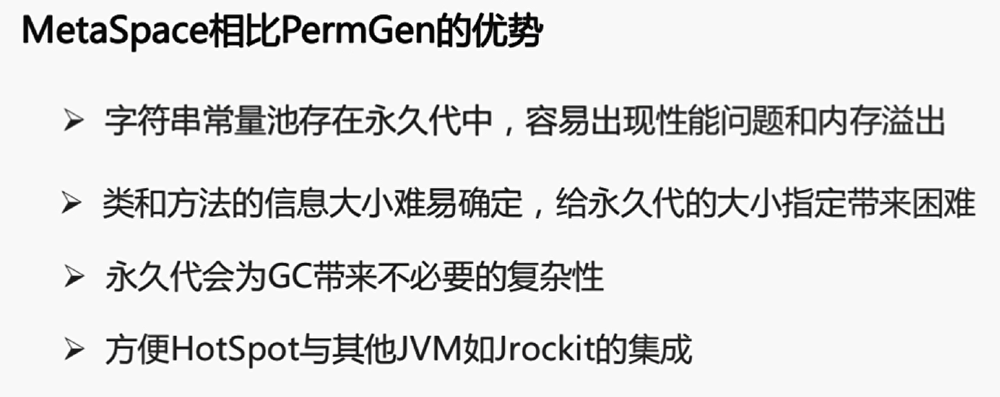

## 堆

# JVM三大性能调优参数-Xms -Xmx -Xss的含义

- -Xss：规定了每个线程虚拟机栈（堆栈）的大小
- -Xms：堆的初始值
- -Xmx：堆能达到的最大值

# Java内存模型中堆和栈的区别——内存分配策略

- **联系：引用对象、数组时，栈里定义变量保存堆中目标的首地址**

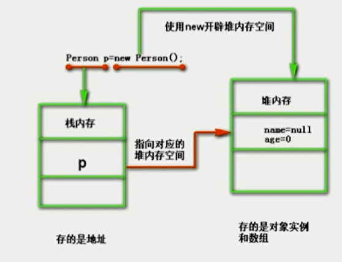

### 区别

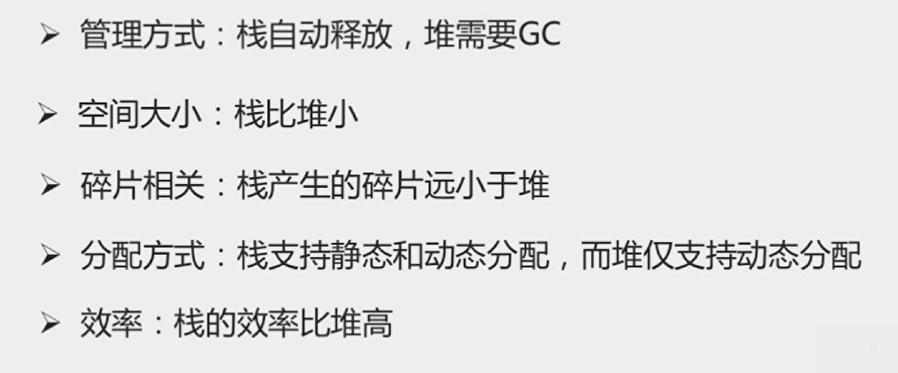

**程序**

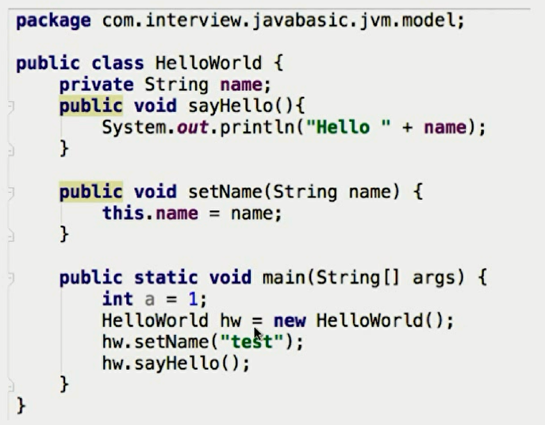

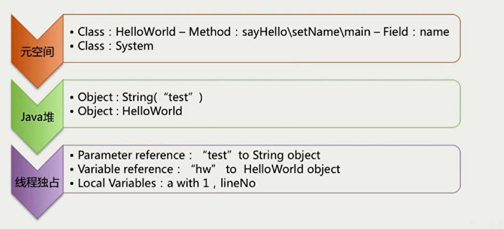

# 不同JDK版本之间intern（）方法的区别——JDK6 VS JDK6+

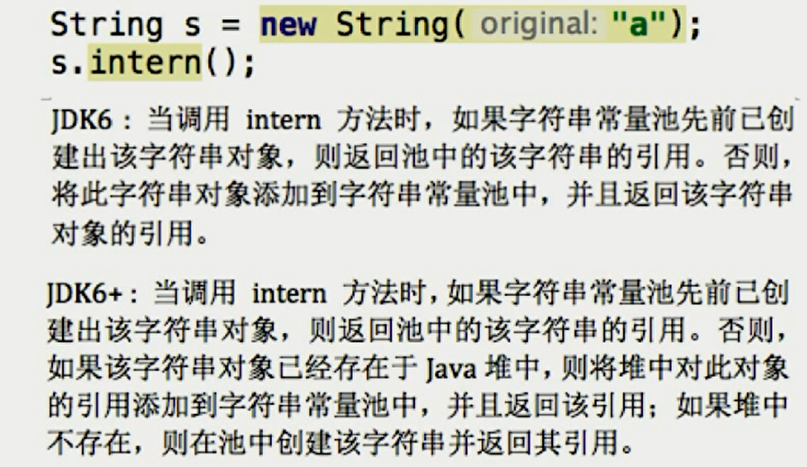

## 程序代码

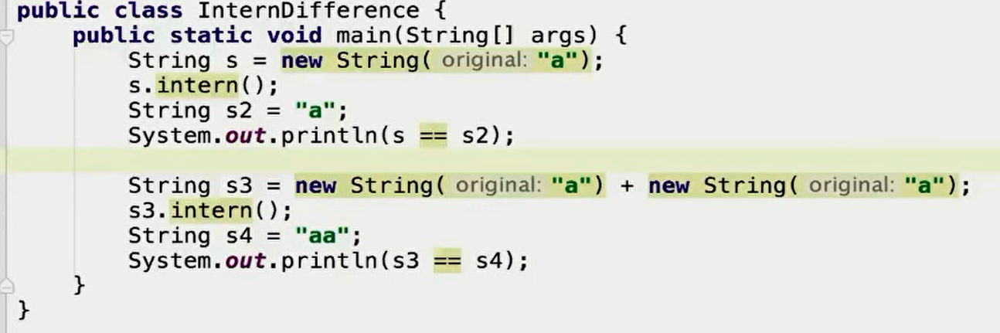

JDK8 : false true

JDK6：false false

### JDK6时intern()

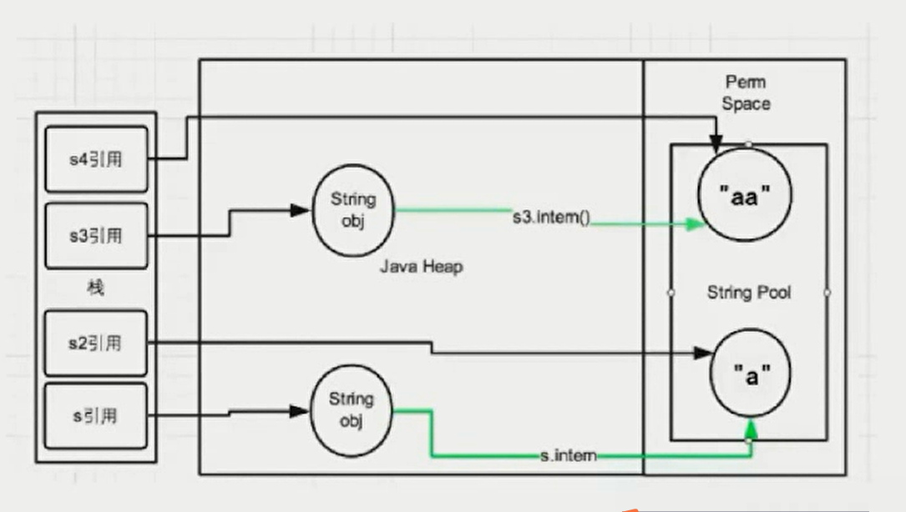

### JDK7及以上

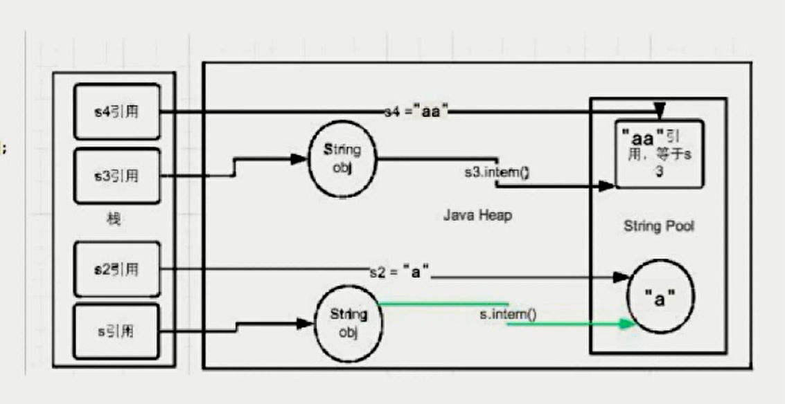