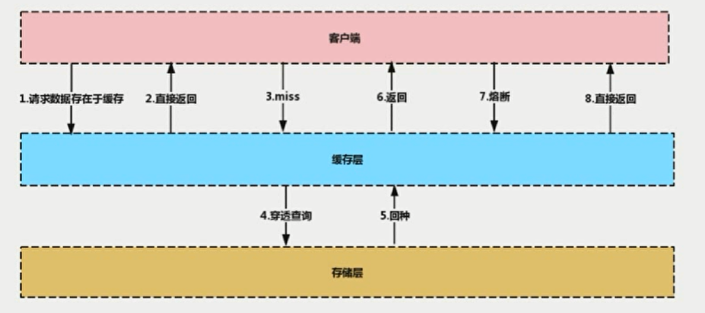

# 缓存中间件——Memcache和Redis的区别

**Memcache：代码层次类似于Hash**

- 支持简单数据类型
- 不支持数据持久化存储
- 不支持主从
- 不支持分片

**Redis**

- 数据类型丰富
- 支持数据磁盘持久化存储
- 支持主从
- 支持分片

# 为什么Redis能这么快

- 完全基于内存，绝大部分请求是纯粹的内存操作，执行效率高
- 数据结构简单，对数据操作也简单
- 采用单线程，单线程也能处理高并发请求，想多核也可以启动多实例
- 使用多路I/O复用模型，非阻塞IO

# 多路I/O复用模型

FD：File Descriptor，文件描述符

一个打开的文件通过唯一的描述符进行引用，该描述符是打开文件的元数据到文件本身的映射

## 传统的阻塞I/O模型

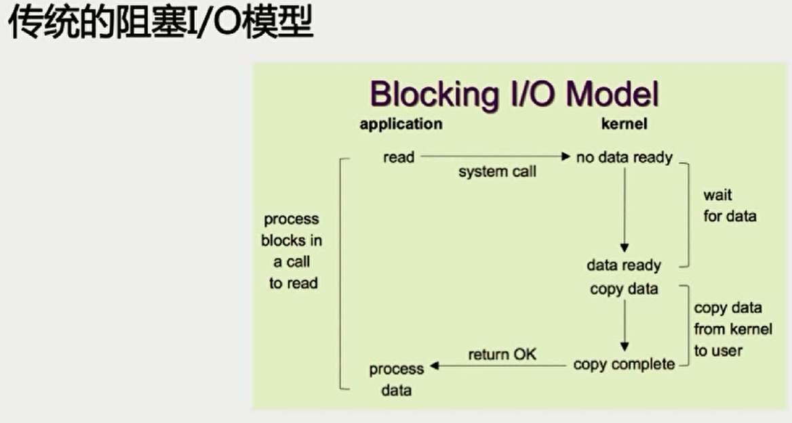

## 多路I/O复用模型

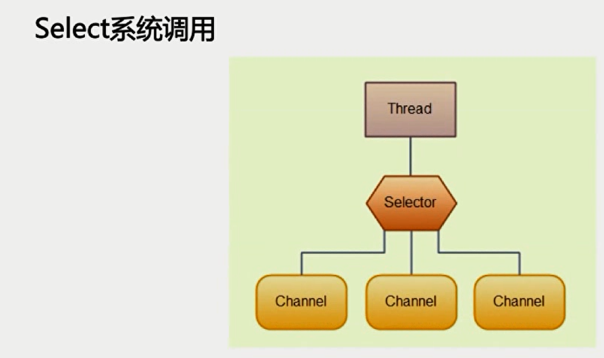 

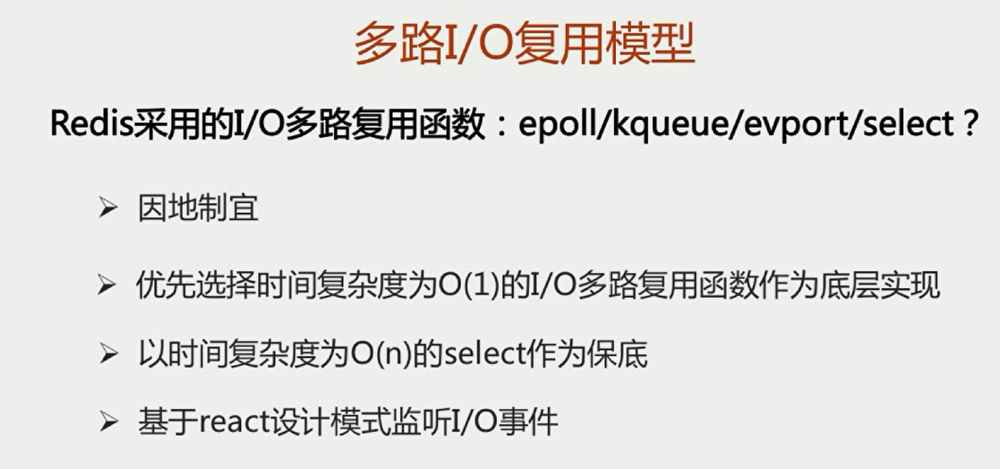

# 说一说你用过的Redis的数据类型

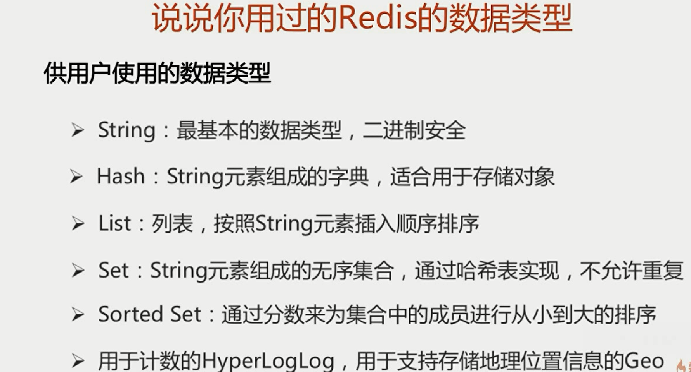

# 从海量Key里查询出某一固定前缀的Key

**留意细节**

- 摸清数据规模，即问清楚边界

## 使用keys对线上的业务的影响

KEYS pattern：查找所有符合给定模式pattern的key

- KEYS指令一次性返回所有匹配的key
- 键的数量过大会使服务卡顿

## SCAN cursor [MATCH pattern][COUNT count]

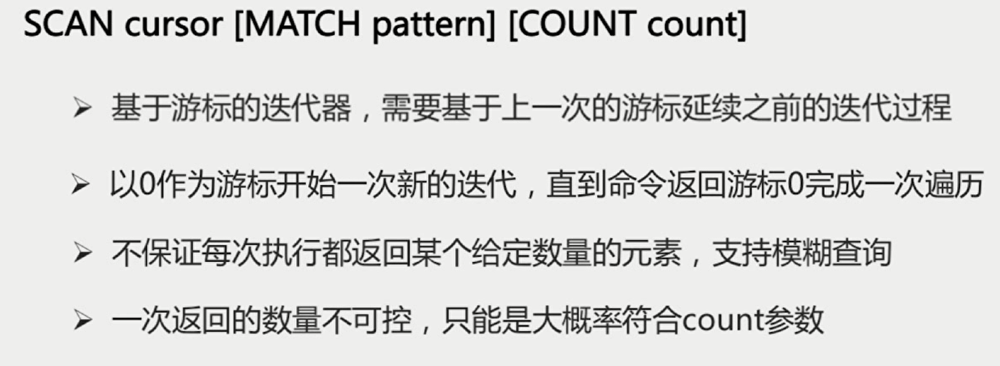

# 如何通过Redis实现分布式锁

## 分布式锁需要解决的问题

- 互斥性
- 安全性
- 死锁
- 容错

## SETNX key value:如果key不存在，则创建并赋值

- 时间复杂度：O(1)
- 返回值：设置成功，返回1；设置失败，返回0

## 如何解决SETNX长期有效的问题

**EXPIRE key seconds**

- 设置key的生存时间，当key过期时（生存时间为0），会被自动删除
- 缺点：原子性得不到满足，虽然两个操作都是原子的，但是组合起来就不是原子操作了

## 好的解法

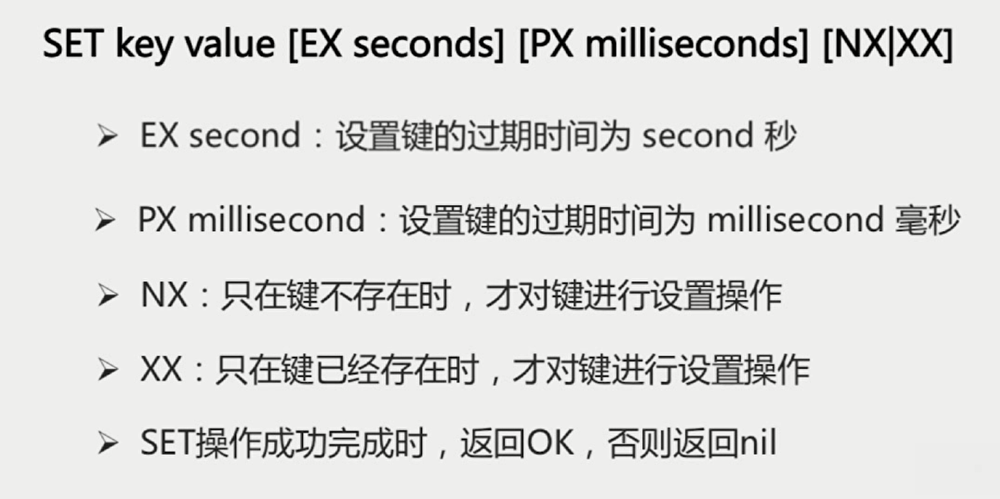

## 大量的key同时过期的注意事项

集中过期，由于清除大量的key很耗时，会出现短暂的卡顿现象

- 解决方案：在设置key的过期时间的时候，给每个key加上随机值

# 如何使用Redis做异步队列 

使用List作为队列，RPUSH生产消息，LPOP消费消息

- 缺点：没有等待队列里有值就直接消费
- 弥补：可以通过在应用层引入Sleep机制去调用LPOP重试

BLPOP key [key...] timeout:阻塞直到队列有消息或者超时

- 缺点：只能供一个消费者消费

## 解决方案

pub/sub：主题订阅者模式

- 发送者（pub）发送消息，订阅者（sub）接收消息
- 订阅者可以订阅任意数量的频道

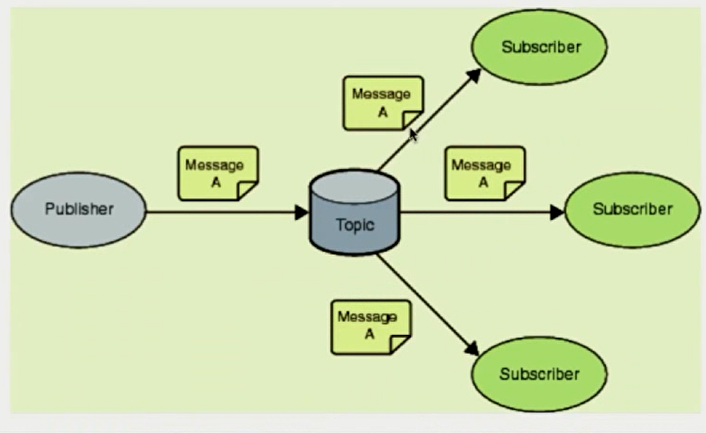 

缺点：

消息发布是无状态的，无法保证可达

# Redis如何做持久化

RDB（快照）持久化：保存某个时间点的全量数据快照

## 自动触发RDB持久化的方式

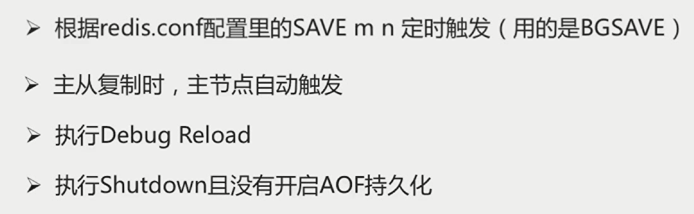 

## BGSAVE原理

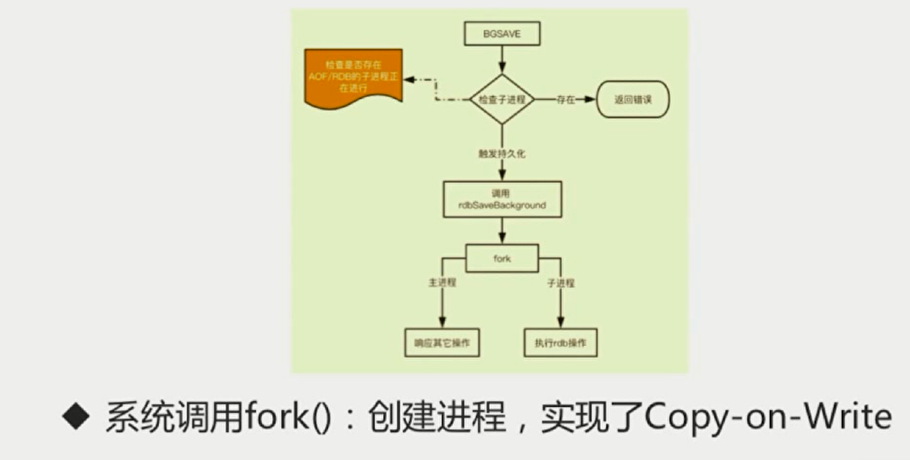

Copy-on-Write

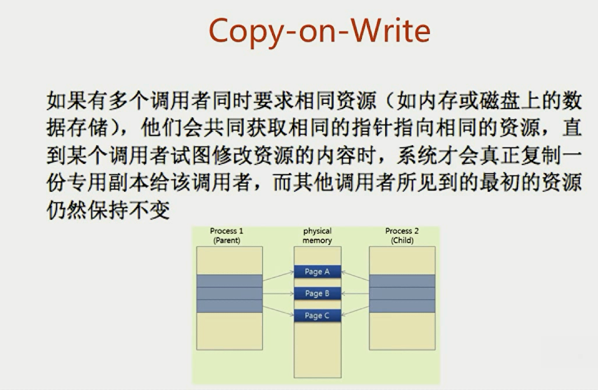 

## 缺点

- 内存数据的全量同步，数据量大会由于I/O而严重影响性能
- 可能会因为Redis挂掉而丢失从当前至最近一次快照期间的数据  

# AOF（Append-Only-File）持久化：保存写状态

- 记录下除了查询以外的所有变更数据库状态的指令
- 以append的形式追加保存到AOF文件中（增量）

## 日志重写

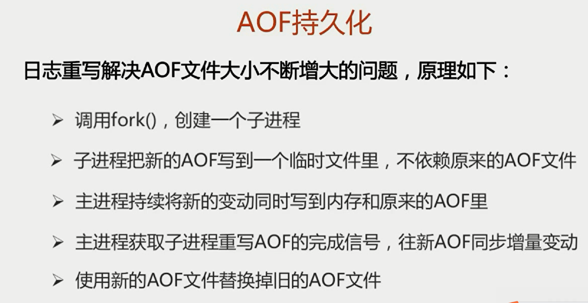

# Redis数据的恢复

RDB和AOF文件共存情况下的恢复流程

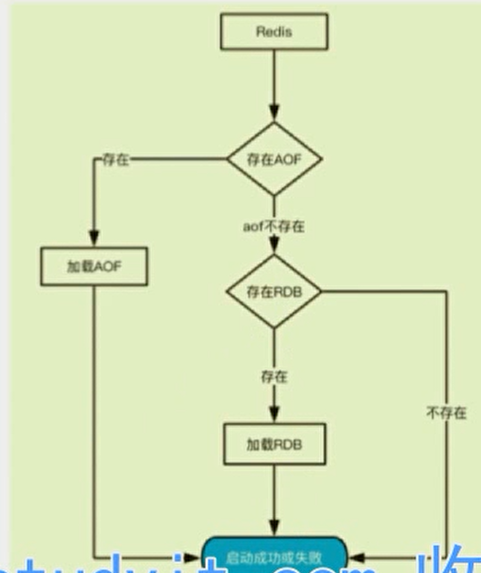

## RDB和AOF的优缺点

- RDB优点：全量数据快照，文件小，恢复快
- RDB缺点：无法保存最近一次快照之后的数据
- AOF优点：可读性高，适合保存增量数据，数据不易丢失
- AOF缺点：文件体积大，恢复时间长

## RDB-AOF混合持久化方式

- 比较推荐的持久化方式
- BGSAVE做镜像全量持久化，AOF做增量持久化

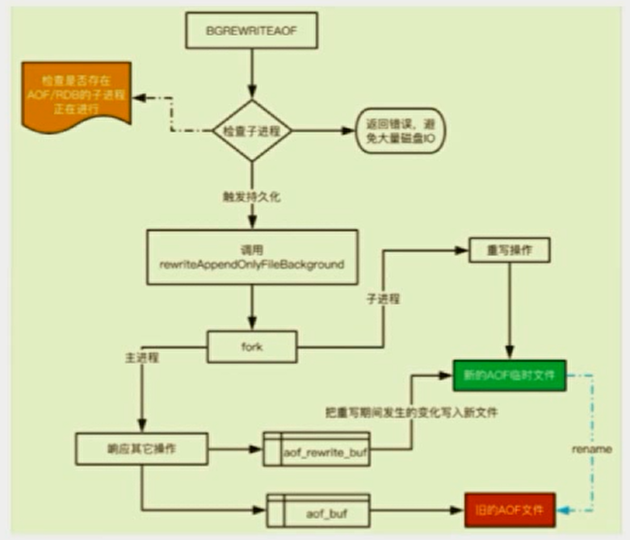

# 使用Pipeline的好处

- Pipeline和Linux的管道类似
- Redis基于请求/响应模型，单个请求处理需要一一应答
- Pipeline批量执行指令，节省多次IO往返的时间
- 有顺序依赖的指令建议分批发送

# Redis的同步机制

**主从同步原理**

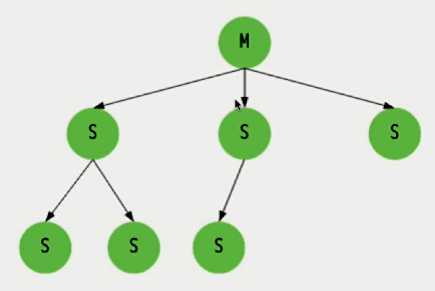

## 全同步过程 

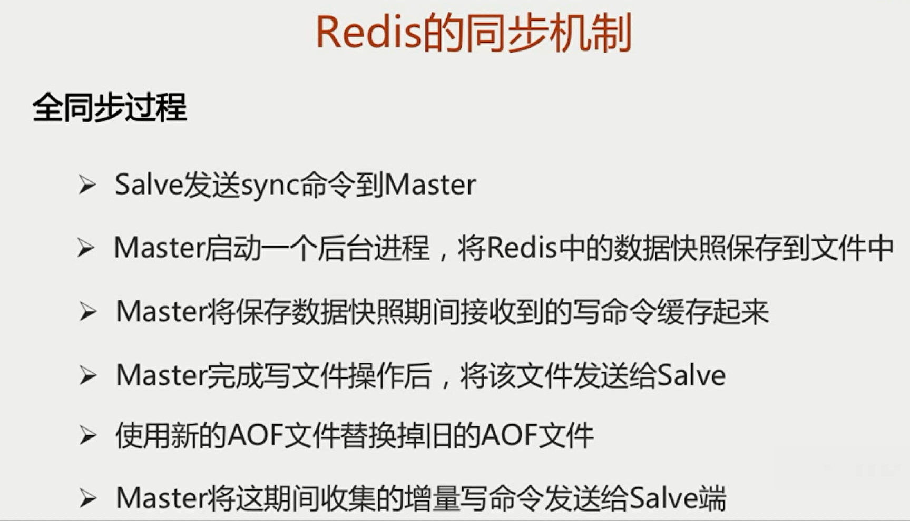

## 增量同步过程

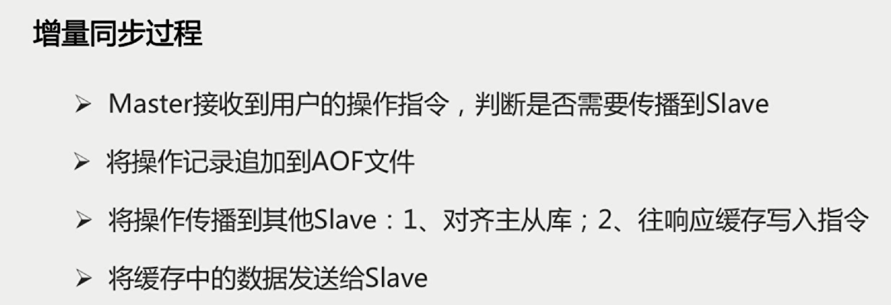

# Redis Sentinel(哨兵)

解决主从同步Master宕机后的主从切换问题

- 监控：检查主从服务器是否运行正常
- 提醒：通过API向管理员或者其他应用程序发送故障通知
- 自动故障迁移：主从切换

# 流言协议Gossip

在杂乱无章中寻求一致

- 每个节点都随机地与对方通信，最终所有节点的状态达成一致
- 种子节点定期随机向其它节点发送节点列表以及需要传播的消息
- 不保证信息一定会传递给所有节点，但是最终会趋于一致

 

# Redis的集群原理

如何从海量数据里快速找到所需？

- 分片：按照某种规则去划分数据，分散存储在多个节点上
- 常规的按照哈希划分无法实现节点的动态增减

一致性哈希算法：对2^32取模，将哈希值空间组织成虚拟的圆环

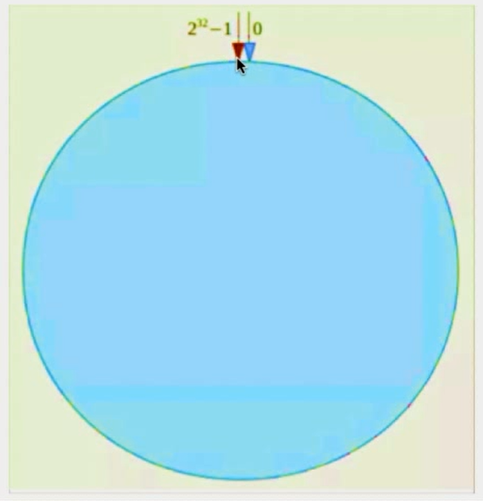

将数据key使用相同的函数Hash计算出哈希值

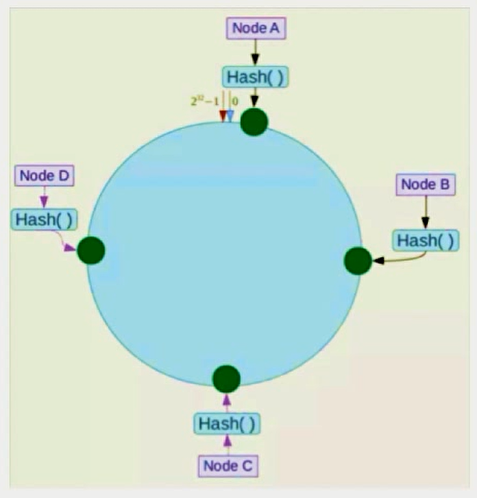

将对象进行hash计算后在哈希环上顺时针行走，碰到的第一个服务器就是所存储的

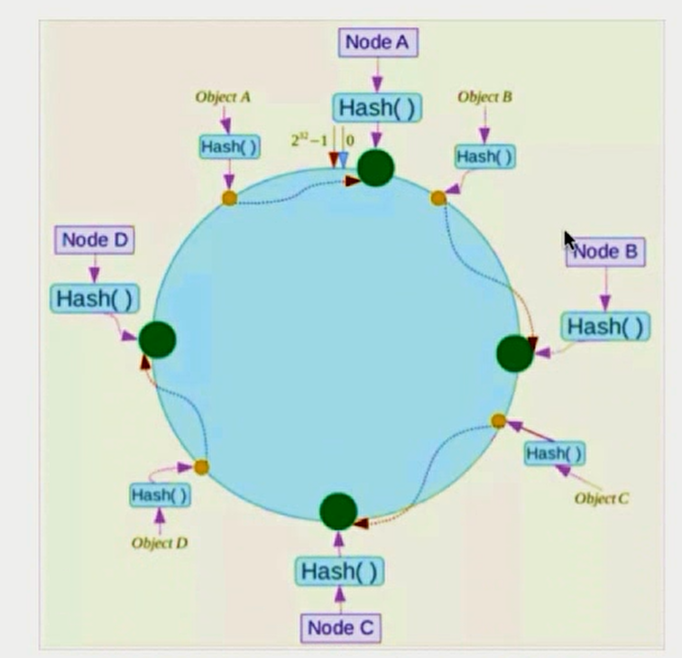

## Hash环的数据倾斜问题

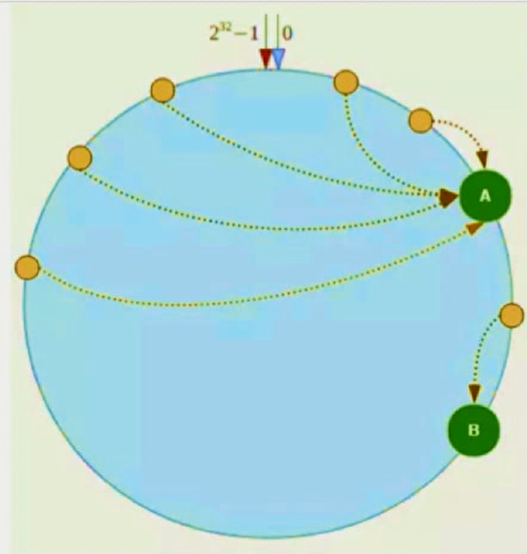

## 引入虚拟节点解决数据倾斜问题

即为每一台服务器计算多个hash

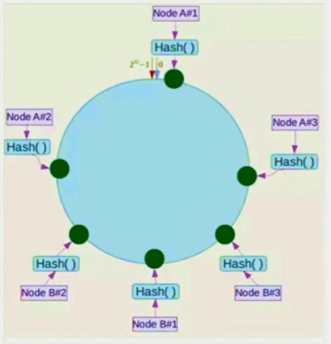