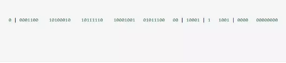

在复杂分布式系统中，往往需要对大量的数据和消息进行唯一标识。如在美团点评的金融、支付、餐饮、酒店、猫眼电影等产品的系统中，数据日渐增长，**对数据分库分表后需要有一个唯一ID来标识一条数据或消息，数据库的自增ID显然不能满足需求**；特别一点的如订单、骑手、优惠券也都需要有唯一ID做标识。此时一个能够生成全局唯一ID的系统是非常必要的。概括下来，那业务系统对ID号的要求有哪些呢？

1. **全局唯一性**：不能出现重复的ID号，既然是唯一标识，这是最基本的要求。
2. **趋势递增：在MySQL InnoDB引擎中使用的是聚集索引，由于多数RDBMS使用B-tree的数据结构来存储索引数据，在主键的选择上面我们应该尽量使用有序的主键保证写入性能。**
3. 单调递增：保证下一个ID一定大于上一个ID，例如事务版本号、IM增量消息、排序等特殊需求。
4. 信息安全：如果ID是连续的，恶意用户的扒取工作就非常容易做了，直接按照顺序下载指定URL即可；如果是订单号就更危险了，竞对可以直接知道我们一天的单量。所以在一些应用场景下，会需要ID无规则、不规则。

上述123对应三类不同的场景，3和4需求还是互斥的，无法使用同一个方案满足。

同时除了对ID号码自身的要求，业务还对ID号生成系统的可用性要求极高，想象一下，如果ID生成系统瘫痪，整个美团点评支付、优惠券发券、骑手派单等关键动作都无法执行，这就会带来一场灾难。

由此总结下一个ID生成系统应该做到如下几点：

1. 平均延迟和TP999延迟都要尽可能低；
2. 可用性5个9；
3. 高QPS。

# 雪花算法


SnowFlake 算法，是 Twitter 开源的分布式 id 生成算法。其核心思想就是：使用一个 64 bit 的 long 型的数字作为全局唯一 id。在分布式系统中的应用十分广泛，且ID 引入了时间戳，基本上保持自增的。


这 64 个 bit 中 中分成4个部分，其中 1 个 bit 是不用的，然后用其中的 41 bit 作为毫秒数，用 10 bit 作为工作机器 id，12 bit 作为序列号。

给大家举个例子吧，比如下面那个 64 bit 的 long 型数字：

第一个部分，是 1 个 bit：0，这个是无意义的。

第二个部分是 41 个 bit：表示的是时间戳。

第三个部分是 5 个 bit：表示的是机房 id，10001。

第四个部分是 5 个 bit：表示的是机器 id，1 1001。

第五个部分是 12 个 bit：表示的序号，就是某个机房某台机器上这一毫秒内同时生成的 id 的序号，0000 00000000。

# 这种方式的优缺点是：

## 优点

- 毫秒数在高位，自增序列在低位，整个ID都是趋势递增的。
- 不依赖数据库等第三方系统，以服务的方式部署，稳定性更高，**所有计算都是位运算，生成ID的性能也是非常高的。**
- 可以根据自身业务特性分配bit位，非常灵活。

## 缺点

强依赖机器时钟，如果机器上时钟回拨，会导致发号重复或者服务会处于不可用状态。

#  ①1 bit：是不用的，为啥呢？

因为二进制里第一个 bit 为如果是 1，那么都是负数，但是我们生成的 id 都是正数，所以第一个 bit 统一都是 0。

# **②41 bit：表示的是时间戳，单位是毫秒。**

41 bit 可以表示的数字多达 2^41 - 1，也就是可以标识 2 ^ 41 - 1 个毫秒值，换算成年就是表示 69 年的时间。

# **③10 bit：记录工作机器 id，代表的是这个服务最多可以部署在 2^10 台机器上，也就是 1024 台机器。**

但是 10 bit 里 5 个 bit 代表机房 id，5 个 bit 代表机器 id。意思就是最多代表 2 ^ 5 个机房（32 个机房），每个机房里可以代表 2 ^ 5 个机器（32 台机器）。 

# **④12 bit：这个是用来记录同一个毫秒内产生的不同 id。**

12 bit 可以代表的最大正整数是 2 ^ 12 - 1 = 4096，也就是说可以用这个 12 bit 代表的数字来区分同一个毫秒内的 4096 个不同的 id。

 简单来说，你的某个服务假设要生成一个全局唯一 id，那么就可以发送一个请求给部署了 SnowFlake 算法的系统，由这个 SnowFlake 算法系统来生成唯一 id。

 这个 SnowFlake 算法系统首先肯定是知道自己所在的机房和机器的，比如机房 id = 17，机器 id = 12。

 

接着 SnowFlake 算法系统接收到这个请求之后，首先就会用二进制位运算的方式生成一个 64 bit 的 long 型 id，64 个 bit 中的第一个 bit 是无意义的。

 

接着 41 个 bit，就可以用当前时间戳（单位到毫秒），然后接着 5 个 bit 设置上这个机房 id，还有 5 个 bit 设置上机器 id。

 

最后再判断一下，当前这台机房的这台机器上这一毫秒内，这是第几个请求，给这次生成 id 的请求累加一个序号，作为最后的 12 个 bit。

 

最终一个 64 个 bit 的 id 就出来了，类似于：


这个算法可以保证说，一个机房的一台机器上，在同一毫秒内，生成了一个唯一的 id。可能一个毫秒内会生成多个 id，但是有最后 12 个 bit 的序号来区分开来。

# 代码

```java
public class IDWorker {

    /**
     * 起始的时间戳
     */
    private final static long START_STMP = 1480166465631L;

    /**
     * 每一部分占用的位数
     * 最高1位不用
     * 41位时间戳
     * 1+41+5+5+12=64
     */
    private final static long SEQUENCE_BIT = 12; //序列号占用的位数
    private final static long MACHINE_BIT = 5;   //机器标识占用的位数
    private final static long DATACENTER_BIT = 5;//数据中心占用的位数

    /**
     * 每一部分的最大值
     */
    private final static long MAX_DATACENTER_NUM = -1L ^ (-1L << DATACENTER_BIT);
    private final static long MAX_MACHINE_NUM = -1L ^ (-1L << MACHINE_BIT);
    private final static long MAX_SEQUENCE = -1L ^ (-1L << SEQUENCE_BIT);

    /**
     * 每一部分向左的位移
     */
    private final static long MACHINE_LEFT = SEQUENCE_BIT;
    private final static long DATACENTER_LEFT = SEQUENCE_BIT + MACHINE_BIT;
    private final static long TIMESTMP_LEFT = DATACENTER_LEFT + DATACENTER_BIT;

    private long datacenterId;  //数据中心,可以指机房
    private long machineId;     //机器标识
    private long sequence = 0L; //序列号
    private long lastStmp = -1L;//上一次时间戳

    public IDWorker(long datacenterId, long machineId) {
        if (datacenterId > MAX_DATACENTER_NUM || datacenterId < 0) {
            throw new IllegalArgumentException("datacenterId can't be greater than MAX_DATACENTER_NUM or less than 0");
        }
        if (machineId > MAX_MACHINE_NUM || machineId < 0) {
            throw new IllegalArgumentException("machineId can't be greater than MAX_MACHINE_NUM or less than 0");
        }
        this.datacenterId = datacenterId;
        this.machineId = machineId;
    }

    /**
     * 产生下一个ID
     *
     * @return
     */
    public synchronized long nextId() {
        long currStmp = getNewstmp();
        if (currStmp < lastStmp) {
            throw new RuntimeException("Clock moved backwards.  Refusing to generate id");
        }

        if (currStmp == lastStmp) {
            //相同毫秒内，序列号自增
            sequence = (sequence + 1) & MAX_SEQUENCE;
            //同一毫秒的序列数已经达到最大
            if (sequence == 0L) {
                currStmp = getNextMill();
            }
        } else {
            //不同毫秒内，序列号置为0
            sequence = 0L;
        }

        lastStmp = currStmp;

        return (currStmp - START_STMP) << TIMESTMP_LEFT //时间戳部分
                | datacenterId << DATACENTER_LEFT       //数据中心部分
                | machineId << MACHINE_LEFT             //机器标识部分
                | sequence;                             //序列号部分
    }

    private long getNextMill() {
        long mill = getNewstmp();
        while (mill <= lastStmp) {
            mill = getNewstmp();
        }
        return mill;
    }

    private long getNewstmp() {
        return System.currentTimeMillis();
    }

    public static void main(String[] args) {
        IDWorker idWorker = new IDWorker(2, 3);
        for (int i = 0; i < 10; i++) {
            System.out.println(idWorker.nextId());
        }
      /*  System.out.println(MAX_SEQUENCE);
        System.out.println(Long.toBinaryString(MAX_SEQUENCE));*/
    }

}
```

