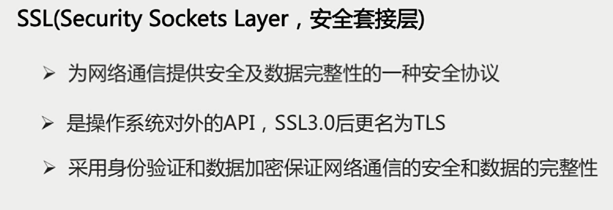

# 1、OSI开放式互联参考模型

  **概念性框架**

# 2、OSI的实现：TCP/IP

**先自上而下，后自下而上处理数据头部**

# 3、说说TCP的三次握手

1. 面向连接的、可靠的、基于字节流的传输层通信协议
2. 将应用层数据流分割成报文段并发送给目标节点的TCP层
3. 数据包都有序号，对方收到则发送ACK确认，未收到则重传
4. 用来校验和来检验数据在传输过程中是否有误

**TCP报文头**

**TCP连接是全双工的**

**TCP Flags**

1. URG:紧急指针标志
2. ACK：确认序号标志
3. PSH：push标志
4. RST：重置连接标志
5. SYN：同步序号，用于建立连接过程
6. FIN：finish标志，用于释放连接

**"握手"是为了建立连接，TCP三次握手的流程图如下：**

**在TCP/IP协议中，TCP协议提供可靠的连接服务，采用3次握手建立一个连接**

- **第一次握手：建立连接时，客户端发送一个SYN包（syn=x）到服务器，并进入SYN_SENT状态，等待服务器确认；**
- **第二次握手：服务器收到SYN包，必须确认客户的SYN（ack=x+1）,同时自己也发送一个SYN包（syn=y）,即SYN+ACK包，此时服务器进入SYN_RECV状态；**
- **第三次握手：客户端收到服务器的SYN+ACK包，向服务器发送确认包ACK（ack=y+1）,此包发送完毕，客户端和服务器进入ESTABLISHED状态，完成三次握手**

## 为什么需要三次握手才能建立起连接

为了初始化Sequence Number即上图中的x，y。通信双方要告诉对方自己初始化的Sequence Number,作为以后数据通信的序号,以保证应用层接收到的数据，不会因为网络上的传输问题而乱序，即TCP会用这个序号来拼接数据。

**首次握手的隐患----SYN超时**

**问题起因分析**

1. Server收到Client的SYN，回复SYN-ACK的时候未收到ACK确认
2. Server不断重试直到超时，Linux默认等待63s才断开连接。（默认重试次数为5次，重试的间隔时间从1s开始，每次都翻倍1+2+4+8+16=31s，第5次发出去之后，还需要等待32s才能判定超时，所以一共63s）

**后果：SYN Flood攻击，恶意程序给服务器发1个SYN报文之后下线。让服务器等63s**

针对SYN Flood的防护措施

1. SYN队列满后，通过tcp_syncookies参数回发SYN Cookie
2. 若为正常连接则Client会回发SYN Cookie，直接建立连接

**建立连接后，Client出现故障怎么办**

**保活机制**

1. 向对方发送保活探测报文，如果未收到响应则继续发送
2. 尝试次数达到保活探测数，仍未收到响应则中断连接

**4、谈一谈TCP的四次挥手**

**“挥手”是为了终止连接，TCP四次挥手的流程图如下：（总共发出4个包）**

因为第二次挥手之后，服务端还可以发送数据，所以seq变成了w

**由于TCP连接是全双工的，连接的拆除需要发送四个包，因此称为“四次挥手”。客户端或服务器均可主动发起挥手动作，在socket编程中，任何一方执行close()操作即可产生挥手操作。**

1. **第一次挥手：Client发送一个FIN，用来关闭Client到Server的数据传送，Client进入FIN_WAIT_1状态；**
2. **第二次挥手：Server收到FIN后，发送一个ACK给Client，确认序号为收到的序号+1(与SYN相同，一个FIN占用一个序号)，Server进入CLOSE_WAIT状态**
3. **第三次挥手：Server发送一个FIN，用来关闭Server到 Client的数据传输，Server进入LAST_ACK状态；**
4. **第四次挥手：Client收到FIN后，Client进入TIME_WAIT状态，接着发送一个ACK给Server，确认序号为收到序号+1，Server进入CLOSED状态，完成四次挥手**

 **MSL为最长报文段寿命**

**为什么会有TIME_WAIT状态**

1、确保有足够的时间让对方收到ACK包，如果被动关闭的那方没有收到ACK，就会触发被动端重发FIN包，一来一去正好2个MSL

2、避免新旧连接混淆，有些路由器会缓存IP数据包，如果连接被重用了，那么这些延迟收到的包可能会跟新连接混在一起

**为什么需要四次握手才能断开连接**

因为TCP连接是全双工的，所以发送方和接收方都需要FIN报文和ACK报文，所以发送方和接收方各需要2次挥手

**服务器出现大量CLOSE_WAIT状态的原因**

其中一个表现：客户端一直在请求，但是返回给客户端的信息是异常的，但是服务器压根没收到请求 

对方关闭socket连接，我方忙于读或写，没有及时关闭连接

1、检查代码，特别是释放资源的代码

2、检查配置，特别是处理请求的线程配置，比如线程池中的线程数配置不合理

# 4、UDP简介

**UDP报文结构**

**UDP的特点**

1. 面向非连接
2. 不维护连接状态，支持同时向多个客户端传输相同的消息
3. 数据包报头只有8个字节（相对于TCP的20个字节信息报头），额外开销较小
4. 吞吐量只受限于数据生成速率，传输速率以及机器性能
5. 尽最大努力交付，不保证可靠交付，不需要维持复杂的链接状态表
6. 面向报文，不对应用程序提交的报文信息进行拆分或者合并

**TCP和UDP的区别**

1. TCP面向连接vsUDP面向无连接
2. 可靠性，TCP通过握手确认和重传机制来保证可靠性，UDP是不可靠的
3. 有序性，TCP利用序列号保证了消息报的顺序交互，到达可能无序，但TCP最终会排序，UDP不具备有序性
4. 速度：TCP速度较慢，因为要建立连接，保证消息的可靠性和有序性。UDP速度更快
5. 量级，TCP重量级，UDP轻量级。体现在元数据的头大小，TCP20字节，UDP8字节

# 5、TCP的滑动窗口

**RTT和RTO**

- RTT（Round-Trip Time）：发送一个数据包到收到对应的ACK，所花费的时间
- RTO(Retransmission Time Out)：重传时间间隔，是根据RTT计算出来的

**TCP通过滑动窗口做流量控制与乱序重排**

- 保证TCP的可靠性
- 保证TCP的流控特性

从左到右发送或者接收

发送端：

LastByteWriten：上层应用已写完的最后一个字节位置，即当前程序已经准备好的最新的一个数据段

LastByteSent：指向已发送的最后一个字节的位置，只是发出去了，还没收到ACK的回应

LastByteAcked：指向收到的最大ACK的位置

接收端：

LastByteRead：表示上层应用已经读完的最后一个字节的位置，已经给回执的最后一个位置

NextByteExpected：收到连续最大的sequence的位置

LastByteRcvd：已经收到的最后一个字节的位置 

**接收方还能接受的量**

**和窗口内剩余可发送的量**

**TCP会话的发送方**

**Category2,3组成滑动窗口**

**TCP会话的接收方**

**TCP最基本的传输可靠性来源于确认重传机制，TCP的滑动窗口的可靠性，也是建立在确认重传基础上的，发送窗口只有收到接收端对于本段发送窗口内字节的ACK确认，才会移动发送窗口的左边界，接受窗口只有在前面所有的段都确认的情况下，才会移动左边界。当前面还有字节未接受，但收到后面的字节的情况下，窗口是不会移动的，并不对后续字节确认，以此确保重传。滑动窗口的大小可以根据一定策略动态调整。例如会根据自身的处理能力的变化，通过本端TCP接受窗口大小的控制来实现对端的发送窗口进行流量限制**

# 6、HTTP简介

超文本传输协议HTTP主要特点

- 支持客户/服务器模式
- 简单快速
- 灵活
- 无连接
- 无状态

## HTTP请求结构

**请求行，请求头，请求空行，请求正文**

## HTTP响应结构

**响应行、响应头、响应空行、响应体**

**请求/响应的步骤**

- 客户端连接到Web服务器
- 发送HTTP请求
- 服务器接收请求并返回HTTP响应
- 释放连接TCP连接
- 客户端浏览器解析HTML内容

## 面试题：在浏览器地址栏输入URL，按下回车之后经历的流程

答案：

- DNS解析，DNS从近到远依次是浏览器缓存，系统缓存，路由器缓存，IPS服务器缓存，域名服务器缓存，顶级域名服务器缓存
- TCP连接
- 发送HTTP请求
- 服务器处理请求并返回HTTP报文
- 浏览器解析渲染页面
- 连接结束

## 面试题，常见的HTTP状态码

5中可能的取值

- 1xx：指示信息--表示请求已接受，继续处理
- 2xx：成功--表示请求已被成功接受、理解、接受
- 3xx：重定向--要完成请求必须进行更进一步的操作
- 4xx：客户端错误--请求有语法错误或请求无法实现
- 5xx：服务端错误--服务器未能实现合法的请求

## 面试题：GET请求和POST请求的区别

### 从三个层面来解答

- 从HTTP报文层面：GET将请求信息放在URL，POST放在报文体中
- 数据库层面：GET符合幂等性和安全性，POST不符合
- 其它层面：GET可以被缓存，被存储，而POST不行

## 面试题：Cookie和Session的区别

### Cookie简介

- 是由服务器发给客户端的特殊信息，以文本的形式存放在客户端
- 客户端再次请求的时候，会把Cookie回发
- 服务器接收到后，会解析Cookie生成的客户端相对应的内容

### Cookie的设置以及发送过程

### Session简介

- 服务器端的机制，在服务器上保存的信息
- 解析客户端请求并操作session id，按需保存状态信息

### Session的实现方式

### cookie和session的区别

- cookie数据存放在客户的浏览器上，session的数据放在服务器上
- session相对于cookie更安全
- 若考虑减轻服务器负担，应当使用cookie

# HTTP和HTTPS的区别

**SSL，安全套接层**

加密的方式

HTTPS是证书+各种加密方式，打出了一套组合拳

## Https数据传输流程

 

## Http和Https的区别

