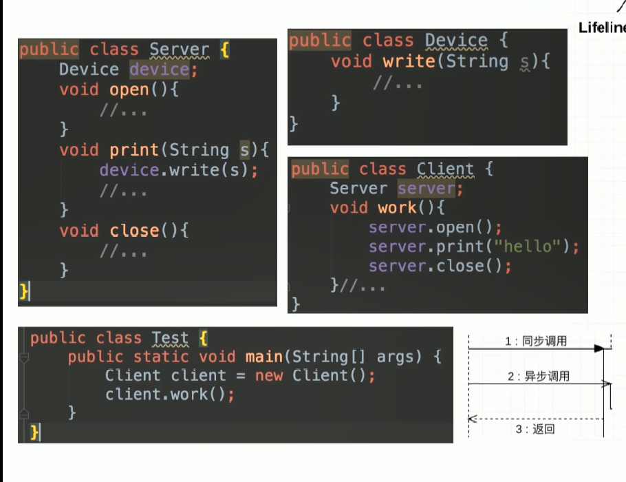

# UML定义

1. **统一建模语言（Unified Modeling Language,缩写UML）**
2. **非专利的第三代建模和规范语言**

# UML特点

1. **UML是一种开放的方法**
2. **用于说明、可视化、构建和编写一个正在开发的面向对象的、软件密集系统的制品的开放方法**
3. **UML展示了一系列最佳工程实践，这些最佳实践在对大规模，复杂系统进行建模方面，特别是在软件架构层次已经被验证有效**

# **UML类图**

1. **Class Diagram:用于表示类、接口、实例等之间相互的静态关系**
2. **虽然名字叫类图，但类图中并不只有类**

# 记忆技巧

## **1、箭头方向****从子类指向父类**

1. **UML箭头方向：****从子类指向父类**
2. **定义子类时需要通过extends关键字指定父类**
3. **子类一定是知道父类定义的，但父类并不知道子类的定义**
4. **只有知道对方信息时，才能指向对方**

## **2、****实线-继承|虚线-实现**

1. **空心三角箭头：继承或实现**
2. **实线-继承，is a 关系，扩展目的，不虚，很结实**
3. **虚线-实现，虚线代表“虚”无实体**

## **3、****实线-关联|虚线-依赖**

**关联关系通常是一个类中有另一个类对象作为属性****（也就是一个类是另外一个类的成员变量）**

**依赖关系一般是一个类使用另一个类作为参数使用，或作为返回值**

1. **虚线-依赖关系：临时用一下，若即若离，虚无缥缈，若有若无**
2. **表示一种使用关系，一个类需要借助另一个类来实现功能**
3. **一般是一个类使用另一个类作为参数使用，或作为返回值**

1. **实线-关联关系：关系稳定，实打实的关系，铁哥们**
2. **表示一个类对象和另一个类对象有关联**
3. **通常是一个类中有另一个类对象作为属性****（也就是一个类是另外一个类的成员变量）**

## **4、空心菱形-聚合|实心菱形-组合**

1. **菱形就是一个盛东西的器皿（例如盘子）**
2. **聚合：代表空器皿里可以放很多相同的东西，聚在一起（箭头方向所指的类）**
3. **组合：代表满器皿里已经有实体结构的存在，生死与共**

**空心菱形-聚合**

1. **整体和局部的关系，两者有着独立的生命周期，是****has a****的关系**
2. **弱关系**
3. **消极的词:弱-空**

**A类中包含B类的一个引用，当A类对象消失时，B类对象不会消失，还有别的对象引用它**

**实心菱形-组合**

1. **整体与局部的关系，和聚合的关系相比，关系更加强烈，两者有相同的生命周期，是contains-a的关系**
2. **强关系**
3. **积极的词：强-满**

**鸟和翅膀是强关系，并且有相同的生命周期**

**A类中包含B类的一个引用，当A类对象消失时，B类对象也同时消失，没有任何一个对象引用它，就成了垃圾回收对象**

**上图表示1个鸟有2个翅膀**

# UML时序图

**Sequence Diagram：是显示对象之间交互的图，这些对象是按时间顺序排列的**

**时序图中包括的建模元素主要有：**

1. **对象（Actor）**
2. **生命线（Lifeline）**
3. **控制焦点（Focus of control）**
4. **消息（Message）**

**时间从上到下流逝**

# **一个典型的类图**

1. **第一行类的名字，斜体代表抽象类，接口需要加《interface》**
2. **第二行类的属性，第三行类的行为**
3. **+ public**
4. **- private**
5. **# protected**
6. **~ 或者什么都不加 为default**
7. **下划线  代表 static**
8. **斜体 代表抽象方法**

