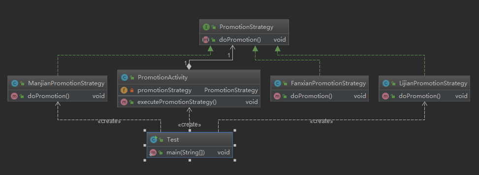
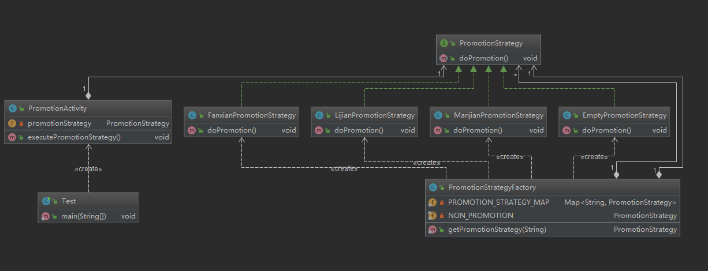

# **策略模式**

- 定义：定义了算法家族，分别封装起来，让他们之间可以相互替换，此模式让算法的变化不会影响到使用算法的用户 
- 消除大量的if....else....
- 类型：行为型

# **策略模式-适用场景**

- 系统有很多类，而他们的区别仅仅在于他们的行为不同
- 一个系统需要动态地在几种算法中选择一种

# **策略模式-优点**

- 开闭原则
- 避免使用多重条件转移语句（if....else....）
- 提高算法的保密性和安全性

# **策略模式-缺点**

- 客户端必须知道所有的策略类，并自行决定使用哪一个策略类
- 产生很多策略类



```java
public interface PromotionStrategy {
    void doPromotion();
}
```

```java
public class ManjianPromotionStrategy  implements PromotionStrategy{
    @Override
    public void doPromotion() {
        System.out.println("满减促销");
    }
}
```

```java
public class PromotionActivity {
    private PromotionStrategy promotionStrategy;

    public PromotionActivity(PromotionStrategy promotionStrategy) {
        this.promotionStrategy = promotionStrategy;
    }
    public void executePromotionStrategy(){
        promotionStrategy.doPromotion();
    }
}
```

# **更优雅的解决方案：策略+工厂**



```java
public class PromotionStrategyFactory {
    private static Map<String,PromotionStrategy> PROMOTION_STRATEGY_MAP=new HashMap<String, PromotionStrategy>();
    static {
        PROMOTION_STRATEGY_MAP.put(PromotionKey.LIJIAN,new LijianPromotionStrategy());
        PROMOTION_STRATEGY_MAP.put(PromotionKey.MANJIAN,new ManjianPromotionStrategy());
        PROMOTION_STRATEGY_MAP.put(PromotionKey.FANXIAN,new FanxianPromotionStrategy());
    }
    private PromotionStrategyFactory(){
    }
    private static final  PromotionStrategy NON_PROMOTION =new EmptyPromotionStrategy();
    public static PromotionStrategy getPromotionStrategy(String promotionKey){
        PromotionStrategy promotionStrategy = PROMOTION_STRATEGY_MAP.get(promotionKey);
        return promotionStrategy==null?NON_PROMOTION:promotionStrategy;
    }
    private interface PromotionKey{
        String LIJIAN="LIJIAN";
        String FANXIAN="FANXIAN";
        String MANJIAN="MANJIAN";
    }
}
```

```java
public class Test {
    public static void main(String[] args) {
     String promotionKey="LIJIAN";
     PromotionActivity promotionActivity=new PromotionActivity(PromotionStrategyFactory.getPromotionStrategy(promotionKey));
     promotionActivity.executePromotionStrategy();
    }
}
```

# JDK应用

Arrays工具类中的sort方法需要传入Comparator

```java
public static <T> void sort(T[] a, int fromIndex, int toIndex,
                            Comparator<? super T> c) {
                                //...
                            }
```

Comparator是一个接口

```java
public interface Comparator<T> {//...}
```

