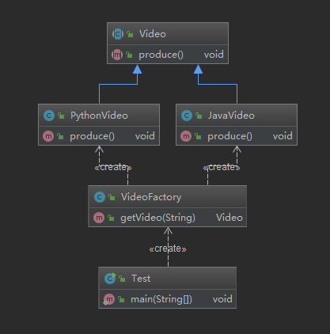
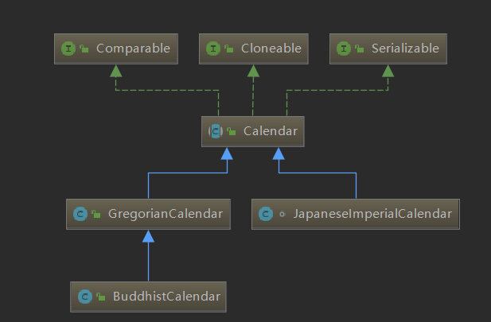

# **简单工厂**

- 定义：由一个工厂对象决定创建出哪一种产品的实例
- 类型：创建新，但不属于GOF23种设计模式

# **适用场景**

- 工厂类负责创建的对象比较少
- 客户端（应用层）只知道传入工厂类的参数，对于如何创建对象（逻辑）不关心

# 优点

- 只需要传入一个正确的参数（甚至不需要知道类名），就可以获取你所需要的对象，而无需知道其创建细节

# 缺点

- 工厂类的职责相对过重，增加新的产品，需要修改工厂类的判断逻辑，违背开闭原则



**用反射改进**

```java
public class VideoFactory {
     public Video getVideo(Class clazz){
        Video video=null;
        try {
            video = (Video) Class.forName(clazz.getName()).newInstance();
        } catch (InstantiationException e) {
            e.printStackTrace();
        } catch (IllegalAccessException e) {
            e.printStackTrace();
        } catch (ClassNotFoundException e) {
            e.printStackTrace();
        }
        return video;
    }
}
```

# **简单工厂JDK源码**



```java
public static Calendar getInstance(TimeZone zone)
{
    return createCalendar(zone, Locale.getDefault(Locale.Category.FORMAT));
}
```

**在写mysql driver时**

`Class.forName("com.mysql.jdbc.Driver");` 

**logback中**

```java
public static Logger getLogger(String name) {   ILoggerFactory iLoggerFactory = getILoggerFactory();   return iLoggerFactory.getLogger(name); } 
```

