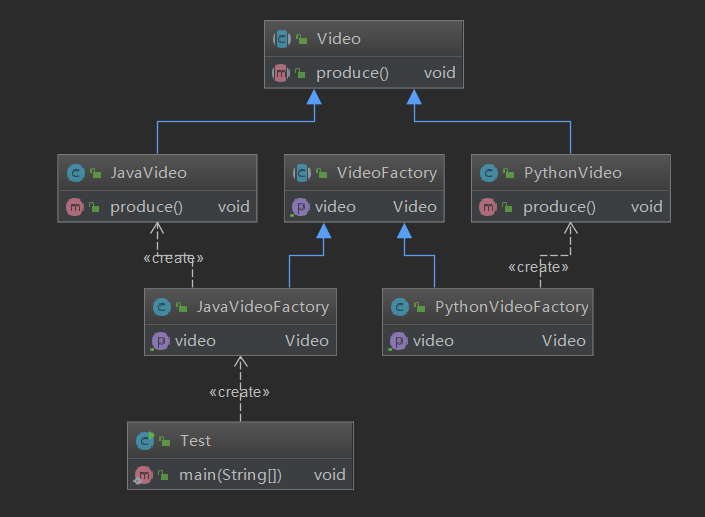

# 工厂方法

定义：定义一个创建对象的接口

但让实现这个接口的类来决定实例化哪个类

**工厂方法让类的实例化推迟到子类中进行**

# 类型：创建型

# **工厂方法-适用场景**

- 创建对象需要大量重复代码
- 客户端（应用层）不依赖于产品类实例如何被创建，实现等细节
- 一个类通过其子类来指定创建哪个对象

# **工厂方法-优点**

- 用户只需要关心所需产品对应的工厂，无需关心创建细节
- 加入新产品符合开闭原则，提高可扩展性

# **工厂方法-缺点**

类的个数容易过多，增加复杂度

增加了系统的抽象性和理解难度



```java
public abstract class VideoFactory {
    public abstract Video getVideo();
}
```

```java
public class JavaVideoFactory extends VideoFactory {
    @Override
    public Video getVideo() {
        return new JavaVideo();
    }
}
```

```java
public abstract class Video {
    public abstract void produce();
}
```

```java
public class JavaVideo extends Video {
    @Override
    public void produce() {
        System.out.println("录制Java视频");
    }
}
```

```java
public class Test {
    public static void main(String[] args) {
        VideoFactory videoFactory=new JavaVideoFactory();
        Video video = videoFactory.getVideo();
        video.produce();
    }
```

 **JDK中**

接口Collection 是一个抽象工厂相当于VideoFactory 

抽象产品Iterator<E>相当于Video 

工厂方法：相当于：`public abstract void produce()`;

`Iterator<E> iterator(); `

具体实现工厂：ArrayList  相当于JavaVideo 

实际产品new Itr()  相当于  `public void produce() { System.out.println("录制Java视频");}`

```java
public Iterator<E> iterator() {
    return new Itr();
}
```


