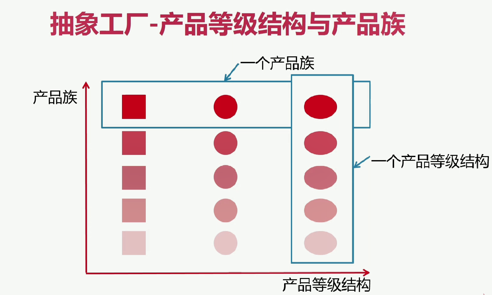
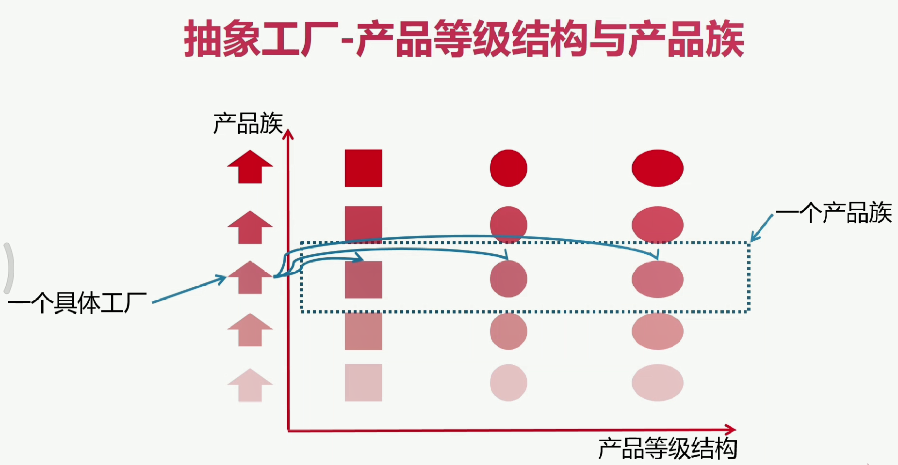
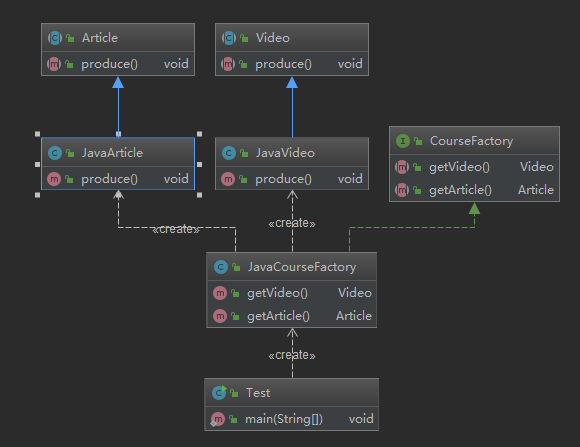
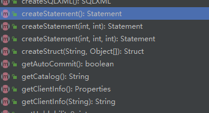

# 抽象工厂模式

适用于产品等级结构相对固定的，并且多个产品组合在一起形成产品族

抽象工厂里的方法，经常以工厂方法的形式来实现

**工厂方法针对的是产品等级结构**

**抽象工厂模式针对的是产品族**

- 定义：抽象工厂模式提供一个创建一系列相关或相互依赖对象的接口
- 无需指定他们具体的类
- 类型：创建型

# **抽象工厂-适用场景**

- 客户端（应用层）不依赖于产品类实例如何被创建、实现等细节
- 强调一系列相关的产品对象（属于同一产品族）一起使用创建对象需要大量重复代码
- 提供一个产品类的库，所有产品以同样的接口出现，从而使客户端不依赖于具体实现

# **抽象工厂-优点**

- 具体产品在应用层代码隔离，无须关心创建细节
- 将一个系列的产品族统一到一起创建

# **抽象工厂-缺点**

- 规定了所有可能被创建的产品集合，产品族中扩展新的产品困难，需要修改抽象工厂的接口
- 增加了系统的抽象性和理解难度

# **抽象工厂-产品等级结构与产品族**

产品族的是美的品牌，有不同产品冰箱，洗衣机

产品等级结构是指都是冰箱，有不同的品牌，美的，西门子

**工厂方法针对的是产品等级结构**

**抽象工厂模式针对的是产品族。我们指出产品族和产品等级结构，就可以唯一的确定这个产品**

# UML类图

# **在java.sql.Connection中**

返回的都是同一产品族，例如Mysql的相关连接