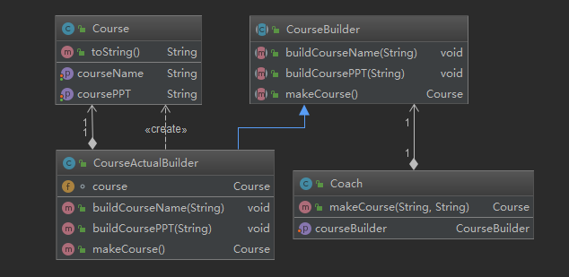
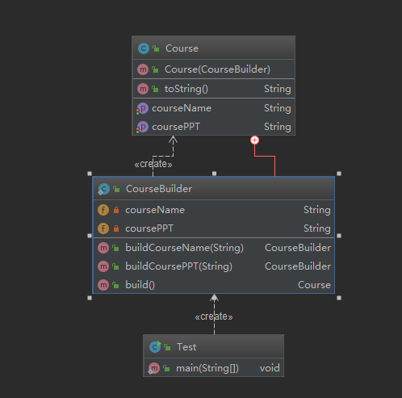

# 定义与类型

1. 定义：将一个复杂对象的构建与它的表示分离，使得同样的构建过程可以创建不同的表示
2. 用户只需指定需要建造的类型就可以得到它们，建造过程及细节不需要知道
3. 类型：创建型

# 建造者-适用场景

1. 如果一个对象有非常复杂的内部结构（很多属性）
2. 想把复杂对象的创建和使用分离

# 建造者-优点

1. 封装性好，创建和使用分离
2. 扩展性好、建造类之间独立，一定程度上解耦

# 建造者-缺点

1. 产生多余的Builder对象
2. 产品内部发生变化，建造者都要修改，成本较大

# UML类图

## v1



## v2

```java
public class Course {
    private String courseName;
    private String coursePPT;

    public Course(CourseBuilder courseBuilder) {
        this.courseName=courseBuilder.courseName;
        this.coursePPT=courseBuilder.coursePPT;
    }

    public String getCourseName() {
        return courseName;
    }

    public void setCourseName(String courseName) {
        this.courseName = courseName;
    }

    public String getCoursePPT() {
        return coursePPT;
    }

    public void setCoursePPT(String coursePPT) {
        this.coursePPT = coursePPT;
    }
    public static class CourseBuilder{
        private String courseName;
        private String coursePPT;
        public CourseBuilder buildCourseName(String courseName){
            this.courseName=courseName;
            return this;
        }
        public CourseBuilder buildCoursePPT(String coursePPT){
            this.coursePPT=coursePPT;
            return this;
        }
        public Course build(){
            return new Course(this);
        }
    }

    @Override
    public String toString() {
        return "Course{" +
                "courseName='" + courseName + '\'' +
                ", coursePPT='" + coursePPT + '\'' +
                '}';
    }
}
```



#  建造者模式源码解析(jdk+guava+spring+mybatis)

## jdk

```java
  public StringBuilder append(StringBuffer sb) {
        super.append(sb);
        return this;
    }

    @Override
    public StringBuilder append(CharSequence s) {
        super.append(s);
        return this;
    }
```
## guava
```java
Set<String> set = ImmutableSet.<String>builder().add("a").add("b").build();
System.out.println(set);
```

