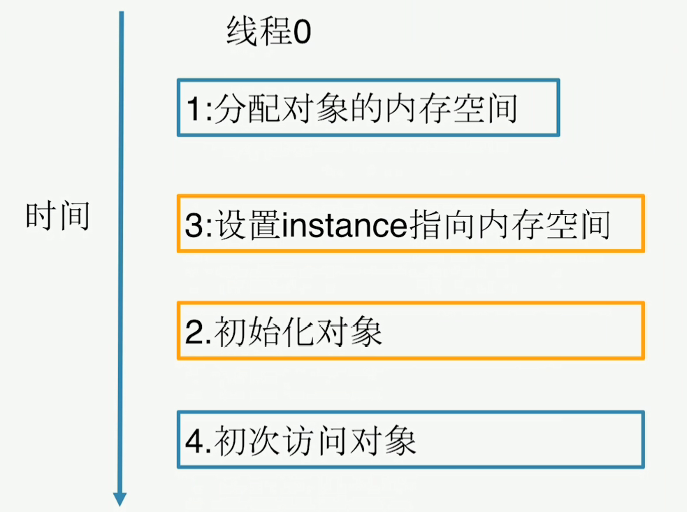
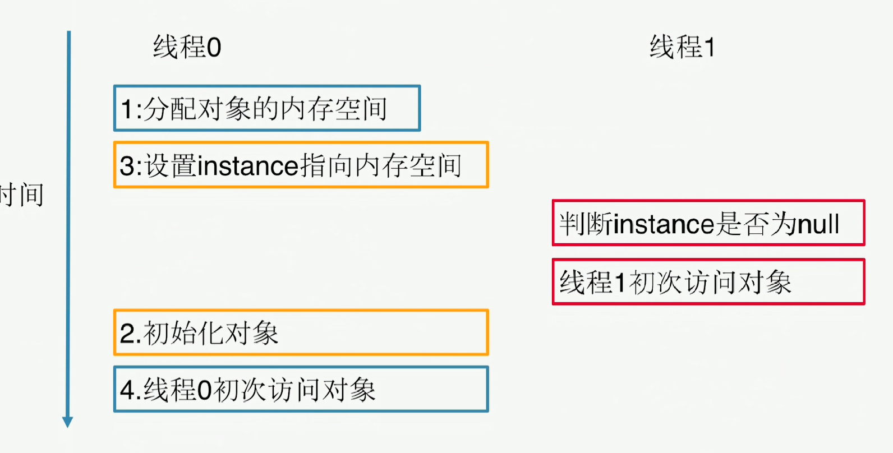
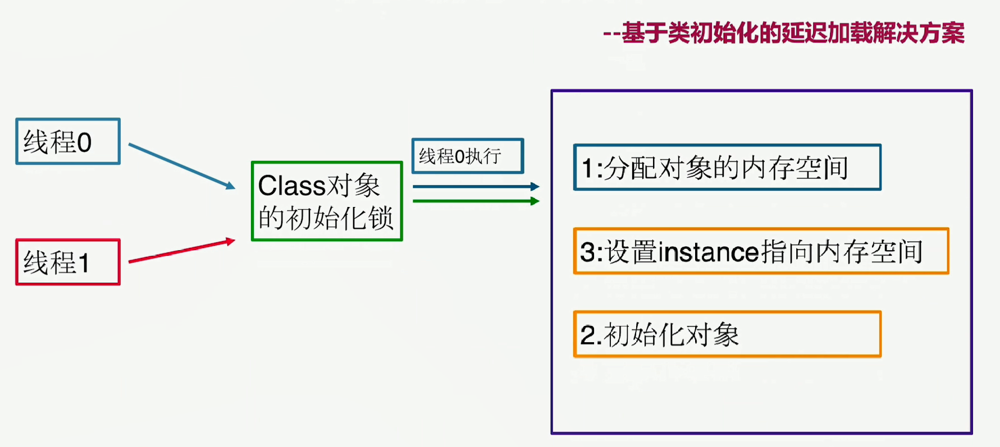

# 单例-定义与类型

- 定义：保证一个类仅有一个实例，并提供一个全局访问点
- 创建型

# 单例-适用场景

- 想确保任何情况下都绝对只有一个实例

# 单例-优点

- 在内存里只有一个实例，减少了内存开销
- 可以避免对资源的多重占用
- 设置全局访问点，严格控制访问

# 单例-缺点

- 没有接口，扩展困难

# 单例重点

- 私有构造器
- 线程安全
- 延迟加载
- 序列化和反序列化安全
- 防止反射攻击

# 单例实现方案

# 单例-Double Check





`lazyDoubleCheckSingleton=new LazyDoubleCheckSingleton();`这句代码会发生指令重排

    //1.分配内存给这个对象
    //3.设置lazyDoubleCheckSingleton 指向刚分配的内存地址
    //2.初始化对象
##  volatile 的特性

- volatile 是一个类型修饰符。volatile 的作用是作为指令关键字，确保本条指令不会因编译器的优化而省略。
- 保证了不同线程对这个变量进行操作时的可见性，即一个线程修改了某个变量的值，这新值对其他线程来说是立即可见的。**（实现可见性）**
- **禁止进行指令重排序。（实现有序性）**
- **volatile 只能保证对单次读/写的原子性。`i++` 这种操作不能保证原子性。**

##  volatile 的实现原理

volatile 变量的内存可见性是基于内存屏障（Memory Barrier）实现。

- 内存屏障，又称内存栅栏，是一个 CPU 指令。

- 在程序运行时，为了提高执行性能，编译器和处理器会对指令进行重排序，JVM 为了保证在不同的编译器和 CPU 上有相同的结果，通过插入特定类型的内存屏障来禁止特定类型的编译器重排序和处理器重排序，插入一条内存屏障会告诉编译器和 CPU：不管什么指令都不能和这条 Memory Barrier 指令重排序。

- lock 前缀的指令在多核处理器下会引发两件事情。 

  - 1）将当前处理器缓存行的数据写回到系统内存。
  - 2）写回内存的操作会使在其他 CPU 里缓存了该内存地址的数据无效。

- 为了提高处理速度，处理器不直接和内存进行通信，而是先将系统内存的数据读到内部缓存（L1，L2 或其他）后再进行操作，但操作完不知道何时会写到内存。

- 如果对声明了 volatile 的变量进行写操作，JVM 就会向处理器发送一条 lock 前缀的指令，将这个变量所在缓存行的数据写回到系统内存。

- 为了保证各个处理器的缓存是一致的，实现了缓存一致性协议（MESI），每个处理器通过嗅探在总线上传播的数据来检查自己缓存的值是不是过期了，当处理器发现自己缓存行对应的内存地址被修改，就会将当前处理器的缓存行设置成无效状态，当处理器对这个数据进行修改操作的时候，会重新从系统内存中把数据读到处理器缓存里。 

  - 所有多核处理器下还会完成：3）当处理器发现本地缓存失效后，就会从内存中重读该变量数据，即可以获取当前最新值。

- volatile 变量通过这样的机制就使得每个线程都能获得该变量的最新值。

使用volatile禁止指令重排

```java
package com.wjj.design.pattern.creational.singleton;

/**
 * @author wjj
 * @version 1.0
 * @date 2019/12/1 11:42
 */
public class LazyDoubleCheckSingleton {
    private volatile static LazyDoubleCheckSingleton lazyDoubleCheckSingleton;
    private LazyDoubleCheckSingleton(){
    }
    public static LazyDoubleCheckSingleton getInstance(){
        if (lazyDoubleCheckSingleton==null){
            synchronized (LazyDoubleCheckSingleton.class){
                if (lazyDoubleCheckSingleton==null){
                    lazyDoubleCheckSingleton=new LazyDoubleCheckSingleton();
                    //指令重排
                    //1.分配内存给这个对象
                    //3.设置lazyDoubleCheckSingleton 指向刚分配的内存地址
                    //2.初始化对象
                    //intra-thread semantics保证重排序不会改变单线程内的执行结果
                    //  ------------------------3.设置lazyDoubleCheckSingleton 指向刚分配的内存地址
                }
            }
        }
        return lazyDoubleCheckSingleton;
    }
}

```


# 单例-静态内部类

-- 基于类初始化的延迟加载解决方案

##  类在以下情况会被初始化

1. 创建类的实例
2. 调用类的静态方法
3. 类中静态成员被赋值
4. **使用类的非常量静态成员**
5. 调用Java API中的某些反射方法
6. 初始化某个类的子类
7. 含有main()方法的类启动时



```java
package com.wjj.design.pattern.creational.singleton;
/**
 * @author wjj
 * @version 1.0
 * @date 2019/12/1 17:05
 */
public class StaticInnerClassSingleton {
    private static class InnerClass{
        private static StaticInnerClassSingleton staticInnerClassSingleton=new StaticInnerClassSingleton();
    }
    public static StaticInnerClassSingleton getInstance(){
        return InnerClass.staticInnerClassSingleton;
    }
    private StaticInnerClassSingleton(){
    }
}
```


# 实用技能

- 反编译
- 内存原理
- 多线程Debug

# 单例-相关设计模式

- 单例模式和工厂模式
- 单例模式和享元模式

# 序列化和反序列化安全

先序列化到文件，再读出，变成为了2个对象

```java
  LazyDoubleCheckSingleton instance = LazyDoubleCheckSingleton.getInstance();
        ObjectOutputStream oos = new ObjectOutputStream(new FileOutputStream("singleton_file"));
        oos.writeObject(instance);

        File file = new File("singleton_file");
        ObjectInputStream ois = new ObjectInputStream(new FileInputStream(file));
        LazyDoubleCheckSingleton newInstance = (LazyDoubleCheckSingleton) ois.readObject();
        System.out.println(instance);
        System.out.println(newInstance);
        System.out.println(instance==newInstance);
```
加入一个这个方法通过，反序列化时，会检测有没有这个方法，如果有，则通过这个方法生成
```java
  private Object readResolve(){
        return getInstance();
    }
```

# 防止反射攻击

## 静态内部类方法

可以勉强避免反射攻击，因为只要反射调用构造函数，`InnerClass`就会被加载，从而`InnerClass.staticInnerClassSingleton`就会被生成，生成的时候，又会调用构造函数，生成`StaticInnerClassSingleton`实例，然后回到反射调用的构造函数，此时`InnerClass.staticInnerClassSingleton`已经不是null，就会抛出异常。这种情况，不可能用反射生成实例

```java
   private StaticInnerClassSingleton(){
       // System.out.println(InnerClass.staticInnerClassSingleton);
        if (InnerClass.staticInnerClassSingleton!=null){
            throw new RuntimeException("单例构造器禁止反射调用");
        }
    }
```

## Double Check

```java
  private LazyDoubleCheckSingleton(){
        if (lazyDoubleCheckSingleton!=null){
            throw new RuntimeException("单例构造器禁止反射调用");
        }
   }
```
先用反射，则能破坏单例，反过来，先`getInstance`则不会出现问题，但是在多线程情况下，不能保证哪个先执行

```java
        Class<LazyDoubleCheckSingleton> c = LazyDoubleCheckSingleton.class;
        Constructor<LazyDoubleCheckSingleton> constructor = c.getDeclaredConstructor();
        constructor.setAccessible(true);
        LazyDoubleCheckSingleton instanceNew = constructor.newInstance();

        LazyDoubleCheckSingleton instance = LazyDoubleCheckSingleton.getInstance();
        System.out.println(instance);

        System.out.println(instanceNew);
        System.out.println(instance==instanceNew);
```


# 最佳实践-枚举

懒加载，在加载的时候就实例化，线程安全，能防止反射攻击，序列化反序列化安全

```java
package com.wjj.design.pattern.creational.singleton;

/**
 * @author wjj
 * @version 1.0
 * @date 2019/12/2 11:23
 */
public enum EnumInstance {
    INSTANCE{
        @Override
        protected void printTest(){
            System.out.println("Geely Print Test");
        }
    };
    protected abstract void printTest();
    private Object data;

    public Object getData() {
        return data;
    }

    public void setData(Object data) {
        this.data = data;
    }
    public static EnumInstance getInstance(){
        return INSTANCE;
    }
}
```

# 基于容器

```java
public class ContainerSingleton {
    private ContainerSingleton(){
    }
    private static Map<String,Object> singletonMap=new ConcurrentHashMap<String, Object>();
    public static void putInstance(String key,Object instance){
        if (StringUtils.isNotBlank(key)&&instance!=null){
            if (!singletonMap.containsKey(key)){
                singletonMap.put(key,instance);
            }
        }
    }
    public static Object getInstance(String key){
        return singletonMap.get(key);
    }
}
```

# 线程唯一

```java
package com.wjj.design.pattern.creational.singleton;

/**
 * @author wjj
 * @version 1.0
 * @date 2019/12/2 13:05
 */
public class ThreadLocalInstance {
        private static final ThreadLocal<ThreadLocalInstance> threadLocalInstance=new ThreadLocal<ThreadLocalInstance>(){
                @Override
                protected ThreadLocalInstance initialValue() {
                        return new ThreadLocalInstance();
                }
        };

        private ThreadLocalInstance(){
        }

        public static ThreadLocalInstance getInstance(){
                return threadLocalInstance.get();
        }
}
```


