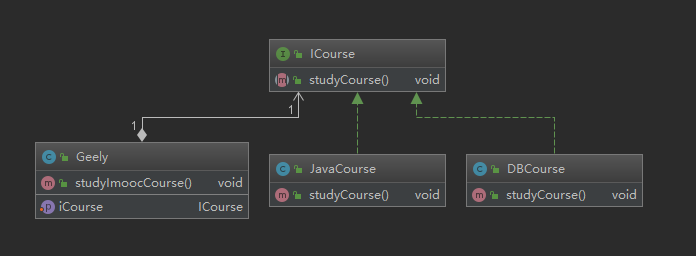

# 目录

1.  开闭原则
2. 依赖倒置原则
3. 单一职责原则
4. 接口隔离原则
5. 迪米特法则（最小知道原则）
6. 里式替换原则
7. 合成/复用（组合/复用原则）

不是强行遵守的，而是讲究取舍

# 1、开闭原则

- 定义：一个软件实体如类、模块、函数应该对扩展开放，对修改关闭
- 用抽象构建框架，用实现扩展细节
- 优点：提高软件系统的可复用性及可维护性

如：当发生促销，打折销售的时候，应该新增一个类，继承原来的类，增加新的方法

# **2、依赖倒置原则**

- 定义：高层模块不应该依赖低层模块，二者都应该依赖其抽象（例如service层不应该依赖dao层，service是高层，dao是低层 ）
- 抽象不应该依赖细节；细节应该依赖抽象
- 针对接口编程，不针对实现编程
- 优点：可以减少类间的耦合性，提高系统稳定性，提高代码可读性和可维护性，可降低修改程序所造成的风险

依赖正置是：在Gelly类中new JavaCourse（），new DBCourse（）。然后才能执行JavaCourse，DBCourse中的方法。耦合性过大

**依赖倒置**是：通过在client注入不同的实例，调用`gelly.studyImoocCourse（）`的时候，基于多态特性，会执行实例方法，而不是在Geely中new各种对象，来完成功能。这样新增一个课程的时候，只需要实现ICourse接口，再在client注入新的实例即可。

# **3、单一职责原则**

- 定义：不要存在多余一个导致类变更的原因
- 一个类/接口/方法只负责一项职责
- 优点：降低类的复杂度，提高类的可读性，提高系统的可维护性，降低变更引起的风险

**实际中类的单一职责看情况，方法单一职责**

# **4、接口隔离原则**

- 定义：用多个专门的接口，而不是使用单一的总接口，客户端不应该依赖它不需要的接口
- 一个类对一个类的依赖应该建立在最小的接口上
- 建立单一接口，不要建立庞大臃肿的接口
- 尽量细化接口，接口中的方法尽可能少
- 适度原则，一定要适度
- 优点：符合我们常说的高内聚低耦合的设计思想，从而使得类具有良好的可读性，可扩展性和可维护性

# **5、迪米特原则**

- 定义：一个对象应该对其它对象保持最少的了解。又叫最少知道原则
- 尽量降低类和类直接的耦合
- 优点：降低类之间的耦合
- 强调只和朋友交流，不和陌生人说话
- 朋友：出现在成员变量、方法的输入、输出参数中的类称为成员朋友类，而出现在方法体内体的类不属于朋友类

# **6、里氏替换原则**

定义：

如果对每一个类型为T1的对象o1，都有类型为T2的对象o2，使得以T1定义的所有程序P在所有对象o1都替换成o2时，程序P的行为没有发生变化，那么类型T2是类型T1的子类型

定义扩展：

一个软件实体如果适用一个父类的话，那一定适用其子类，所有引用父类的地方必须能透明地使用其子类的对象，子类对象能够替换父类对象，而程序逻辑不变。

引申意义：子类可以扩展父类的功能，但不能改变父类原有的功能。

1. 含义一：子类可以实现父类的抽象方法，但不能覆盖父类的非抽象方法

2. 含义二：子类中可以增加自己特有的方法

3. 含义三：当子类方法重载父类方法时，方法的前置条件（即方法的输入/入参）要比父类方法的输入参数更宽松

如果子类重载父类的方法时，方法的参数比父类方法更严格，此时不能保证子类在什么地方都可以替换父类，例如：下面是一个类的继承图

如果父类的参数是动物，子类的参数缩小为天上飞的，此时给父类传递的参数是水里游的，那么这个地方子类不能替换父类。

4. 含义四：当子类方法实现父类的方法时（重写/重载或实现抽象方法），方法的后置条件（即方法的输出/返回值）要比父类更严格或相等

如果不符合，编译器会报错

优点1：约束继承泛滥，开闭原则的一种体现

优点2：加强程序的健壮性，同时变更时，也可以做到非常好的兼容性，提高程序的维护性，扩展性。降低需求变更时引入的风险

# **7、合成（组合）/聚合复用原则**

-  定义：尽量使用对象组合/聚合（黑箱复用），而不是继承关系（白箱复用）达到软件复用的目的
- 聚合has-A和组合contains-A
- 优点：可以使系统更加灵活，降低类与类之间的耦合度，一个类的变化对其它类造成的影响相对较小

- 何时使用组合/聚合、继承
- **聚合has-A，组合contains-A，继承is-A**

**不合理：**

**合理：**

