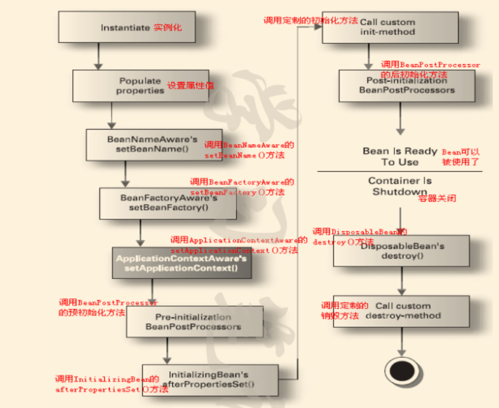

作者：帅冒哥哥
链接：https://www.nowcoder.com/discuss/371495?type=post&order=create&pos=&page=1
来源：牛客网

1、上来就问了项目，基本上照着简历扣，把自己做的那一块说一下，项目中单点登录的实现，dubbo与springcloud的区别，你说使用过docker，能不能介绍下docker与虚拟机的区别

 2、string的几种拼接方式区别，+和stringbuilder底层有没有区别

 3、事务概念以及事务隔离级别

 4、进程与线程的区别

 5、线程池（没接触过，不会）

 6、tcp三次握手，为什么是三次而不是四次或是两次

 7、java内存模型，堆内存划分

 8、互斥锁 ReentrantLock （直接答了不会）

 9、乐观锁与悲观锁

 10、平衡二叉树与二叉排序树的概念

 11、java的类加载机制

 12、手撕代码（手写单例模式+两个栈实现一个队列（没写出来））好气，太久没写算法了。 


作者：帅冒哥哥
链接：https://www.nowcoder.com/discuss/370494
来源：牛客网

新鲜出炉，阿里巴巴零售部分Java后台开发岗暑期实习一面面经
   我是在2月22号上午十点钟接的面试电话，过程持续了大概半小时，总共十来个问题，答出来八个的样子，目前等通知。面试过程如下，如果觉得写的不错评论区一起讨论吧：

 1、数组与链表的区别
   （1）数组是连续存储的，链表是散列存储的。数组随机访问性强（通过下标进行快速定位），所以数组的查询比链表要快，链表不能随机查找，必须从第一个开始遍历，查找效率低。
   （2）数组插入和删除效率低（插入和删除需要移动数据），链表插入删除速度快（因为有next指针指向其下一个节点，通过改变指针的指向可以方便的增加删除元素）

 2、堆内存与栈内存

   一 方法区（Method Area）
   \1. 什么是方法区（Method Area）？
   《深入理解JVM》书中对方法区（Method Area）描述如下：
   方法区（Method Area）与Java堆一样，是各个线程共享的内存区域。
   2.方法区（Method Area）存储什么？
   《深入理解JVM》书中对方法区（Method Area）存储内容描述如下：
   它存储已被Java虚拟机加载的类信息、常量、静态变量、即时编译器编译后的代码等

   二 堆
   Java堆（Java Heap） ：被所有线程共享的一块内存区域，在虚拟机启动时创建。Java堆（Java Heap）唯一目的就是存放对象实例。所有的对象实例及数组都要在Java堆（Java Heap）上分配内存空间。

   1、栈内存用来存放基本类型的变了和引用变量，堆内存用来存储java中的对象，无论是成员变量，局部变量，还是类变量，他们指向的对象都存储在堆内存中。
   2、栈内存归属于单个线程，每个线程都会有一个栈内存，其存储的变量只能在其所属的线程中可见，即栈内存可以理解成线程的私有内存；堆内存中的对象对所有线程可见。堆内存中的对象可以被所有线程访问。
   3、如果栈内存没有可用的空间存储方法调用和局部变量，JVM会抛出java.lang.stackoverflowerror 错误；如果是堆内存内有可用的空间存储生成的对象，jvm会抛出java.lang.outofmemoryerror错误。
   4、栈的内存要远远小于堆内存，如果你使用递归的话，那么你的栈会很快充满。-Xss设置每个线程堆栈内存的大小 -Xms可以设置堆内存开始时的大小。
  简单总结如下：
   JVM 中堆和栈属于不同的内存区域，使用目的也不同。栈常用于保存方法帧和局部变量，而对象总是在堆上分配。栈通常都比堆小，也不会在多个线程之间共享，而堆被整个 JVM 的所有线程共享。

 3、进程与线程的区别
   1.进程要分配一大部分的内存，而线程只需要分配一部分栈就可以了.
   2.一个程序至少有一个进程,一个进程至少有一个线程.
   3.进程是资源分配的最小单位，线程是程序执行的最小单位。
   4.一个线程可以创建和撤销另一个线程，同一个进程中的多个线程之间可以并发执行.
   5.进程与进程之间的交互通过TCP/IP的端口来实现，线程的通信就比较简单，有一大块共享的内存，只要大家的指针是同一个就可以看到各自的内存。
   操作系统真正运行的是一个个的线程，而进程可以看做是线程的一个容器。


 4、tcp与udp的区别
   \1. TCP是面向连接(Connection oriented)的协议，UDP是无连接(Connection less)协议；
   TCP用三次握手建立连接：1) Client向server发送SYN；2) Server接收到SYN，回复Client一个SYN-ACK；3) Client接收到SYN_ACK，回复Server一个ACK。到此，连接建成。UDP发送数据前不需要建立连接。
   \2. TCP可靠，UDP不可靠；
     TCP丢包会自动重传，UDP不会。 
   \3. TCP有序，UDP无序；
     消息在传输过程中可能会乱序，后发送的消息可能会先到达，TCP会对其进行重排序，UDP不会。
    
   \4. TCP无界，UDP有界；
     TCP通过字节流传输，UDP中每一个包都是单独的。   
   \5. TCP有流量控制（拥塞控制），UDP没有；
     主要靠三次握手实现。以及慢开始、拥塞避免、快重传、快恢复 
   \6. TCP传输慢，UDP传输快；
     因为TCP需要建立连接、保证可靠性和有序性，所以比较耗时。这就是为什么视频流、广播电视、在线多媒体游戏等选择使用UDP。
   \7. TCP是重量级的，UDP是轻量级的；
     TCP要建立连接、保证可靠性和有序性，就会传输更多的信息，如TCP的包头比较大。 
   \8. TCP需要更多资源，UDP则要好上很多
   \9. 应用场合不同：TCP一般应用在对可靠性要求比较高的场合，例如http,ftp等等。而UDP一般应用在对实时性要求较高场合，例如视频直播，大文件传输等等 
   小结：
   TCP是面向连接的、可靠的、有序的、速度慢的协议；UDP是无连接的、不可靠的、无序的、速度快的协议。TCP开销比UDP大，TCP头部需要20字节，UDP头部只要8个字节。TCP无界有拥塞控制，TCP有界无拥塞控制。

 5、完全二叉树与满二叉树
   满二叉树：指深度为k且有2^k-1个结点的二叉树。节点的编号按照层序遍历的顺序曾旭排列。
   完全二叉树：当二叉树的深度为h时，它的h层节点必须都是连续靠左并不可隔开的(满二叉树也符合)，并且1～h-1层的结点数都达到最大个数(即1~h-1层为一个满二叉树)。

 6、hashmap的底层实现
   这个是高频考点，大家应该都会就不写了

 7、jvm的类加载器
   当程序使用某个类时，如果该类还未被加载到内存中，则系统通过加载，连接，初始化三个步骤来实现对这个类的加载。分别介绍这三个步骤。。。
   简单说了下类加载的时机，和三种常见的类加载器。

 8、常用的数据库是啥，建索引大的两种方式，建立一个树形结构部门表该如何设计
   （1）CREATE INDEX indexName ON mytable(username(length))；
   （2）ALTER table mytable ADD UNIQUE [indexName] (username(length))
    建表这问不知道他是想问啥，就说自己没设计过，不会

 9、简单说说你做过的比较好的项目
   简历里面的项目聊了聊

 10、平时会逛逛哪些论坛
   就说平时喜欢逛牛客，LeetCode也有刷题


作者：骚小孩
链接：https://www.nowcoder.com/discuss/370682
来源：牛客网


前几天进行的一面，然后第二天就开始二面，现在还没有通知三面，感觉应该是凉了，倒在了框架原理和分布式原理了解上了。 

  


  **一面：**  

  1.currenthashmap 实现原理（特别细），插入时怎么保证的线程安全，更新时怎么保证的线程安全，什么时候加锁。
 2.对代理得理解。
 3.动态代理是什么，静态代理是什么，他们得区别
 4.动态代理得实现方式，他们有什么区别？
 5.jvm常用命令行调优工具。
 6.redis缓存击穿和缓存雪崩
 7.nginx和编程规范选一个问，我选了编程规范
 8.你觉得你开发的项目过程中哪个项目比较有亮点遇到什么困难，讲一下？ 

  


  面试官反馈：说我项目讲的有点乱，让我再好好梳理一下，总体感觉还是不错的。 

  


  **二面：**  

  1先将项目，这个可能我做的项目比较简单没问什么其他的问题。
 2.让我自己选一个最擅长的部分，我选的集合，然后让我讲说了一下集合
 3.currenthashmap和hashtable的区别
 4.对jvm的了解分区
 5.jvm回收算法，优缺点
 6.数据库事务隔离级别以及会产生的问题
 7.数据库b+树索引建立过程
 8.redis介绍
 9.redis路由选择了解过吗？
 10.spring的了解，ioc，aop原理。 

  


  面试官反馈：java基础没有短板，但是分布式还需要加强，我以为我可以过的，问了问内部人员说没过吧，二面没有一面好。 

  害，也没啥好说的，菜是原罪。继续努力。


static 关键字
static 方法和不加static方法区别
java线程有哪些状态（打非所问）
java timed_waiting与waiting区别
notify notifyall有什么区别
Hashmap是不是线程安全的
hashtable 是不是线程安全
hashtable变成线程安全
currenthashmap    hashmap  线程map

1.一道算法题 二进制字符串求和 要求输出也是二进制 （太简单 直接秒了）
2.面试官说问个java基础吧 int多少位 范围是多少？（内心？？？？？）
3.接口类和抽象类区别
4.java多线程实现方式 runnable和callable区别
5.object类方法（说到五个的时候就让我停了）
6.jvm分代
7.数据库分页实现
8.项目 难点
9.你来阿里想学什么（学什么？啥都学呗！）
10 提问 我问我需要注意啥 面试官就说基础 。。。。。。。。。。。
总结：感觉所有问题都特别简单。。。而且问的都不深 。。。虽然都说出来了 但是怎么就感觉面试官不太喜欢我 最后问他我能过吗 他说保密。。。。。 唉 还是我太菜了吧。。。


我是从大二开始一直跟着我们一个老师做开发，学校里的一些应用都是从我们团队里面出去的
像什么在线请销假、最近的疫情签到是老师带着我们做出来的，面试官大概率因为这个给的过，
因为我是99年的嘛，项目里面还用了一些分布式的东西，面试官觉得我很年轻？反正我菜的抠脚
正文:
上来就是怼数据结构没得商量
1. 用语言描述一颗二叉树
2. 怼排序算法、插入排序、时间复杂度
3. 优先队列构建过程
4. MySQL索引nnoDB、MyISAM巴拉巴拉，说到了B+树那里，解释了为什么MyISAM不支持行锁，而InnoDB支持，还有他俩的区别
5. 放弃使用索引 大概是七八个的情况
6. Object方法有哪些
7. 深拷贝浅拷贝（不知道囧）
8. 乐观锁VS悲观锁 CAS和synchronized关键字还说了说AQS、和对synchronized关键字优化（偏向锁、轻量锁、重量级锁）
9. Http协议
10. 这个就很囧了，面试官问的是继承和组合的区别，我听成进程和组合的区别，，，我一脸蒙蔽后来听录音才听出来...
11. 观察者模式
加上之前面试新零售的，阿里必问的就是排序算法（一面基本上都会问）、数据结构、索引、存储引擎、事务、锁（JUC看一遍就OK）。
没了，总之很简单的东西，问的都是基础，面试官人很好
反问：
1. 您觉得我的技术栈应该补充那些
2. 我能不能过 他回了个恩，心里悬着的石头掉了下来
总之还是要补充好基础吧！回馈一下牛客
感兴趣的大佬可以看一下我写的复习博客，希望能帮到看到这篇面经的同学！
https://blog.csdn.net/aaahxz
后续：又补了一段代码测试的环节，不知道算不算二面反正写在这里了
大概的题目就是数组查重、二分查找两道题，很简单，主要是看代码规范标准的意思吧！


紧张了一天等来了三面，人生中第一次三面，原谅我太菜。祝自己好运~

项目介绍 分布式锁
分布式锁除了 redis 还有其他实现吗，我说有数据库和 zookeeper，说了数据库的实现，zk 不了解
团队之间如何分工
题目一：链表奇数位升序，偶数位降序，如何改为有序链表
遍历一次将奇数和偶数分别存储到两个列表中，然后合并
如何不用额外存储空间：先遍历一遍将单向链表改成双向链表，然后分别从两头开始遍历
评论区同学说可以把偶数节点连起来然后反转最后再合并两个链表，俺当时也没想出什么好做法，总之面试官的意思是想要 O(1)的空间复杂度
题目二：百万的数据，找出最大的 100 个
用最小堆
如果这 100 万个数据都是 0-100 之间的有什么其他办法，用一个大小为 100 的哈希结构存储数据
如果数据是 100 亿，大到内存存不下怎么办，我说就分次读取
redis 有哪些数据结构
redis 的有序列表怎么实现
跳表有什么优势，比如和二叉树比较
mysql 用的是什么数据结构存储
b+ 数是什么样的，b 数和 b+ 数的区别，为什么用 b+ 不用 b 数
题目三：有一个函数 random(5) 产生随机数 0-5，如何用它来实现 random(7)
产生随机数的概率得是均匀的
更新一下， 好多人回复了这道题的做法，我也不知道对错，这里是leetcode里random 7实现random 10 官方题解
场景设计题：抖音点赞，QPS 是百万级，如何设计
用 redis 做缓存
数据最终写到哪：数据库
怎么写：定期写入
有没有不一致问题：机器出问题数据丢了就可能不一致吧
怎么解决：redis 的持久存储 rdb 和 aof
磁盘出问题怎么办，rdb 和 aof 都有问题：redis 集群，用多台 redis 保证高可用
redis 集群怎么设计的：一台写其他读
上面我给出的回答可能不是对的，只是我当时所想到的，并不完整。大家有什么想法可以在评论区指正。


是从官网的内推链接投的  题目不是也别难，但出了3道场景题，没怎么答上来。。运气好竟然一面二面过了，三面终面约了下周，发篇面经攒攒人品吧，加油加油!
一面：
1.自我介绍
2.手写代码：有序链表合并
3.聊聊项目  怎么个秒杀法
4.计算过qps吗  qps是什么
5.场景题：设计表结构  怎么实现用户量大的情况下快速查询用户的粉丝数/关注数
6.聊聊IOC
7.IOC加载过程
8.wait和sleep的区别
9.synchronized底层原理  是可重入锁吗
10.CAS原理  -> java内存模型   CAS会有什么问题
11.怎么解决ABA问题
12.HashMap数据结构 线程安全吗
13.举个例子HashMap怎么线程不安全
14.聊聊B树和B+树 数据结构是什么  查询复杂度是多少

感觉一面是个快速刷人的过程，涉及的点可能会比较广，但浅尝即止，没怎么往深处问，而且我感觉他们应该是有套面试题的列表
面试官大概会扫一眼有哪些领域问了，哪些没问

二面：
1.场景1：硬盘1T，内存2G 有很多数据id, 有重复的id 怎么找到重复次数最多的Top10
2.场景2：网页中有一个用户输入框，输入完文本后会拿到一个url，然后关闭页面。
用户下次再进入页面时根据上次的url可以看到上次输入的文本    怎么实现这个功能，把你能想到的说出来
(上来两道场景题直接把我给整懵了，后来面试官安慰说不出来没关系)
3.数据库索引怎么建立，把你的认识说出来，后来我引到了聚簇索引，索引覆盖
4.解释什么是索引覆盖
5.数据库隔离级别有哪些
6.举个不可重复读的例子
7.除了设置数据库隔离级别，还有什么方法可以解决不可重复读 (后面提示说这个有个专有的名词)
8.讲讲滑动窗口的过程 滑动窗口在哪里用到
9.手写代码：有序链表合并的升级版，合并n多和有序链表，并计算时间复杂度

暂时就记得这么多了，可能有些问题没记住，就算了吧


3级缓存怎么解决脏读的问题

# 大文件4g，每一行都是一个数字，只有256M内存，怎么排序

```java
1、排序的实现
这是一个单机外部排序的典型题目。具体的方法就是先分块进行排序然后多路归并成输出文件。
2、查找
如果不能对文件进行处理的话，只能遍历进行查找。
如果是可以对文件进行处理的话，那么上面已经排序好了文件，就可以进行二分查找。
3、统计
如果不能对文件进行处理的话，还是没有好的办法，只能是遍历一遍。
如果已经拍好序了，那么就可以直接二分查找。在找到的位置向两头搜索出现的个数。
```

**磁盘多路归并排序**：

1. 假设有K路[数据流](https://baike.baidu.com/item/数据流/3002243)，流内部是有序的，且流内部同为升序；

2. 首先读取每个流的第一个数，如果已经读完，pass；

3. 将有效的k(k可能小于K)个数比较，选出最小的那路mink，输出，读取mink的下一个；

4. 直到所有K路都读完。

**置换选择排序**：减少初始归并段的个数

1. 首先从初始文件中输入 6 个记录到内存工作区中；
2. 从内存工作区中选出关键字最小的记录，将其记为 MINIMAX 记录；
3. 然后将 MINIMAX 记录输出到归并段文件中；
4. 此时内存工作区中还剩余 5 个记录，若初始文件不为空，则从初始文件中输入下一个记录到内存工作区中；
5. 从内存工作区中的所有比 MINIMAX 值大的记录中选出值最小的关键字的记录，作为新的 MINIMAX 记录；
6. 重复过程 3—5，直至在内存工作区中选不出新的 MINIMAX 记录为止，由此就得到了一个初始归并段，然后重开一个归并段；
7. 重复 2—6，直至内存工作为空，由此就可以得到全部的初始归并段。

**最佳归并树**：用哈夫曼树

**败者树**

   败者树是胜者树的一种变体。在败者树中，用父结点记录其左右子结点进行比赛的败者(数值大的下标)，而让胜者参加下一轮的比赛。败者树的根结点记录的是败者，需要加一个结点来记录整个比赛的胜利者，就是数值最小的下标

# Spring bean的生命周期



  1、实例化一个Bean－－也就是我们常说的new；

  2、按照Spring上下文对实例化的Bean进行配置－－也就是IOC注入；

  3、如果这个Bean已经实现了BeanNameAware接口，会调用它实现的setBeanName(String)方法，此处传递的就是Spring配置文件中Bean的id值

  4、如果这个Bean已经实现了BeanFactoryAware接口，会调用它实现的setBeanFactory(setBeanFactory(BeanFactory)传递的是Spring工厂自身（可以用这个方式来获取其它Bean，只需在Spring配置文件中配置一个普通的Bean就可以）；

  5、如果这个Bean已经实现了ApplicationContextAware接口，会调用setApplicationContext(ApplicationContext)方法，传入Spring上下文（同样这个方式也可以实现步骤4的内容，但比4更好，因为ApplicationContext是BeanFactory的子接口，有更多的实现方法）；

  6、如果这个Bean关联了BeanPostProcessor接口，将会调用postProcessBeforeInitialization(Object obj, String s)方法，BeanPostProcessor经常被用作是Bean内容的更改，并且由于这个是在Bean初始化结束时调用那个的方法，也可以被应用于内存或缓存技术；

  7、如果Bean在Spring配置文件中配置了init-method属性会自动调用其配置的初始化方法。

  8、如果这个Bean关联了BeanPostProcessor接口，将会调用postProcessAfterInitialization(Object obj, String s)方法、；

  注：以上工作完成以后就可以应用这个Bean了，那这个Bean是一个Singleton的，所以一般情况下我们调用同一个id的Bean会是在内容地址相同的实例，当然在Spring配置文件中也可以配置非Singleton，这里我们不做赘述。

  9、当Bean不再需要时，会经过清理阶段，如果Bean实现了DisposableBean这个接口，会调用那个其实现的destroy()方法；

  10、最后，如果这个Bean的Spring配置中配置了destroy-method属性，会自动调用其配置的销毁方法。

# 怎么判断一个链表有没有环，怎么找到环的位置

印象比较深的项目？项目难点？
count(*)和count(1)的区别？
大表的条件count的方案，除了索引之外有哪些？
索引的优缺点？
什么时候用索引？什么时候不用？
分布式事务怎么保证一致性？
Java的Synchronized锁的是什么东西？
自旋锁了解吗？会有什么问题？
Java的Hashmap实现原理？get和put


自我介绍
面向对象三大特性
继承，接口区别
重写重载原理，重载重写各自应用的场景
int 和 Integer区别，为什么有Integer缓冲池？Integer缓冲池细节，Integer a =1, Integer b = new Integer(1), a和b比较返回true或者false？
Object类下有什么方法？
hashcode有什么作用？equals和hashcode什么关系？
hashcode在HashMap中的作用？HashMap和ConcurrentHashMap区别？
什么是线程安全？操作变量情景下怎样是线程安全，怎样是线程不安全？自己举一个情景说明
多个线程操作局部变量，和操作静态变量两种情况下，虚拟机是怎样分配内存的
Synchronized实现原理，锁升级过程，修饰实例对象和class的区别
讲一下wait，notify，notifyAll，notify能具体指定唤醒某一个实例吗？为什么是随机唤醒，底层如何实现？
详细讲一下ClassLoader，jre包下的jar由什么加载
讲一下Exception和Error
用户线程和守护线程区别，使用场景？守护线程能否访问数据库？
TCP三次握手。为什么不能两次四次？TCP四次挥手
HTTTP和HTTPS的区别，给你一个网站，你如何考虑使用HTTP还是HTTPS？12306一开始为什么使用HTTP而不是HTTPS？
讲一下IOC，AOP。不通过spring，如何实现AOP。讲一下动态代理细节。比较jdk动态代理和cglib的性能。
MyBatis通过接口没有实现就能实现一些增删改查操作，背后原理？如果自己设计，大概是怎样的流程？
说一下你理解的MVC，SpringMVC处理流程，拦截请求怎么实现？
项目的消息处理为什么选型EMQ？处理的数据通过什么协议？系统最大TPS是多少？
一台机器如果一直没收到消息，或是某些中间节点坏掉，可能是网络问题或是节点本身故障问题，怎样快速定位程序是出现问题是在哪里？
网络时好时坏，如果网络坏了时机器正在做一些重要的工作，这时机器如果故障，上报不了故障报告，怎样处理网络恢复后机器的故障数据能收集回来？
物联网场景工业机器人分布在不同地方，属于不同环境下，比如现在数字手表或是天猫精灵，现在连着的wifi是有故障的，作为一个厂商或应用系统，要收集到所有产品的实时数据，如何在故障恢复后把这些数据收集回来？
支付宝如果你付款了，但网络故障了，应用系统如何知道你是否付款了？
MongoDB和MySQL的区别？各自使用场景？项目为什么选型MongoDB？MongoDB中Object_id由什么组成？MongoDB实现原理？