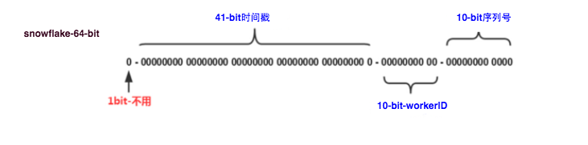
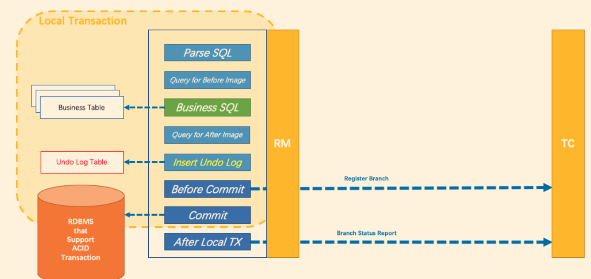
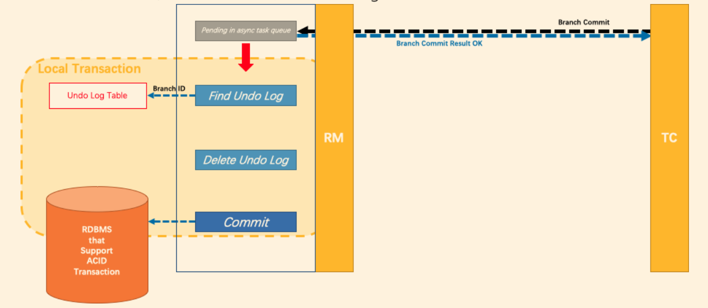
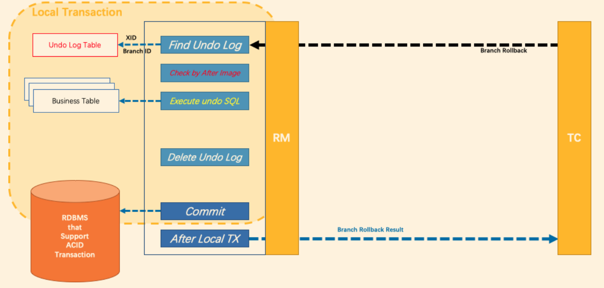
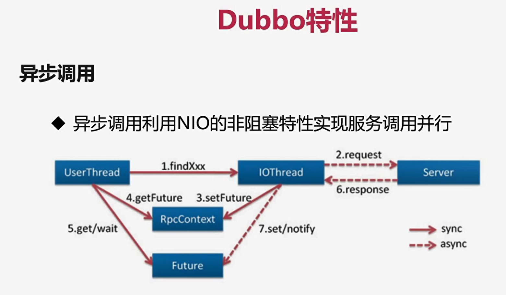

# 推特雪花算法

SnowFlake 算法，是 Twitter 开源的分布式 id 生成算法。其核心思想就是：使用一个 64 bit 的 long 型的数字作为全局唯一 id。，且ID 引入了时间戳，基本上保持自增的。



这 64 个 bit 中分成4个部分，其中 1 个 bit 是不用的，然后用其中的 41 bit 作为毫秒数，用 10 bit 作为工作机器 id，12 bit 作为序列号。

给大家举个例子吧，比如下面那个 64 bit 的 long 型数字：

第一个部分，是 1 个 bit：0，这个是无意义的。

第二个部分是 41 个 bit：表示的是时间戳。

第三个部分是 5 个 bit：表示的是机房 id，10001。

第四个部分是 5 个 bit：表示的是机器 id，1 1001。

第五个部分是 12 个 bit：表示的序号，就是某个机房某台机器上这一毫秒内同时生成的 id 的序号，0000 00000000。

**这种方式的优缺点是：**

## 优点

- 毫秒数在高位，自增序列在低位，整个ID都是趋势递增的。
- 不依赖数据库等第三方系统，以服务的方式部署，稳定性更高，**所有计算都是位运算，生成ID的性能也是非常高的。**
- 可以根据自身业务特性分配bit位，非常灵活

**①1 bit：是不用的，为啥呢？**

因为二进制里第一个 bit 为如果是 1，那么都是负数，但是我们生成的 id 都是正数，所以第一个 bit 统一都是 0。

**②41 bit：表示的是时间戳，单位是毫秒。**

41 bit 可以表示的数字多达 2^41 - 1，也就是可以标识 2 ^ 41 - 1 个毫秒值，换算成年就是表示 69 年的时间。

**③10 bit：记录工作机器 id，代表的是这个服务最多可以部署在 2^10 台机器上，也就是 1024 台机器。**

但是 10 bit 里 5 个 bit 代表机房 id，5 个 bit 代表机器 id。意思就是最多代表 2 ^ 5 个机房（32 个机房），每个机房里可以代表 2 ^ 5 个机器（32 台机器）。 

**④12 bit：这个是用来记录同一个毫秒内产生的不同 id。**

12 bit 可以代表的最大正整数是 2 ^ 12 - 1 = 4096，也就是说可以用这个 12 bit 代表的数字来区分同一个毫秒内的 4096 个不同的 id。


 这个 SnowFlake 算法系统首先肯定是知道自己所在的机房和机器的，比如机房 id = 17，机器 id = 12。

接着 SnowFlake 算法系统接收到收成id请求之后，首先就会用二进制位运算的方式生成一个 64 bit 的 long 型 id，64 个 bit 中的第一个 bit 是无意义的。 

首先 41 个 bit，就可以用当前时间戳（单位到毫秒），然后接着 5 个 bit 设置上这个机房 id，还有 5 个 bit 设置上机器 id。

最后再判断一下，当前这台机房的这台机器上这一毫秒内，这是第几个请求，给这次生成 id 的请求累加一个序号，作为最后的 12 个 bit。**如果最后的序列号为0了，说明4096个序列号用完了，那么要阻塞等到下一毫秒**，也就是理论上来说这个算法1ms最多生成4096个序号

# Seata实现2PC与传统2PC的差别

- 架构层次方面，传统2PC方案的 RM（资源管理器） 实际上是在数据库层，RM 本质上就是数据库自身，通过 XA 协议实现，而
  Seata的 事务协调器是以jar包的形式作为中间件层部署在应用程序这一侧的。
- 两阶段提交方面，传统2PC无论第二阶段的决议是commit还是rollback，事务性资源的锁都要保持到Phase2完成
  才释放。而Seata的做法是在Phase1 就将本地事务提交，这样就可以省去Phase2持锁的时间，整体提高效率。

**其设计思路如图**

第一阶段



核心在于**对业务sql进行解析，转换成undolog，并同时入库**，通过`DataSourceProxy`代理数据源执行

第二阶段

分布式事务操作成功，则TC通知RM异步删除undolog



分布式事务操作失败，TM向TC发送回滚请求，RM 收到协调器TC发来的回滚请求，通过 XID 和 Branch ID 找到相应的回滚日志记录，通过回滚记录生成反向的更新 SQL 并执行，以完成分支的回滚



# 基于Dubbo的异步调用特性

基于Dubbo的异步调用特性，异步获取影片服务描述、图片、演员信息，提高网站响应速度

**Dubbo的异步调用特性**

- 异步调用利用NIO的非阻塞特性实现服务调用并行



UserThread调用一个方法，不去等返回值，直接去获取future，获取了future之后再等着返回结果

图中2,3,6,7对我们来说是透明的,我们只需要调用方法，获取future对象，然后等待结果就行了，只需要操作1,4,5

假设4个接口都是这样子，假设3个接口200ms，1个接口300ms，则调用4个接口只需要300ms

1. 把需要异步调用的API抽离出来一个接口 `FilmAsyncServiceApi`

```java
public interface FilmAsyncServiceApi {
    FilmDescVO getFilmDesc(String filmId);
    ImgVO getImgs(String filmId);
    ActorVO getDecInfo(String filmId);
    List<ActorVO> getActors(String filmId);
}
```

2. 写一个实现类实现该异步API     DefaultFilmAsyncServiceImpl，重写异步方法，业务逻辑一样

3. 在Controller里注入

```java
@Reference(check = false,async = true)
private FilmAsyncServiceApi filmAsyncServiceApi;
```


4. 实际调用时，采用上图中的1,4,5步骤

```java
filmAsyncServiceApi.getActors(filmId);  //第一步：调用方法
Future<List<ActorVO>> actorVOFuture = RpcContext.getContext().getFuture();  //第二步获得future对象
//组织Actor属性
ActorRequestVO actorRequestVO = new ActorRequestVO();
actorRequestVO.setActorVOList(actorVOFuture.get());//第三步，get()对象
```

# Hystrix服务垄断降级，兜底

```java
//FailBack方法
public ResponseVo error(Integer fieldId, String soldSeats, String seatsName){
    return ResponseVo.serviceFail("抱歉,下单的人太多了，请稍后重试");
}
```

如果发生超时或者错误等，就会返回兜底方法

