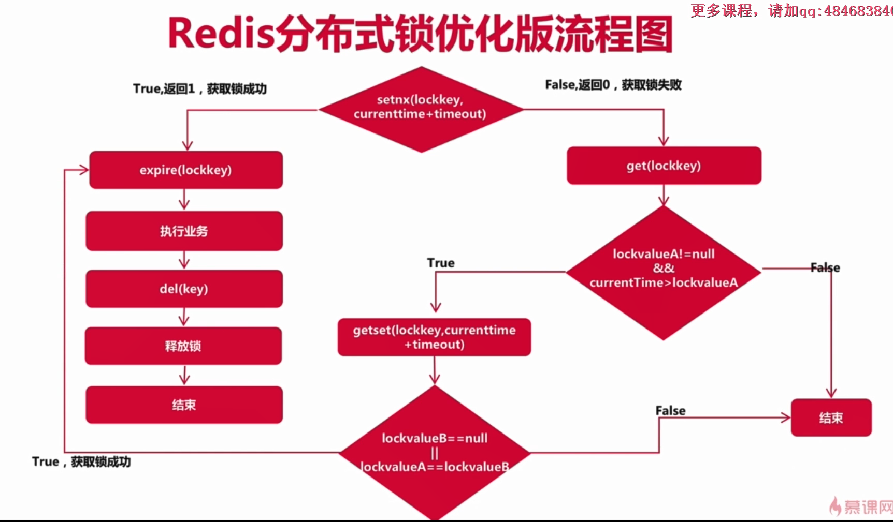

# Lombok原理

**Lonbok原理**

- 支持JSP 269 Pluggable Annotation Processing API
-  javac从java6开始支持“JSR 269 API”规范
- 只要程序实现了该API，就能在javac运行的时候调用
- Lombok实现了“JSR 269 API”，在编译时，javac编译源码的具体流程如下


@Data：包含

1. @Getter
2. @Setter
3. @ToString
4. @EqualsAndHashCode

# Maven环境隔离

**Maven环境隔离编译打包命令**

`mvn clean package -Dmaven.test.skip=true -Pdev`

`mvn clean package -Dmaven.test.skip=true -Pbeta`

`mvn clean package -Dmaven.test.skip=true -Pprod`

# **Nginx负载均衡配置，常用策略，场景及特点**

1. 轮询（默认）
2. 权重
3. ip hash
4. url hash(第三方)
5. fair（第三方）

**轮询（默认）**

优点：实现简单

缺点：不考虑每台服务器处理能力


**权重**

优点：考虑了每台服务器处理能力的不同


**ip hash**

优点：能实现同一个用户访问同一个服务器

缺点：根据ip hash不一定平均


**url hash（第三方插件）**

优点：能实现同一服务访问同一服务器

缺点：能根据url hash分配请求会不平均，请求频繁的url会请求到同一个服务器上

 


**fair（第三方）**

特点：根据后端服务器的响应时间来分配请求，响应时间短的优先分配


**负载均衡参数扩展知识点**


# 单点登录

基于Redis实现用户单点登录功能，解决分布式Session问题，实现集群节点的无状态，将user对象序列化后存入redis

# 一致性哈希算法构建Redis集群

1. 首先求出Redis服务器（节点）的哈希值，并将其配置到0～2的32次的圆（continuum）哈希环上。**对于cache的hash计算，一般使用机器的ip地址，端口号，或者机器名作为hash输入**
2. 然后采用同样的方法求出存储数据的键的哈希值，并映射到相同的圆上。
3. 然后从数据映射到的位置开始顺时针查找，将数据保存到找到的第一个服务器上。


　　从上图的状态中添加一台Redis服务器，在Consistent Hashing中，只有在圆（continuum）上增加服务器的地点逆时针方向的第一台服务器上的键会受到影响，影响范围很小如下图所示：


**此时object4顺时针找到CacheC,只会影响该Cache与逆时针方向前一个Cache之间的节点**


另外，一致性哈希算法在服务节点太少时，容易因为节点分部不均匀而造成数据倾斜问题。为了解决这种数据倾斜问题，一致性哈希算法引入了虚拟节点机制，即对每一个服务节点计算多个哈希，每个计算结果位置都放置一个此服务节点，称为虚拟节点。具体做法可以在服务器ip或主机名的后面增加编号来实现。


**虚拟节点**

通过虚拟节点，将真实节点放大

每个实际节点都可以配置几百个虚拟节点


通过`ShardedJedisPool`调用

```java
//MURMUR_HASH对应的是一致性算法
        pool=new ShardedJedisPool(config,jedisShardInfoList, Hashing.MURMUR_HASH, Sharded.DEFAULT_KEY_TAG_PATTERN);
```

这时返回的是`ShardedJedis`

# Spring Schedule定时关单


# Redis实现分布式锁

**Redis分布式锁双重防死锁演进**



```java
/**
 * 双重防死锁
 */
@Scheduled(cron = "0 0/1 * * * ?")
public void closeOrderTaskV3(){
    log.info("关闭订单定时任务启动");
    //从配置文件中获取过期时间，测试时用50s,上线时用5s
    long lockTimeout = Long.parseLong(
            PropertiesUtil.getProperty("lock.timeout", "5000"));
    //在redis里设置过期时间
    //如果空闲，则可以获取锁，如果已经有值，即锁被别的进程占用，则不执行
    //基于redis的setnx完成分布式锁
    //setnx为原子性操作
    Long setnx = RedisShardedPoolUtil.setnx(
            Const.REDIS_LOCK.CLOSE_ORDED_TASK_LOCK,
            String.valueOf(System.currentTimeMillis() + lockTimeout));
    if (setnx!=null&&setnx.intValue()==1){
        //如果返回值是1，代表设置成功，获取锁
        closeOrder(Const.REDIS_LOCK.CLOSE_ORDED_TASK_LOCK);
    }else {
        String lockValueA = RedisShardedPoolUtil.get(Const.REDIS_LOCK.CLOSE_ORDED_TASK_LOCK);
        //如果lockValueA==null,则说明已经释放锁，不会产生死锁现象
        if (lockValueA!=null&&System.currentTimeMillis()>Long.parseLong(lockValueA)){
            String lockValueB = RedisShardedPoolUtil.getSet(Const.REDIS_LOCK.CLOSE_ORDED_TASK_LOCK,
                    String.valueOf(System.currentTimeMillis() + lockTimeout));
            //lockValueB==null说明锁已过期
            //lockValueA  equals lockValueB 说明这期间没有别的进程改动过，如果多进程同时getSet，则只有第一个getSet的集成能满足equal
            if (lockValueB==null|| StringUtils.equals(lockValueA,lockValueB)){
                //获得锁
                closeOrder(Const.REDIS_LOCK.CLOSE_ORDED_TASK_LOCK);
            }else {
                //锁没过期，且有别的进程先getSet了
                log.info("没有获取分布式锁：{}",Const.REDIS_LOCK.CLOSE_ORDED_TASK_LOCK);
            }
        }else {
            log.info("没有获取分布式锁：{}",Const.REDIS_LOCK.CLOSE_ORDED_TASK_LOCK);
        }
    }
    log.info("关闭订单定时任务关闭");
}
```

