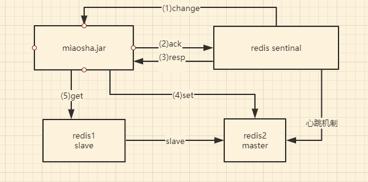
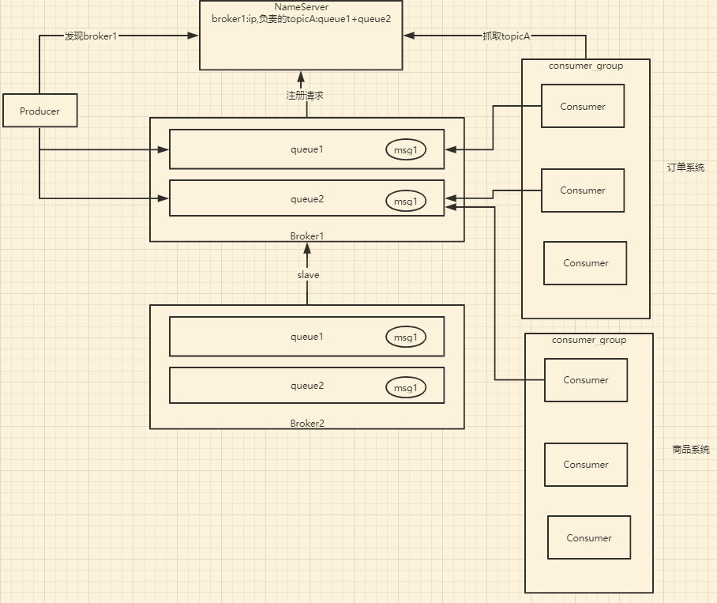

# 面试的故事

通过`pstree -p pid |wc -l`指令可以查询当前某程序的线程或进程数,发现并发线程数上不去，在没有任何压力的时候，并发线程大概是30多个

解决：通过**查看SpringBoot配置**

- spring-configuration-metadata.json文件下
- 查看各个节点的配置发现默认配置中，默认最大工作线程数是200个，最小工作线程数是10个，等待队列长度是100个，这样的话在默认配置下，触发的请求超过200+100后拒绝处理

```java
server.tomcat.accept-count:等待队列长度，默认100
server.tomcat.max-connections:最大可被连接数,默认为10000
server.tomcat.max-threads:最大工作线程数,默认200
server.tomcat.min-spare-threads:最小工作线程数,默认为10

默认配置下，连接超过10000后出现拒绝连接情况
默认配置下，触发的请求超过200+100后拒绝处理
```

在application.properties中修改，把等待队列长度、最大工作线程数、最小工作线程数都调大

经验值：对于4核8g的服务器来说，最好的最大工作线程数是800

```java
server.tomcat.accept-count=1000#:等待队列长度，默认100
server.tomcat.max-connections=10000#:最大可被连接数,默认为10000
server.tomcat.max-threads=800#:最大工作线程数,默认200
server.tomcat.min-spare-threads=100#:最小工作线程数,默认为10
```

http1.1的keepalive请求为当我们的客户端向服务器发送http请求的时候，若带上了对应的keepalive请求头，则表明我们的http客户端和服务端之间建立一个keepalive链接，那这个keepalive链接的用处就是告诉服务端，与服务端建立完连接之后，不要立刻断开，而是要复用这个连接，主要是用来解决http连接，每次连接都要断开连接所造成的一个耗时问题。

如果没有定制化keepAlive设置，如果用户没事挂着网页，但是不做任何操作，那这条连接对服务端来说就是一条废连接，第二容易被攻击者攻击，浪费服务器资源。

**然后是定制化内嵌Tomcat开发keepAlive，在Spring容器中注入WebServerConfiguration这个bean（继承WebServerFactoryCustomizer），然后手动添加KeepAliveTimeout为30s和MaxKeepAliveRequests为1w个，这样的话，就定制化keepalivetimeout，30秒内没有请求，则服务端自动断开keepalive连接，当客户端发送超过10000个请求，则自动断开keepalive连接**

接着是通过多级缓存：redis、guava cache、nginx lua缓存实现了一套削峰的多级缓存方案，具体是这么实现的**先到nginx的shared dictionary：就是共享内存字典，lua脚本编写的程序，先到共享内存字典中找到缓存，这是第一级缓存，如果没命中，在Controller中，先到本地缓存中取，这是第二级缓存，本地缓存中没有命中，则到Redis里取，这是第三级缓存，Redis里没有，调用Service去数据库查**，缓存设计的原则的话是距离用户越近，效率越高，但是更加占用内存，且不容易更新，容易产生脏读，其中，本地缓存采用的方案：Cuava cache ：本质上是一个可并发的hashmap，有如下特点：可控制的大小、超时时间可配置lru策略(Least recently used,最近最少使用)、线程安全

接着是扣减库存缓存化，基于RocketMQ事务型消息异步扣减数据库内库存，保证数据的最终一致性，

使用的**方案：**

-（1）活动发布同步库存同步到缓存

\- （2）下单交易减缓存库存

-（3）异步消息扣减数据库内库存

**RocketMQ的事务型消息来保证数据的最终一致性**，事务型消息发送的是预确认的消息，在executeLocalTransaction里创建订单，创建订单完成后返回COMMIT_MESSAGE，这时Consumer端才实现库存真正到数据库内扣减的逻辑

**这个时候还有问题**（1）异步消息发送失败（2）扣减操作执行失败（3）下单失败无法正确回补库存

我通过引入库存操作流水来解决这个问题，每次秒杀时记录库存操作流水，追踪库存状态

**秒杀商品item的取和减库存通过Redis缓存在内存中进行，每次下单的时候，新增一条stockLog记录，里面有个status字段，1表示初始状态，2表示下单扣减库存成功，3表示下单回滚',每次下单前新增一条操作流水log，如果下单成功了，就把操作流水的status字段设置成2，这样相当于每次操作加入了StockLog 的行锁，但是StockLog 在每一次OrderController下单的时候，都会插入一条数据，所以每次下单锁住的都是新的行**

**每个订单都有一行，所以StockLog 的行锁对性能几乎没有影响。而itemid在数据库中减库存的时候，多线程竞争行锁，等待，对性能影响比较大**，使用操作流水之后，可以进行库存的状态跟踪，避免对应库存状态断链之后，不知道真实状态，来保证数据库的最终一致性

stock_log表

```sql
CREATE TABLE `stock_log` (
  `stock_log_id` varchar(64) NOT NULL,
  `item_id` int(11) NOT NULL DEFAULT '0',
  `amount` int(11) NOT NULL DEFAULT '0',
  `status` int(11) NOT NULL DEFAULT '0' COMMENT '//1表示初始状态，2表示下单扣减库存成功，3表示下单回滚',
  PRIMARY KEY (`stock_log_id`)
) ENGINE=InnoDB DEFAULT CHARSET=utf8;

```

接下来是解决一个库存售罄问题：**在redis中库存减到0以后，在redis中打上库存已售罄的标识key，在下单的时候，如果发现redis里有库存已售罄的标识key，后续就不走下单流程**

-  库存售罄标识
-  售罄后不去操作后续流程
-  售罄后通知各系统售罄
-  回补上新

**即便查询优化，交易优化技术用到极致后，只要外部的流量超过了系统可承载的范围就有拖垮系统的风险。接下来我通过秒杀令牌，秒杀大闸，队列泄洪等流量削峰技术避免流量拖垮系统**

 **秒杀令牌原理**

秒杀令牌存储在redis中，key整合了促销活动id（promoId）,用户Id（userId）,商品id（itemId），value是一个uuid

```java
 String token= UUID.randomUUID().toString().replace("-","");
        redisTemplate.opsForValue().set("promo_token_"+promoId+"_userid_"+userId+"_itemid_"+itemId,token);
      redisTemplate.expire("promo_token_"+promoId+"_userid_"+userId+"_itemid_"+itemId,5, TimeUnit.MINUTES);
 return token;
```

- 秒杀接口需要依靠令牌才能进入
- 秒杀的令牌由秒杀活动模块负责生成
- 秒杀活动模块对秒杀令牌生成全权处理，逻辑收口
- 秒杀下单前需要先获得秒杀令牌

**再抛缺陷**

- 秒杀令牌只要活动一开始就无限制生成，影响系统性

**秒杀大闸**

在活动发布的时候，取库存数量的5倍作为大闸令牌的限制个数，控制大闸流量。将大闸的限制数字设到redis内 ，在生成令牌的时候，获取秒杀大闸的count数量，并且减一。定制化发牌，做到大闸功能，同时可以把用户风控策略、库存售罄判断前置到秒杀令牌发放中

```java
  //将大闸的限制数字设到redis内    
redisTemplate.opsForValue().set("promo_door_count_"+promoId,itemModel.getStock().intValue()*5);
```

```java
 Long result = redisTemplate.opsForValue().increment("promo_door_count_" + promoId, -1);
        if (result.longValue()<0){
            return null;
        }
```

**抛缺陷**

- 浪涌流量涌入后系统无法应对 
- 多库存，多商品等 令牌限制能力弱

**队列泄洪原理**

我主要是依靠排队和下游拥塞窗口程度调整队列释放流量大小去限制并发流量

**利用线程池，将队列维护在本地内存中。使用ExecutorService创建固定大小的线程池,可控制线程最大并发数，超出的线程会在队列中等待。同步调用线程池的submit方法,同1时间只有20个线程能执行，拥塞窗口为20的等待队列，用来队列化泄洪，一台服务器只有1个executorService，同1时间只有20个请求能执行，其它请求都要排队**

- 排队有些时候比并发更高效（例如redis单线程模型，innodb mutex key等）并发会遇到行锁，互斥锁的竞争，线程之间的切换开销非常大
- 依靠排队去限制并发流量
- 依靠排队和下游拥塞窗口程度调整队列释放流量大小（比如一次性取5个任务队列去执行）
- 支付宝银行网关队列（ZQueue）：支付宝可以承受流量大，银行网关流量小，所以中间有一个队列，先存在队列中，然后根据下游的承载能力泄洪


**防刷限流**

**验证码**

利用Java的BufferedImage类和Graphics类和Random类 随机生成4位验证码，另外随机产生40条干扰线，使图象中的认证码不易被其它程序探测到。

将验证码Code和用户ID绑定后存入redis中，设置10分钟的有效期，在获取秒杀令牌前，需要验证验证码的有效性

- 包装秒杀令牌前置，需要验证码来错峰
- 数学公式验证码生成器

```java
    BufferedImage buffImg = new BufferedImage(width, height, BufferedImage.TYPE_INT_RGB);
        // Graphics2D gd = buffImg.createGraphics();
        // Graphics2D gd = (Graphics2D) buffImg.getGraphics();
        Graphics gd = buffImg.getGraphics();
        // 创建一个随机数生成器类
        Random random = new Random();
```

常见的限流算法有两种，令牌桶算法和漏桶算法，令牌桶算法是客户端从令牌桶中获取令牌，另外有一个定时器每秒往桶里放置令牌，优点是能应对突发流量。漏桶法就是每秒以固定的速率流出流量，没有办法应对突发流量，平滑网络流量，为了应对突发流量，我采用了令牌桶算法。

**令牌桶（用的最多）**

**能应对突发流量**，但是不能超过限定值


**漏桶法**

没有办法应对突发流量，平滑网络流量，以固定的速率流入操作


具体实现使用了Google的guava RateLimiter的令牌桶限流实现，比如设置300个permits，在`OrderController.createOrder()`方法的入口加上限制， acquire方法会返回现在令牌桶当中减完之后还剩下多少令牌，如果令牌数<=0，则返回错误

```java
   private RateLimiter orderCreateRateLimiter;

    @PostConstruct
    public void init(){
        //tps为300，要根据压测来获得，即1秒钟允许通过300个permits
        orderCreateRateLimiter=RateLimiter.create(300);
    }
```

在`OrderController.createOrder()`方法的入口加上限制

```java
// acquire方法会返回现在令牌桶当中减完之后还剩下多少令牌
if (orderCreateRateLimiter.acquire()<=0){
            throw new BusinessException(EmBusinessError.RATE_LIMIT);
  }
```


**限流目的**

- 流量远比你想的要多
- 系统活着比挂了要好
- 宁愿只让少数人能用，也不要让所有人都不能用

TPS：衡量会对数据库产生写操


# 压测发现容量问题：server端并发线程数上不去

通过`pstreee -p pid |wc -l`查询当前某程序的线程或进程数,发现线程数上不去，一直都是30几个

- 解决：**查看SpringBoot配置**
  - spring-configuration-metadata.json文件下
  - 查看各个节点的配置

```java
server.tomcat.accept-count:等待队列长度，默认100
server.tomcat.max-connections:最大可被连接数,默认为10000
server.tomcat.max-threads:最大工作线程数,默认200
server.tomcat.min-spare-threads:最小工作线程数,默认为10

默认配置下，连接超过10000后出现拒绝连接情况
默认配置下，触发的请求超过200+100后拒绝处理
```

在application.properties中修改

```java
server.tomcat.accept-count=1000#:等待队列长度，默认100
server.tomcat.max-connections=10000#:最大可被连接数,默认为10000
server.tomcat.max-threads=800#:最大工作线程数,默认200
server.tomcat.min-spare-threads=100#:最小工作线程数,默认为10
```

**定制化内嵌Tomcat开发** keepAlive

- keepAliveTimeOut：多少毫秒后不响应断开keepalive
- maxKeepAliveRequests:多少次请求后keepalive断开失效
- 使用WebServerFactoryCustomizer<ConfigurableServletWebServerFactory>定制化内嵌tomcat配置

```java
//当Spring容器内没有TomcatEmbeddedServletContainerFactory这个bean时，会把此bean加载进spring容器
@Component
public class WebServerConfiguration implements WebServerFactoryCustomizer<ConfigurableWebServerFactory> {
    @Override
    public void customize(ConfigurableWebServerFactory factory) {
        ((TomcatServletWebServerFactory) factory).addConnectorCustomizers(new TomcatConnectorCustomizer() {
            @Override
            public void customize(Connector connector) {
                //使用对应工厂类提供给我们的接口定制化我们的tomcat connector
                Http11NioProtocol protocol = (Http11NioProtocol) connector.getProtocolHandler();
                //定制化keepalivetimeout，30秒内没有请求，则服务端自动断开keepalive连接
                protocol.setKeepAliveTimeout(30000);
                //当客户端发送超过10000个请求，则自动断开keepalive连接
                protocol.setMaxKeepAliveRequests(10000);
            }
        });
    }
}
```

**发现容量问题：响应时间变成 TPS上不去**

 **单Web容器上限**

- 线程数量：4核cpu 8G内存单进程调度线程数800-1000以上后，即花费巨大时间在cpu调度上
- 等待队列长度：队列做缓冲池用，但也不能无限长，消耗内存，出队入队也耗cpu，一般设置在1000-2000左右

**MySql数据库QPS容量问题** Queries-per-second

- 主键查询：千万级别数据=1-10ms
- 唯一索引查询：千万级别数据=10-100ms
- 非唯一索引查询：千万级别数据=100-1000ms
- 无索引：百万条数据=1000ms+

解决：加索引，分库分表，扩容热点数据

**MySql数据库TPS容量问题**

- 非插入更新删除操作：同查询
- 插入操作：1w~10w tps（依赖配置优化，后续讲解）

# 分布式扩展

**解决方案**

- mysql数据库开放远端连接
- 服务端水平对称部署
- 验证访问

架构图


**nginx**

- 使用nginx作为web服务器
- 使用nginx作为动静分离服务器
- 使用nginx作为反向代理服务器

**tomcat外挂日志 accesslog**

```java
server.tomcat.accesslog.enabled=true server.tomcat.accesslog.directory=/home/wjj/product/miaosha/tomcat server.tomcat.accesslog.pattern=%h %l %u %t "%r" %s %b %D
```

图中nginx和miaosha.jar为短连接，需要设置成keepalive长连接，并且使用http1.1协议，与数据库的长连接有Druid连接池解决

```java
upstream backend_server{
        server 127.0.0.1:8090 weight=1;
        server 127.0.0.1:8091 weight=1;
        keepalive 30;
}
server {
        listen 80;
        autoindex on;
        server_name www.wjjlucky.top wjjlucky.top;
        access_log /usr/local/openresty/nginx/logs/access.log combined;
        index index.html index.htm index.jsp index.php;
        #root /devsoft/apache-tomcat-7.0.73/webapps/mmall;
        #error_page 404 /404.html;
        if ( $query_string ~* ".*[\;'\<\>].*" ){
                return 404;
        }
        location /resources/ {
                alias /usr/local/openresty/nginx/html/resources/;
                index index.html;
        }
        location / {
                proxy_pass http://backend_server;
                proxy_set_header Host $http_host:$proxy_port;
                proxy_set_header X-Real-IP $remote_addr;
                proxy_set_header X-Forwarded-For $proxy_add_x_forwarded_for;
                add_header Access-Control-Allow-Origin *;
                add_header backendIP $upstream_addr; 
                #使用http1.1协议
                proxy_http_version 1.1;
                proxy_set_header Connection "";
        }
 }
```

# Nginx高性能的原因

- java bio模型，阻塞进程式

java client只有等socket.write所有的字节流inpu到tcp/ip的缓冲区之后，对应的java client才会返回，如果缓冲区满了，则叫阻塞


- linux select模型，变更触发轮训查找，有1024数量上限

缺点：轮训效率太低


- epoll模型，变更触发回调直接读取，理论上无上限

优点：无需遍历，效率高


**master-worker进程模型** 

master只负责管理worker进程，worker进程负责连接client。当work进程挂了或者管理员发送./nginx -s reload重启，master进程会发一个信号给worker进程,要求worker进程将所有的连接交给master进程去管理，master进程会调用一个新的worker进程,让新的worker进程去管理

每个work进程中只有一个线程，也就是说每个work进程都是单线程的，如果线程内部没有任何阻塞操作，则单线程的操作会比多线程更快。在work进程中不允许有任何阻塞操作，因此是单线程


**3、协程机制**

- 依附于线程的内存模型，切换开销小
- 遇阻塞及归还执行权，代码同步
- 无需加锁

总结

1. 依靠epoll多路复用解决了IO阻塞的回调通知问题
2. 依靠master worker进程模型可以平滑的过度，平滑的重启，并且依靠worker单线程模型和epoll多路复用模型完成高效操作
3. 利用协程机制，让用户的每一个请求对应到线程中的某一个协程中

# 缓存设计的原则

距离用户越近，效率越高，但是更加占用内存，且不容易更新，容易产生脏读

**先到nginx的shared dic：共享内存字典，lua脚本编写的中找到缓存，如果没命中，在Controller中，先到本地缓存中取，本地缓存中没有命中，则到Redis里取，Redis里没有，调用Service去数据库查**

- 快速存取设备，用内存
- 将缓存推倒离用户最近的地方
- 脏缓存清理

**多级缓存**

- redis缓存
- 热点内存本地缓存
- nginx proxy cache缓存**（不好用）**
- nginx lua缓存

# **第三级:redis缓存**

**1、单机版**

**2、sentinal哨兵模式 ：应用程序只需要感知redis sentinal**



**3、集群cluster模式**


## **商品详情动态内容实现redis缓存**

 在springmvc的controller层将对应的redis引入，将从下游service层得到的数据，在controller层缓存起来，以便于下次再有请求进来的时候，判断缓存中是否有商品详情页的数据，如果有则直接返回，不去调用service，减少对数据库的依赖

# **第二级: 本地热点缓存，就是jvm缓存**

- 热点数据
- 脏读非常不敏感
- 内存可控
- 生命周期很短

**方案：Cuava cache ：本质上是一个可并发的hashmap**

- 可控制的大小和超时时间
- 可配置lru策略
- 线程安全

## （不好用）nginx proxy cache缓存

- nginx反向代理前置
- 依靠文件系统存索引级的文件
- 依靠内存缓存文件地址

**性能反而降低了，因为nginx需要从本地磁盘去读文件，没有缓存在内存中**

#  第一级：**nginx lua**

协程的好处：在编写对应代码的时候，无需考虑异步的方式，完全可以以同步的方式去编写，一旦对应的协程在运行的时候遇到任何阻塞，比如IO调用，会主动地到Nginx对应的epoll模型上注册异步回调的句柄，放弃自己的执行权限，然后当我们对应的epoll模型接收到IO请求阻塞调用的返回之后，会将对应的协程唤醒，对应的协程就像是在写一个同步的代码一样。

- lua协程机制，
- nginx协程机制
- nginx lua插载点
- OpenResty

**协程机制**

- 依附于线程的内存模型，切换开销小
- 遇阻塞即归还执行权，代码同步
- 无需加锁

**nginx协程**

- nginx的每一个Worker进程都是在epoll或者kqueue这种事件模型之上，封装成协程
- 每一个请求都有一个协程进行处理
- 即使ngx_lua需要运行Lua，相对C有一定的开销，但依旧能保证高并发能力

**nginx协程机制**

- nginx每个工作进程创建一个lua虚拟机
- 工作进程内的所有协程共享一个vm
- 每个外部请求由一个lua协程处理，之间数据隔离
- lua代码调用io等异步接口时，协程被挂起，上下文数据不变
- 自动保存，不阻塞工作进程
- io异步操作完成后还原协程上下文，代码继续执行

**OpenResty**

- OpenResty由Nginx核心加很多第三方模块组成，默认集成了Lua开发环境，使得Nginx可以作为一个Web Server使用

- 借助于Nginx的事件驱动模型和非阻塞IO，可以实现高性能的Web应用服务器

- OpenResty提供了大量组件如Mysql、Redis、Memcached等等，使得在Nginx上开发Web应用更方便更简单。

**OpenResty实践**

- openresty hello world
- shared dic：共享内存字典，所有worker进程可见，lru淘汰，就像guava cache一样的key-value内存数据库结构
- openresty redis支持

**shared dic：共享内存字典**

在nginx.conf中添加

`lua_shared_dict my_cache 128m;`

lua脚本,直接在nginx上的lua脚本作缓存

```lua
--定义两个函数
function get_from_cache(key)
        local cache_ngx=ngx.shared.my_cache
        local value=cache_ngx:get(key)
        return value
end
function set_to_cache(key,value,exptime)
        --如果没传exptime
        if not exptime then
                exptime=0
        end
        local cache_ngx=ngx.shared.my_cache
        --返回的元祖，即有多个返回值
        local succ,err,forcible=cache_ngx:set(key,value,exptime)
        return succ
end
--获取url中的参数
local args=ngx.req.get_uri_args()
local id=args["id"]
local item_model=get_from_cache("item_"..id)
if item_model==nil then
    	--如果缓存里取不到，就将对应请求转发到后端
        local resp=ngx.location.capture("/item/get?id="..id)
        item_model=resp.body
    	--保存到缓存中，设置缓存时间60s
        set_to_cache("item_"..id,item_model,1*60)
end
--如果item_model不等于nil，则直接输出
ngx.say(item_model)
```

**但是更新机制不太好**

**可以在nginx上直接访问redis**


在nginx.conf中添加

```java
     location /luaitem/get{
                default_type "application/json";
                content_by_lua_file ../lua/itemredis.lua;
        }

```
itemredis.lua脚本**可以在nginx上直接访问redis**
```lua
--nginx上获取到的web请求参数
local args=ngx.req.get_uri_args()
local id=args["id"]
--引入redis脚本文件
local redis=require "resty.redis"
local cache=redis:new()
--连接redis
local ok,err=cache:connect("127.0.0.1",6379)
--获取item_model
local item_model=cache:get("item_"..id)
--如果item_model为null
if item_model==ngx.null or item_model==nil then
        local resp=ngx.location.capture("/item/get?id="..id)
        item_model=resp.body
end
ngx.say(item_model)
```

# 扣减库存缓存化

问题：

- 交易验证完全依赖数据库
- 库存行锁

**交易验证优化**

  - 用户风控策略优化：策略缓存模型化
  - 活动校验策略优化：**引入活动发布流程，模型缓存化**，紧急下线能力 

```java
<update id="decreaseStock">
  update item_stock
  set stock =stock-#{amount}
  where item_id = #{itemId,jdbcType=INTEGER} and stock>=#{amount}
</update>
```

- 扣减库存缓存化

- 异步同步数据库

- 库存数据库最终一致性保证

- **方案：**

  -（1）活动发布同步库存同步到缓存

  \- （2）下单交易减缓存库存

- **问题：**

  与数据库记录不一致

#  **异步同步数据库**

**rocketmq有Broker和NameServer，NameServer用来做类似于Zookeeper一样做服务注册发现，Broker到NameServer上注册请求，消费者和生产者都是去NameServer上拉取Broker的信息，由消息生产者轮训投递消息到Broker中的队列中，然后消息消费者去Broker中拉取对应的topic，** 

 **解决方案：**

**RocketMQ的分布式事务来保证数据的最终一致性**

-（1）活动发布同步库存进缓存

-（2）下单交易减缓存库存

-（3）异步消息扣减数据库内库存

**异步消息队列rocketmq**

- 高性能，高并发，分布式消息中间件
- 典型应用场景：分布式事务，异步解耦

概念模型





# 异步同步数据库问题：

- （1）异步消息发送失败

- （2）扣减操作执行失败

- （3）下单失败无法正确回补库存

**问题本质**

没有库存操作流水

**操作流水**

**数据类型**

- 主业务数据：master data
- 操作型数据：log data

**item的取和减库存在内存中进行，加入了StockLog 的行锁，但是StockLog 在每一次OrderController下单的时候，都会插入一条数据**

**每个订单都有一行，所以StockLog 的行锁对性能几乎没有影响。而itemid在数据库中减库存的时候，多线程竞争行锁，等待，对性能影响比较大**

stock_log表

```sql
CREATE TABLE `stock_log` (
  `stock_log_id` varchar(64) NOT NULL,
  `item_id` int(11) NOT NULL DEFAULT '0',
  `amount` int(11) NOT NULL DEFAULT '0',
  `status` int(11) NOT NULL DEFAULT '0' COMMENT '//1表示初始状态，2表示下单扣减库存成功，3表示下单回滚',
  PRIMARY KEY (`stock_log_id`)
) ENGINE=InnoDB DEFAULT CHARSET=utf8;

```

使用操作流水，来进行库存的状态跟踪，避免对应库存状态断链之后，不知道真实状态

**库存数据库最终一致性保证**

**方案：**

\- （1）引入库存操作流水

-（2）引入事务性消息机制

**问题：**

\- （1）redis不可用时，如何处理

\- （2）扣减流水错误如何处理

**业务场景决定高可用技术实现**

**设计原则**

\- 宁可少卖，不能超卖

**方案：**

\- （1）redis可以比实际数据库中少，redis如果出现问题，一定不能回源到数据库

-（2）超时释放

# **库存售罄问题**

假设还有1件库存，有99个人来抢，因为redis是单线程的，只有1个线程能抢到锁，执行redis的命令，其它的要排队，当一个线程执行成功以后，返回的result就是0，第二个线程返回的result就是-1，就直接返回。

```java
 Long result = redisTemplate.opsForValue().increment("promo_item_stock_" + itemId, amount.intValue() * (-1));
```


**在redis中库存减到0以后，在redis中打上库存已售罄的标识key，在下单的时候，如果发现redis里有库存已售罄的标识key，后续就不走下单流程,尽量把请求拦截在上层**

-  库存售罄标识
- 售罄后不去操作后续流程
- 售罄后通知各系统售罄
- 回补上新


**后置流程**

- 销量逻辑异步化

销量+1 会有itemId级别上的行锁，可以让销量+1，做一个异步化的控制

- 交易单逻辑异步化

将冻结库存成功之后，直接返回下单成功，将生成订单，数据库扣减库存等操作全部都做成异步化的操作

**交易单逻辑异步化**

- 生成交易单sequence后直接异步返回
- 前端轮询异步单状态
- 下单操作可以异步，但是支付操作是异步不了的，所以虽然用户被提示下单成功，但是却支付不了，一直在转
- 其实是个假异步，因为用户需要有订单号才能付款

因此我们不怎么用异步下单模型，而是采用异步同步库存模型

# 流量削峰技术

**即便查询优化，交易优化技术用到极致后，只要外部的流量超过了系统可承载的范围就有拖垮系统的风险。本章通过秒杀令牌，秒杀大闸，队列泄洪等流量削峰技术解决全站的流量高性能运行效率**

**挑缺陷**

- 秒杀下单接口会被脚本不停的刷
- 秒杀验证逻辑和秒杀下单接口强关联，代码冗余度高
- 秒杀验证逻辑复杂，对交易系统产生无关联负载

# **秒杀令牌原理**

秒杀令牌存储在redis中

```java
 String token= UUID.randomUUID().toString().replace("-","");
        redisTemplate.opsForValue().set("promo_token_"+promoId+"_userid_"+userId+"_itemid_"+itemId,token);
      redisTemplate.expire("promo_token_"+promoId+"_userid_"+userId+"_itemid_"+itemId,5, TimeUnit.MINUTES);
 return token;
```


- 秒杀接口需要依靠令牌才能进入
- 秒杀的令牌由秒杀活动模块负责生成
- 秒杀活动模块对秒杀令牌生成全权处理，逻辑收口
- 秒杀下单前需要先获得秒杀令牌

**再抛缺陷**

- 秒杀令牌只要活动一开始就无限制生成，影响系统性

# **秒杀大闸原理**

在活动发布的时候，取库存数量的5倍作为大闸令牌的限制个数

```java
  //将大闸的限制数字设到redis内    
redisTemplate.opsForValue().set("promo_door_count_"+promoId,itemModel.getStock().intValue()*5);
```

在生成令牌的时候，获取秒杀大闸的count数量，并且减一

```java
 Long result = redisTemplate.opsForValue().increment("promo_door_count_" + promoId, -1);
        if (result.longValue()<0){
            return null;
        }
```

- 依靠秒杀令牌的授权原理定制化发牌逻辑，做到大闸功能
- 根据秒杀商品初始库存办法对应数量令牌，控制大闸流量
- 用户风控策略前置到秒杀令牌发放中
- 库存售罄判断前置到秒杀令牌发放中

**抛缺陷**

- 浪涌流量涌入后系统无法应对 
- 多库存，多商品等 令牌限制能力弱

# 队列泄洪原理

**利用线程池，将队列维护在本地内存中。使用ExecutorService创建固定大小的线程池,可控制线程最大并发数，超出的线程会在队列中等待。同步调用线程池的submit方法,同1时间只有20个线程能执行，拥塞窗口为20的等待队列，用来队列化泄洪，一台服务器只有1个executorService，同1时间只有20个请求能执行，其它请求都要排队**


- 排队有些时候比并发更高效（例如redis单线程模型，innodb mutex key等）并发会遇到行锁，互斥锁的竞争，线程之间的切换开销非常大
- 依靠排队去限制并发流量
- 依靠排队和下游拥塞窗口程度调整队列释放流量大小（比如一次性取5个任务队列去执行）
- 支付宝银行网关队列（ZQueue）：支付宝可以承受流量大，银行网关流量小，所以中间有一个队列，先存在队列中，然后根据下游的承载能力泄洪

```java
    private ExecutorService executorService;

    private RateLimiter orderCreateRateLimiter;

    @PostConstruct
    public void init(){
        //创建固定大小的线程池,可控制线程最大并发数，超出的线程会在队列中等待。
        executorService= Executors.newFixedThreadPool(20);
        orderCreateRateLimiter=RateLimiter.create(50);
    }

```

```java
		//同步调用线程池的submit方法,同1时间只有20个线程能执行
        //拥塞窗口为20的等待队列，用来队列化泄洪
        //一台服务器只有1个executorService，同1时间只有20个请求能执行，其它请求都要排队
        Future<Object> future = executorService.submit(new Callable<Object>() {
            @Override
            public Object call() throws Exception {
                //加入库存流水init状态
                String stockLogId = iItemService.initStockLog(itemId, amount);

                //再去完成对应的下单事务型消息机制
                boolean mqResult = mqProducer.transactionAsyncReduceStock(userModel.getId(), itemId, promoId, amount, stockLogId);
                if (!mqResult) {
                    throw new BusinessException(EmBusinessError.UNKOWN_ERROR, "下单失败");
                }
                return null;
            }
        });

        try {
            //  获取任务执行结果，任务结束之前会阻塞。
            future.get();
        } catch (InterruptedException e) {
            e.printStackTrace();
            throw new BusinessException(EmBusinessError.UNKOWN_ERROR);
        } catch (ExecutionException e) {
            throw new BusinessException(EmBusinessError.UNKOWN_ERROR);
        }
        return CommonReturnType.create(null);
    }
```

 **本地或分布式**

- 本地：将队列维护在本地内存中
- 分布式：将队列设置到外部redis内

分布式队列存在性能问题，和负载均衡问题：每次都要到redis中取一个集中式的队列，就成为了性能瓶颈，而且存在单点的问题，如果redis挂了，那整个队列泄洪就挂了

因此还是推荐使用本地队列，性能高，没有网络消耗

# 防刷限流

# **验证码**

利用Java的BufferedImage类和Graphics类和Random类 随机生成4位验证码，另外随机产生40条干扰线，使图象中的认证码不易被其它程序探测到。

将验证码Code和用户ID绑定后存入redis中，设置10分钟的有效期，在获取秒杀令牌前，需要验证验证码的有效性

- 包装秒杀令牌前置，需要验证码来错峰
- 数学公式验证码生成器

```java
    BufferedImage buffImg = new BufferedImage(width, height, BufferedImage.TYPE_INT_RGB);
        // Graphics2D gd = buffImg.createGraphics();
        // Graphics2D gd = (Graphics2D) buffImg.getGraphics();
        Graphics gd = buffImg.getGraphics();
        // 创建一个随机数生成器类
        Random random = new Random();
```

# 限流

使用Google的guava RateLimiter的令牌桶限流实现，比如设置300个permits，在`OrderController.createOrder()`方法的入口加上限制

```java
   private RateLimiter orderCreateRateLimiter;

    @PostConstruct
    public void init(){
        //tps为300，要根据压测来获得，即1秒钟允许通过300个permits
        orderCreateRateLimiter=RateLimiter.create(300);
    }
```

在`OrderController.createOrder()`方法的入口加上限制

```java
// acquire方法会返回现在令牌桶当中减完之后还剩下多少令牌
if (orderCreateRateLimiter.acquire()<=0){
            throw new BusinessException(EmBusinessError.RATE_LIMIT);
  }
```


**限流目的**

- 流量远比你想的要多
- 系统活着比挂了要好
- 宁愿只让少数人能用，也不要让所有人都不能用

TPS：衡量会对数据库产生写操作，transaction操作的衡量指标

qps：query，查询每秒的指标

**限流方案**

- 限并发（一般不用）
- 令牌桶算法（用的最多）
- 漏桶算法

**令牌桶（用的最多）**

**能应对突发流量**，但是不能超过限定值


**漏桶法**

没有办法应对突发流量，平滑网络流量，以固定的速率流入操作


**限流力度**

- 接口维度，例如OrderController.createOrder()方法
- 总维度

**限流范围**

-  集群限流：依赖redis或其他中间件技术做统一计数器，往往会产生性能瓶颈
- 单机限流：负载均衡的前提下单机平均限流效果更好 